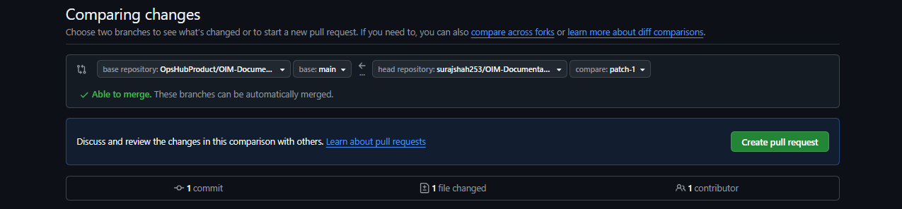
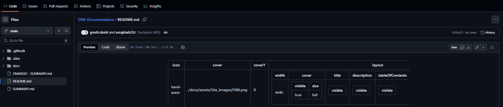
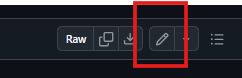
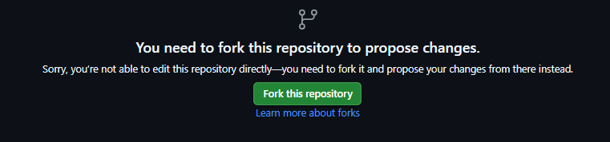
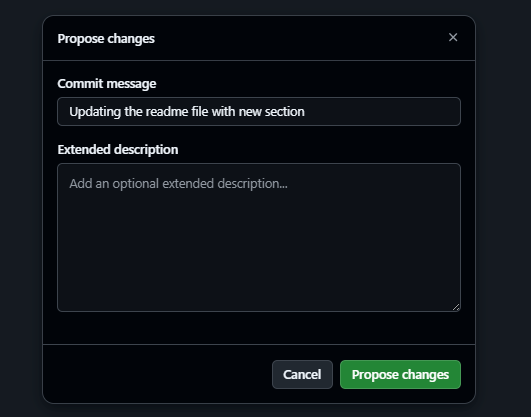

# Contribution Workflow

## Industry-Standard Fork → Edit → PR Workflow

* This repository is public, and **no contributor has direct write access**.
* All contributions must follow the **Fork → Edit → Commit → Pull Request** workflow.
* This ensures security, review quality, and governance — matching the standards used by large open-source foundations and enterprise GitHub projects.

## ⚠️ Public Repository Rules

* Because this is a **public repository**:
  * Anyone can **view**, **fork**, or **clone** the repository.
  * **No one** (including internal OpsHub members) can push directly.
  * All changes must come through a **Pull Request (PR)**.
  * Never commit or upload:
    * passwords, API keys, tokens
    * customer data
    * server URLs or internal IPs
    * proprietary or confidential information
  * Every change is reviewed before merging.

## 📝 Pull Request Review Process

* Reviewer checks content, formatting, and structure.
* Reviewer may request changes.
* Update your branch → PR updates automatically.
* Reviewer merges PR once approved.

## 🔁 Keeping Your Fork Updated

Before starting contributing to the documentation work, sync your fork:

```bash
git fetch upstream
git checkout DevSpace
git merge upstream/DevSpace
git push origin DevSpace
```

## 🚀 How to Contribute

* There are **two supported methods** — both are industry standard.

### 1️⃣ Standard Git Contribution Workflow (Recommended)

#### Step 1: Clone Your Fork

```bash
git clone https://github.com/<your-username>/OIM-Documentation.git
cd OIM-Documentation
```

#### Step 2: Add the Upstream Remote

```bash
git remote add upstream https://github.com/OpsHubProduct/OIM-Documentation.git
```

#### Step 3: Create a Working Branch

```bash
git checkout -b feature-your-change
```

#### Step 4: Make Documentation Changes

Edit `.md` files using your preferred editor (e.g., VS Code, IntelliJ).

#### Step 5: Commit Your Changes

```bash
git add .
git commit -m "Update: improved documentation for XYZ section"
```

#### Step 6: Push Your Branch

```bash
git push origin feature-your-change
```

#### Step 7: Open a Pull Request

1. Go to **your fork** on GitHub.
2. Click **Compare & Pull Request**.

<div align="center"></div>

3\. Set:\
\- Base branch → DevSpace\
\- Compare branch → your branch\
4\. Submit the PR for review.

### 2️⃣ Contribute Using GitHub UI (No Git Required)

* Even without Git, GitHub will automatically:
  * Create a **fork** for you
  * Allow editing the file in the browser
  * Commit changes to your fork
  * Prompt you to open a Pull Request

#### Steps (UI Contribution)

1. Open the file you want to edit on GitHub.

<div align="center"></div>

2\. Click Edit (✏️).

<div align="center"></div>

3\. GitHub will show: “You don’t have write access, so we created a fork for you.”

<div align="center"></div>

4\. Make edits.\
5\. Add a commit message.

<div align="center"></div>

6\. Commit changes.\
7\. Click "Create Pull Request" when prompted.

<div align="center"></div>

You are now ready to contribute professionally using open-source industry standards! 🚀
