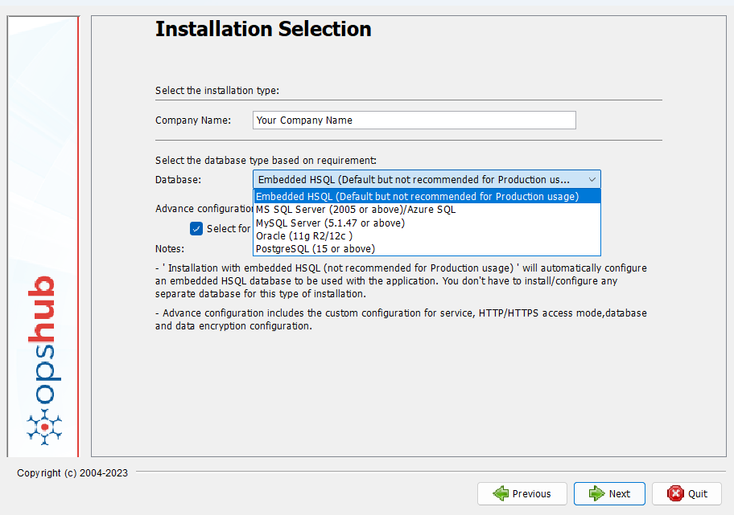
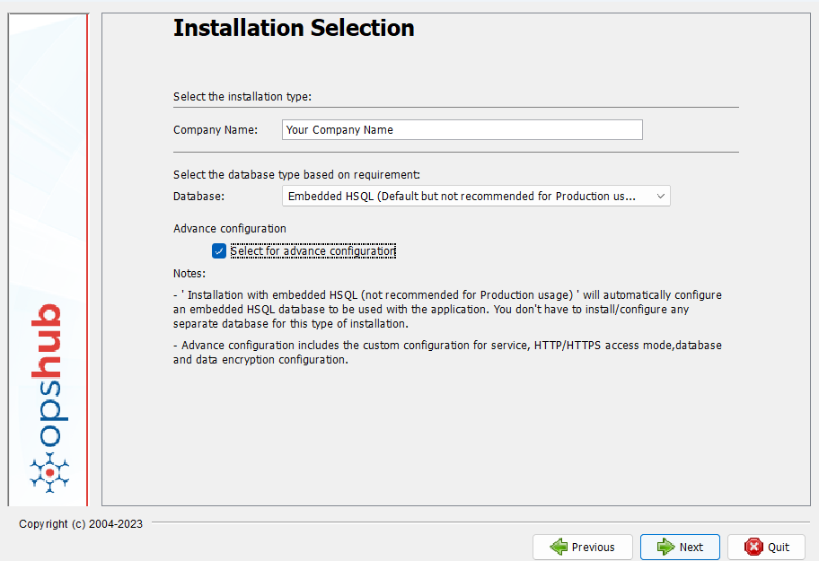
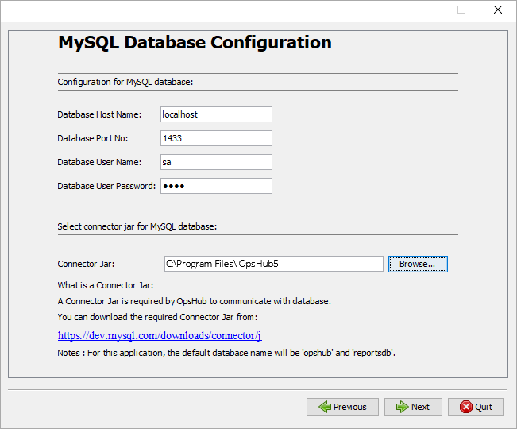
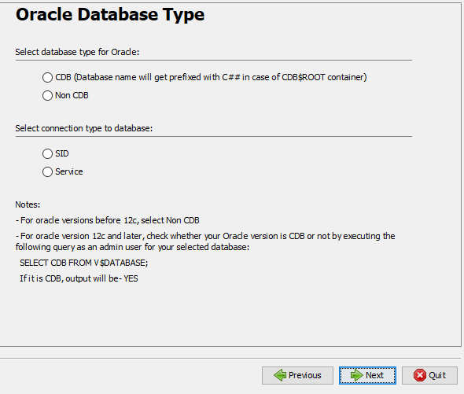
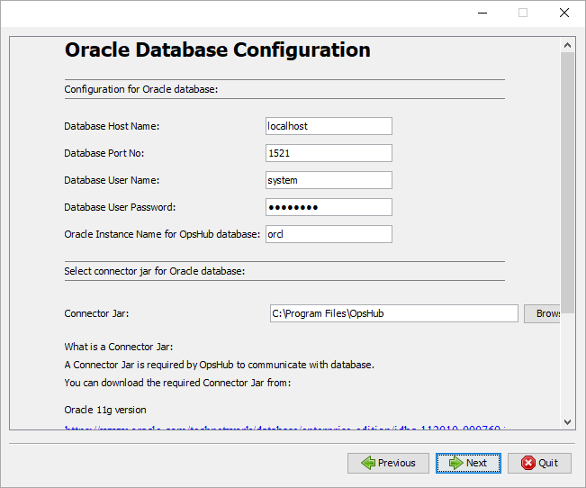
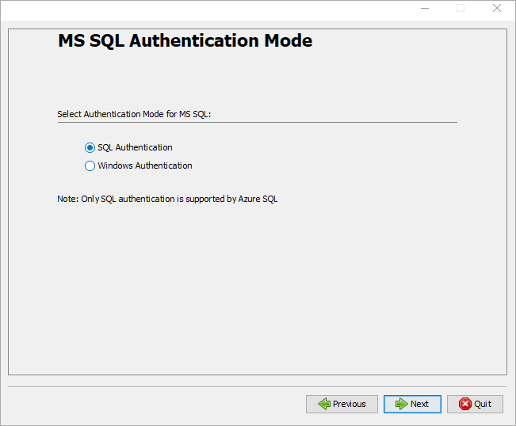
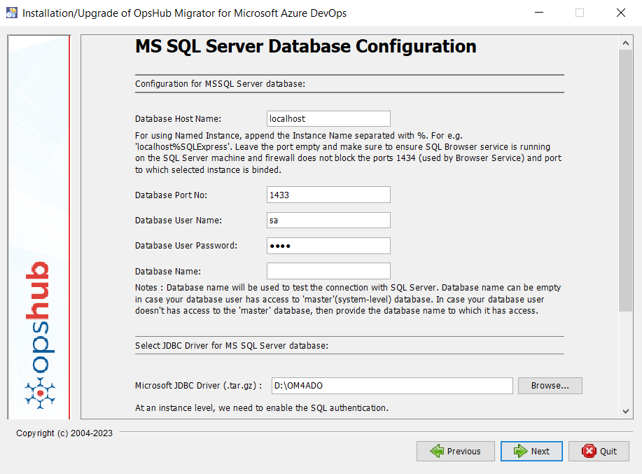
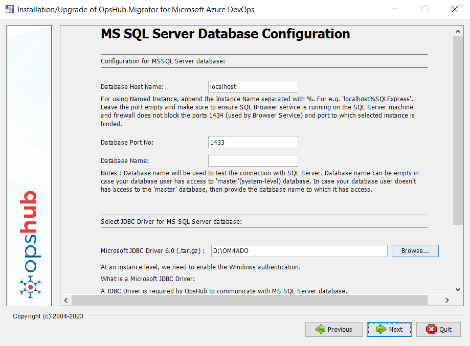
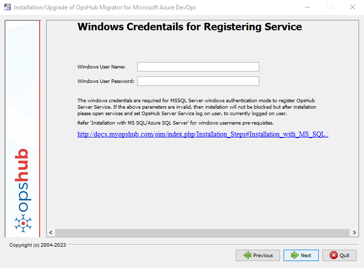
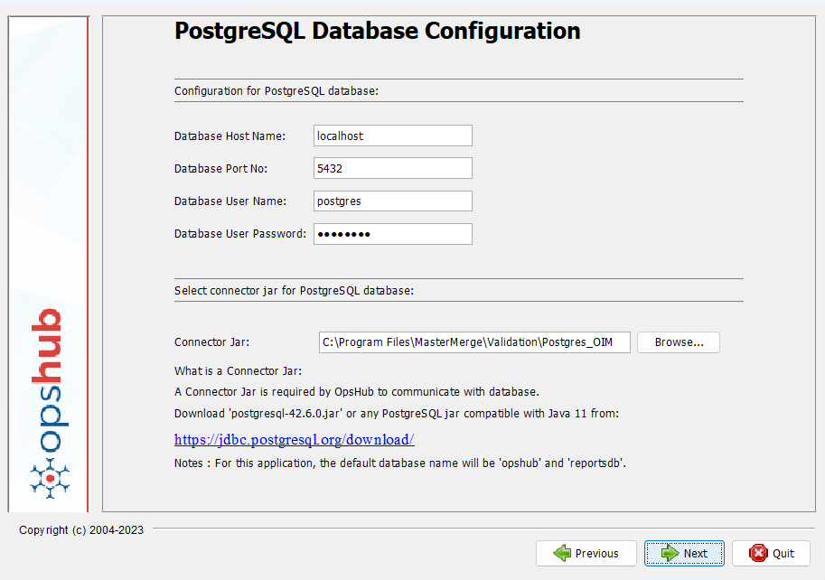

The user should select the Database type for installation from the dropdown list. Database connector jar is required to connect to the database. Refer [Download Database Connector jar](../../getting-started/prerequisites.md#download-database-connector-jar) to get the download link of the database connector jar.

Click the checkbox adjacent to **Advance configuration** option if you have one of the following requirements:


* Install <code class="expression">space.vars.SITENAME</code> in https


* Install multiple instances of <code class="expression">space.vars.SITENAME</code> on a single instance
* Need to create database manually
* Need to change encryption algorithm (by default, it is AES 256)

Now, select **one of the five types of database selection for installation** as mentioned below.

The installer progresses to next panel in accordance with the user selection.

| **Database Type**             | **Installation Details**                                                                                                                                                                                                                                                                                                                                                                                                                                                                                                              |
| ----------------------------- | ------------------------------------------------------------------------------------------------------------------------------------------------------------------------------------------------------------------------------------------------------------------------------------------------------------------------------------------------------------------------------------------------------------------------------------------------------------------------------------------------------------------------------------- |
| **Embedded HSQL**             | 
This type of installation starts from the next panel. No more inputs from the user are required. It installs <code class="expression">space.vars.SITENAME</code> on HSQL database packaged along with <code class="expression">space.vars.SITENAME</code> installer. > <strong>Note</strong>: This installation is not recommended for production. Read more: <a href="#installation-with-embedded-hsql-default">Installation with embedded HSQL (Default)</a>
                                                           |
| **MySQL Server**              | 
This type of installation further asks for MySQL Server database parameters. You need to specify connection parameters to connect to MySQL and the path of the connector jar, which is required for database transaction done by <code class="expression">space.vars.SITENAME</code>. Read more: <a href="#installation-with-mysql-server">Installation with MySQL Server</a> > <strong>Note</strong>: Here for the Connector Jar, select the path of the executable Jar file named mysql-connector-java-5.1.35-bin.jar.
 |
| **Oracle**                    | 
This type of installation further asks for Oracle Server database parameters. You need to specify connection parameters to connect to Oracle and the path of the connector jar, which is required for database transaction done by <code class="expression">space.vars.SITENAME</code>. Read more: <a href="#installation-with-oracle">Installation with Oracle</a>
                                                                                                                                                         |
| **MS SQL / Azure SQL Server** | 
The input form allows you to select Authentication mode. Read more: <a href="#installation-with-ms-sqlazure-sql-server">Installation with MS SQL/Azure SQL Server</a>
                                                                                                                                                                                                                                                                                                                                                       |
| **PostgreSQL**                | 
This type of installation further asks for PostgreSQL database parameters. You need to specify connection parameters to connect to PostgreSQL and the path of the connector jar, which is required for database transaction done by <code class="expression">space.vars.SITENAME</code>. Read more: <a href="#installation-with-postgresql">Installation with PostgreSQL</a>
                                                                                                                                                |

Notes:

*   For MS SQL/Azure SQL Server and MySQL Server, **Database User Name**

    can contain:

    * Alphabets (a-z,A-Z)
    * Numbers (0-9)
    *   Special characters from the list:

        !@#$^&\*()\_+|\[];:'><,.?/\`\~-=
* For Oracle, **Database User Name** can contain:
  * Alphabets (a-z,A-Z)
  * Numbers (0-9)
  * Special characters from the list: !@#$^&\*()\_+|:'><,.?\`\~-=
* **Database User Password** can contain:
  * Alphabets (a-z,A-Z)
  * Numbers (0-9)
  *   Special characters from the list:

      !@#$^&\*()\_+|\[];:'><,.?/\`\~-=

Given below are further details associated with each installation selection.

## Installation with embedded HSQL (Default)

## Installation with MySQL Server

Notes : For this application, the default database name will be `opshub` and `reportsdb`.

## Installation with Oracle

Select Oracle Database Type

* CDB or Container Database refers to the multitenant architecture in Oracle. CDB type was introduced with Oracle 12c version. User can use the instructions given in the following screenshot to find out whether your Oracle database type is CDB or not.
* The user must select the connection type based on the oracle configuration used to connect the above selected database type. It can be either **SID** or **Service name**.

Follow the instructions shown in installer for downloading connector jar.

Notes:

* The default user name will be 'C##opshub' and 'C##reportsdb' for Oracle CDB instance with CDB$ROOT container.
* The default user name will be 'opshub' and 'reportsdb' for Oracle Non-CDB instance or CDB instance with container other than CDB$ROOT.

For the **Oracle cluster** instance, to get the instance name for <code class="expression">space.vars.SITENAME</code> installation, please check the below SQL to get the

currently logged in instance name.

* Log in to the oracle instance \[Cluster] using SQL plus with username, password and service name:**sqlplus username/password@connect\_identifier**
* Run the below SQL:
  *   If service name is configured for the oracle instance:

      `SELECT sys_context('USERENV','SERVICE_NAME') AS Instance FROM dual;`
  *   If SID is configured for the oracle instance:

      `select instance_name from v$instance;`

The output value is the instance name that will be used in installation process.

> **Note**: All these operations must be allowed with ADMIN OPTION.

If you have to install the pre-requisite for Oracle with **version 11g (Release 2)/12c**, follow the instructions below:

* **Pre-requisite for Oracle with version 11g**:

For Oracle 11g version, ojdbc6.jar or ojdbc5.jar is required. The path for ojdbc6.jar or ojdbc5.jar is required while installing <code class="expression">space.vars.SITENAME</code> with Oracle database.

* **Pre-requisite for Oracle with version 12c**':

For Oracle 12c version, ojdbc7.jar or ojdbc6.jar is required. The path of the executable jar files (such as ojdbc7.jar or ojdbc6.jar)is required while installing <code class="expression">space.vars.SITENAME</code> with Oracle database.

* **Pre-requisite for Oracle with version 19c**:

For Oracle 19c version, ojdbc8.jar or ojdbc10.jar is required. The path of the executable jar files (such as ojdbc8.jar or ojdbc10.jar is required while installing <code class="expression">space.vars.SITENAME</code> with Oracle database.

**Known Limitations**

* Currently SSL\_CLIENT\_AUTHENTICATION is not supported for Oracle database.

**Default quota size setting**

*   Default tablespace quota size of user for the opshub database is 2000M

    ( which is equal to 2GB) .
*   If you encountered with following error "ORA-01536: space quota exceeded for tablespace 'USERS'" in <code class="expression">space.vars.SITENAME</code>, then

    it is requires to increase the default quota size for opshub database.

    *   Query To change the tablespace quota for opshub database is :

        **ALTER USER \<opshub\_dbname> QUOTA \<size\_of\_tablespace> ON users;**
    * For example, to increase the quota size from to 10GB for opshub database "opshub", then execute command as **ALTER USER opshub QUOTA 10000M ON users;**

## Installation with MS SQL/Azure SQL Server

> **Note** :Azure SQL is an alias for MS SQL on cloud.

**Character Encoding Considerations**:

* If the end systems to be configured in the <code class="expression">space.vars.SITENAME</code> include characters beyond standard English or ASCII and are incompatible

with the Latin1\_General\_CS\_AS collation (default collation), consider [Advance Installation](../../getting-started/installation.md#advance-installation) option.

* Mark the checkbox, "Check this if you will be creating databases manually" option during installation. The instructions to create databases are mentioned in the section [Manual creation of databases](../../getting-started/installation.md#manual-creation-of-databases)

*   For using Named Instance of MS SQL Server, append the Instance Name to the Database Host Name, separated by %. For e.g.,

    localhost%SQLExpress. In the case of name Instance, port is optional.
* **MS SQL/Azure SQL Server Database Name Input:**
* The database name given in input 'Database Name' will be used to test the connection with the database server. The input needs\
  to be given when your database user doesn't have access to the 'master' database. If the database user has access to the\
  'master' database, then the input can be left blank.
* If the database is to be created by <code class="expression">space.vars.SITENAME</code>, then the database user must have 'master' database access.\
  In that case, the 'Database Name' input is not required and can be set to empty or 'master'.
* If the installation is to be done with an already created database, then the database user must have access on that database.\
  In that case, the 'Database Name' input needs to be set to the name of the already created database.
* For this application, the default database name will be 'opshub'.

**Prerequisites for MSSQL:**

* MSSQL with version 2012 :
  * sqljdbc\_10.2.0.0\_enu.tar.gz databse connector driver.
  * The path to sqljdbc\_10.2.0.0\_enu.tar.gz is required while installing <code class="expression">space.vars.SITENAME</code> with MSSQL database.
* MSSQL with version 2014 onwards:
  * sqljdbc\_12.2.0.0\_enu.tar.gz databse connector driver.
  * The path to sqljdbc\_12.2.0.0\_enu.tar.gz is required while installing <code class="expression">space.vars.SITENAME</code> with MSSQL database.

**a) SQL Authentication Mode**

**b) Windows Authentication Mode**

* The option to set logon user for the OpsHub Server Service appears in either of the two cases: When you have not selected advance configuration option, or when you have selected "Install OpsHub as a service" option in the advance installation screen.

Enter the required details to set logon user for the OpsHub Server Service.

If Windows credentials are not added correctly during installation, the OpsHub Server service will not be started. To avoid such an occurrence, the user will have to manually set the service log-on credentials for OpsHub Server Service in case wrong Windows credentials are added at the installation time.

* Follow the below mentioned steps to set the credentials in the OpsHub Server Services:

1. Open the services application and search for OpsHub Server Service.
2. Right-click on the service, select properties and go to the **Log On** Tab.
3. Enter Windows credentials in **This account**.

* If the user is registered with a domain, the username format will be "{username}@{domain}" or "{domain}\username}". Otherwise, the username format will be ".\username".

**Windows Username should have the following pre-requisites met:**

* If the user is being registered with a domain, the format of the username will be "{username}@{domain}" or "{domain}\username}". Otherwise, the format of the username will be ".\username".
* This user can be of two types:

1. Admin user - Having all the admin privileges.
2. Basic user with at least "read & execute", "list folder contents", "Read" and "write" permissions on the installation folder.

* This user should be present in the MS SQL Server and must have **public** & **sysadmin** Server Roles in MS SQL Server.
* Ensure that the user has **Log on as a service** privilege on the machine on which <code class="expression">space.vars.SITENAME</code> will be installed.

## Installation with PostgreSQL

Notes : For this application, the default database name will be 'opshub' and 'reportsdb'.
