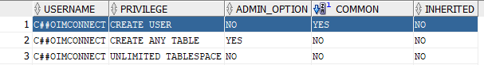

* **Supported versions:** 11g (Release 2), 12c and 19c

**User permission pre-requisites list:**

**System Privilege**

| **Privilege**        | **Installation**         | **Upgrading** | **Running** |
| -------------------- | ------------------------ | ------------- | ----------- |
| CREATE SESSION       | Yes \[WITH ADMIN OPTION] | Yes           | Yes         |
| EXECUTE ANY TYPE     | Yes \[WITH ADMIN OPTION] | Yes           | Yes         |
| CREATE ANY PROCEDURE | Yes \[WITH ADMIN OPTION] | Yes           |             |
| CREATE USER          | Yes                      |               |             |
| CREATE ANY TABLE     | Yes \[WITH ADMIN OPTION] | Yes           |             |
| CREATE ANY VIEW      | Yes \[WITH ADMIN OPTION] | Yes           |             |
| QUERY REWRITE        | Yes \[WITH ADMIN OPTION] | Yes           | Yes         |
| SELECT ANY TABLE     | Yes \[WITH ADMIN OPTION] | Yes           | Yes         |
| GLOBAL QUERY REWRITE | Yes \[WITH ADMIN OPTION] | Yes           | Yes         |
| ALTER ANY TABLE      | Yes \[WITH ADMIN OPTION] | Yes           |             |
| DROP ANY TABLE       | Yes \[WITH ADMIN OPTION] | Yes           |             |
| CREATE ANY INDEX     | Yes                      | Yes           |             |
| INSERT ANY TABLE     | Yes                      | Yes           | Yes         |
| UPDATE ANY TABLE     | Yes                      | Yes           | Yes         |
| DELETE ANY TABLE     | Yes                      | Yes           | Yes         |
| DROP ANY VIEW        | Yes \[WITH ADMIN OPTION] | Yes           |             |
| ALTER ANY PROCEDURE  | Yes \[WITH ADMIN OPTION] | Yes           |             |
| LOCK ANY TABLE       |                          | Yes           |             |
| DROP ANY INDEX       |                          | Yes           |             |
| DROP ANY PROCEDURE   | Yes \[WITH ADMIN OPTION] | Yes           |             |
| CREATE ANY DIRECTORY | Yes \[WITH ADMIN OPTION] | Yes           |             |

* For seamless running of <code class="expression">space.vars.SITENAME</code>, the permissions mentioned for installation and upgrade only can be revoked.
* The default installation of <code class="expression">space.vars.SITENAME</code> with Oracle:
  * Two users are created by <code class="expression">space.vars.SITENAME</code>: `opshub` and `reportsdb`.
  * The user through which the database is connected will perform the following:
    * Create these users. Hence, `CREATE USER` permission is required at the installation time.
    * Grant certain permissions to these users (`opshub` and `reportsdb`) to connect with their database and create the required data in their database. Hence, `WITH ADMIN OPTION` is required.
    * Perform certain operations on the resources of these two users. Hence, it requires `ANY*` permissions.
* In the advanced installation, if <code class="expression">space.vars.SITENAME</code> is going to be installed with the option of the [manual creation of the database](../../getting-started/installation.md#manual-creation-of-the-databases), then:
  * One of the users (`opshub` or `reportsdb`) can be used to connect with the Oracle database and perform all the operations.
  * In this case, `CREATE USER` privilege can be omitted, and only `SELECT ANY TABLE` privilege would require `WITH ADMIN OPTION` during installation.
* It is recommended to create a database manually for a high-security environment. The credentials are used as input to create two new users during the installation, so `CREATE USER` permission is required.\
  If any permission regarding creating a user is missing, then <code class="expression">space.vars.SITENAME</code> will print the password through SQL query.\
  'Create schema' approach was considered, but as Oracle doesn't allow creating schemas alone, we have to go with the 'Create User' approach.
*   If installation is to be done in the **cdb$root container of CDB instance**, then the connection user should have the commonly granted `CREATE USER` permission.\
    To achieve this, the `container=ALL` clause needs to be used while granting the permission.\
    The sample query for creating the user:

    `CREATE USER c##username IDENTIFIED BY password container=ALL;`
* After the user is created, the permission should be verified with the following query:\
  `SELECT * FROM USER_SYS_PRIVS;`
*   Find the below screenshot which shows correct permission for CREATE USER privilege:

    

***

### **SQL script to grant/validate/revoke User permission:**

| **Operation** | **SQL Queries**                                                                                                                                                                                                                                                                                                                                                                                                                                                                     |
| ------------- | ----------------------------------------------------------------------------------------------------------------------------------------------------------------------------------------------------------------------------------------------------------------------------------------------------------------------------------------------------------------------------------------------------------------------------------------------------------------------------------- |
| **Grant**     | 
<code>GRANT CREATE SESSION, EXECUTE ANY TYPE, CREATE ANY PROCEDURE, CREATE ANY TABLE, CREATE ANY VIEW, QUERY REWRITE, SELECT ANY TABLE, GLOBAL QUERY REWRITE, ALTER ANY TABLE, DROP ANY TABLE, DROP ANY VIEW, ALTER ANY PROCEDURE, DROP ANY PROCEDURE, CREATE ANY DIRECTORY TO username WITH ADMIN OPTION;</code>  <code>GRANT CREATE USER, CREATE ANY INDEX, INSERT ANY TABLE, UPDATE ANY TABLE, DELETE ANY TABLE, LOCK ANY TABLE, DROP ANY INDEX TO username;</code>
 |
| **Validate**  | `SELECT * FROM USER_SYS_PRIVS;`                                                                                                                                                                                                                                                                                                                                                                                                                                                     |
| **Revoke**    | `REVOKE CREATE ANY PROCEDURE, CREATE USER, CREATE ANY TABLE, CREATE ANY VIEW, ALTER ANY TABLE, DROP ANY TABLE, CREATE ANY INDEX, DROP ANY VIEW, ALTER ANY PROCEDURE, LOCK ANY TABLE, DROP ANY INDEX, DROP ANY PROCEDURE, CREATE ANY DIRECTORY FROM username;`                                                                                                                                                                                                                       |
