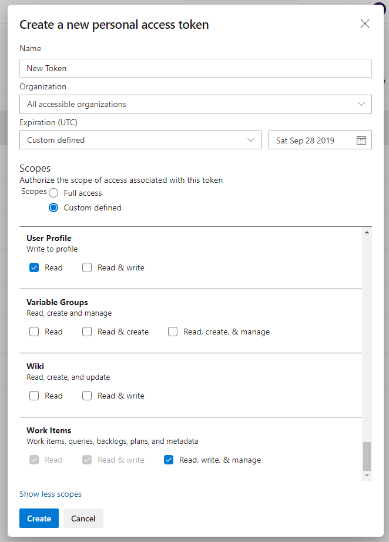
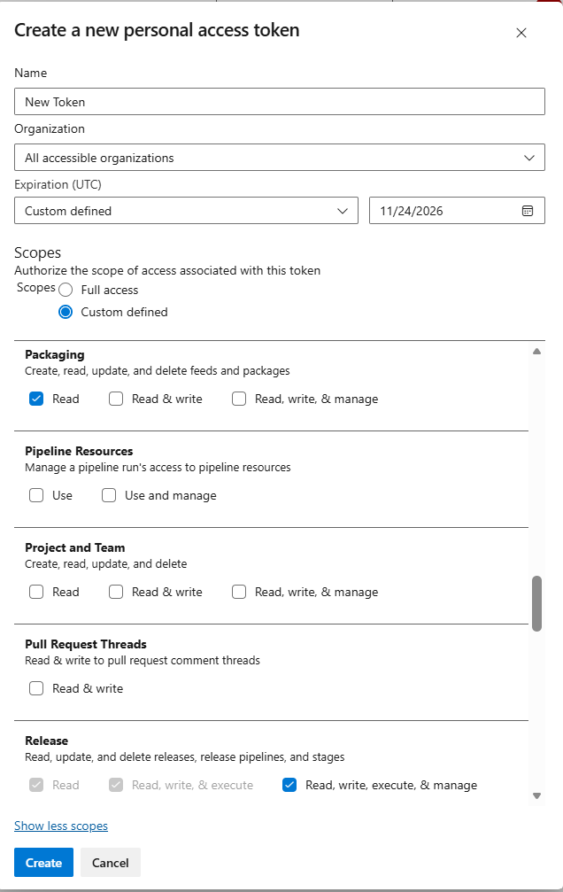

These are the common privileges for **user**. To know specific privileges required for user, refer to [User Privileges](https://github.com/OpsHubProduct/OIM-Documentation/blob/main/docs/.gitbook/includes/tfs-prerequisites.md#user-privileges).

* Add a user in Azure DevOps that is dedicated for <code class="expression">space.vars.SITENAME</code>. This user shouldn't perform any other action from Azure DevOps user interface. Please make sure this user or Service Principal has a unique display name across the instance.
* User must be a member of **Project Administrators** group for work item entities and Build entity migration. For Meta entities like Group, User entities, integration user must be a member of **Project Collection Administrators** group or **Project Administrators** group. Refer section [How to Add User or Service Principal in group](../../connectors/azure-devops.md#how-to-add-user-or-service-principal-in-group).

> **Note**: If integration user is not a member of **Project Collection Administrators** group, collection level permissions will not be synchronized.

* **Bypass rules on work item updates** in Boards section of the permissions must be **Allow** to impersonate the comment author.

> If you are using Service Principal Authentication, the steps described above for user will be applicable for Service Principal Authentication. For more information refer to [Service Principal Privileges](https://github.com/OpsHubProduct/OIM-Documentation/blob/main/docs/.gitbook/includes/tfs-prerequisites.md#service-principal-privileges).

## User Privileges

* User can use **Basic** Authentication or **Personal Access Token** authentication method to communicate with API for Azure DevOps.
  * In case of **Personal Access Token** authentication, please check [Personal Access Token Permission](https://github.com/OpsHubProduct/OIM-Documentation/blob/main/docs/.gitbook/includes/tfs-prerequisites.md#personal-access-token-minimum-required-permission) section for the required permission details. Personal Access Token is supported for Team foundation Server On-Premise (TFS instance with **HTTPS** installation only) with version 2017 and above and Azure DevOps.
  * For On-Premises deployment, either Basic authentication or PAT authentication needs to be enabled on server. Please refer to [Internet Information Services(IIS) Configurations](https://github.com/OpsHubProduct/OIM-Documentation/blob/main/docs/.gitbook/includes/tfs-prerequisites.md#internet-information-services-iis-configurations) to learn more about enabling the Basic/PAT authentication in IIS.
* In case user want to synchronize User type fields of Azure DevOps with any other system with default <code class="expression">space.vars.SITENAME</code> generated mapping, it is necsessary that all users have their preferred e-mail address set in Azure DevOps.
* The user for both the source and target systems requires a minimum access level of **Basic + Test Plans** to synchronize both query-based and requirement-based suites. Additionally, the user of the target system must also have at least **Basic** access to synchronize new tags. Refer to the [Access Level](https://docs.microsoft.com/en-us/azure/devops/organizations/security/access-levels?view=azure-devops) documentation to know more about this access level or subscription for the user. Otherwise, Test Suite synchronization will be resulted in to job error/sync failure as "You are not authorized to access this API. Please contact your project administrator".
* If your Azure DevOps is configured with SSO, then the above mentioned privileges and permissions are sufficient.
* If Bypass Rules is set to **Yes** in the system configuration, make sure the user or Service Principal has the **Bypass rules on work item updates permission** set to Allow at the project level in Azure DevOps.

### Personal Access Token Minimum Required Permission

Refer [Create Personal Access Token](../../connectors/azure-devops.md#create-personal-access-token) section to learn about how to create Personal Access Token.

**For On-Cloud Deployment**

* For On-Cloud deployment, Personal Access Token should be created with **Full access** scope for entities such as Test Plan, Test Result, Test Suite, Test Run, Build, Team, User, Group & Permission. For other entities, user can create a Personal Access Token with **Full access** scope if possible, otherwise user can create Personal Access Token with **Custom defined** scope with essential permissions specified below.

**Least required permissions for all entity types (except Version Control and Git)**

| **Permission Types**          | **Required Permission Values** |
| ----------------------------- | ------------------------------ |
| Identity                      | Read & Manage                  |
| Member Entitlement Management | Read & Write                   |
| Project and Team              | Read, Write & Manage           |
| Service Connections           | Read, Write & Manage           |
| Work Items                    | Read, Write & Manage           |
| Graph                         | Read                           |

**Additional permissions for specific entities (except Version Control and Git)**

| **Entity Types**                           | **Permission Types** | **Required Permission Values** |
| ------------------------------------------ | -------------------- | ------------------------------ |
| Build                                      | Build                | Read                           |
| Test Case, Shared Parameters & Shared Step | Test Management      | Read & Write                   |
| Dashboard & Widget                         | Tokens               | Read & manage                  |

**Permissions required for Version Control and Git**

| **Permission Types** | **Required Permission Values** |
| -------------------- | ------------------------------ |
| Code                 | Full                           |
| Identity             | Read & Manage                  |
| Project and Team     | Read, Write & Manage           |
| Security             | Manage                         |

**Permissions required for Pipeline**

| **Permission Types** | **Required Permission Values** |
| -------------------- | ------------------------------ |
| Build                | Read & Execute                 |
| Secure Files         | Read                           |
| Task Groups          | Read                           |
| Variable Groups      | Read & Create                  |
| Agent Pools          | Read                           |

> **Note**: In case build pipeline is created with TFSGit as source code, you will need to provide additional permission for Git (as specified in Additional permissions for specific entities) data while creating Personal access token.

**Permissions required for Release Pipeline**

| **Permission Types**        | **Required Permission Values** |
| --------------------------- | ------------------------------ |
| Release                     | Read, Write, Execute, & Manage |
| Agent Pools                 | Read & Manage                  |
| Service Connections         | Read, Query, & Manage          |
| Variable Groups             | Read & Create                  |
| Work Items (Query)          | Read, Write, & Manage          |
| Build                       | Read & Execute                 |
| Packaging (Azure Artifacts) | Read                           |
| Deployment Groups           | Read & Manage                  |
| Secure Files                | Read                           |

**For On-Premises Deployment**

* Personal Access Token should be created with **Full access** scope for all entities if user is using On-Premises deployed server.


\### Service Principal Privileges

* It is applicable when the authentication mode is set to **Service Principal - Client Secret** or **Service Principal - Client Certificate**.
* When these authentication modes are selected, the supported entity types are: Work Items, Build, Pipeline, Areas, Iterations, Test Entities (Test Plan, Test Suite, Test Run, Test Result), Shared Parameter, Git Commit Information.

> **Note**: Entities not yet supported with Service Principal authentication: Pull Request, Query, Dashboard, Widget, User, Group, and Team.

* Azure DevOps collection must be connected to Microsoft Entra (Azure Active Directory) for which Service Principal is being used.
* Refer to [Secret key & Certificate](../../connectors/azure-devops.md#secret-key--certificate-in-microsoft-entra-azure-active-directory) section to generate **Secret key** or to upload **Certificate** in Microsoft Entra (Azure Active Directory).

