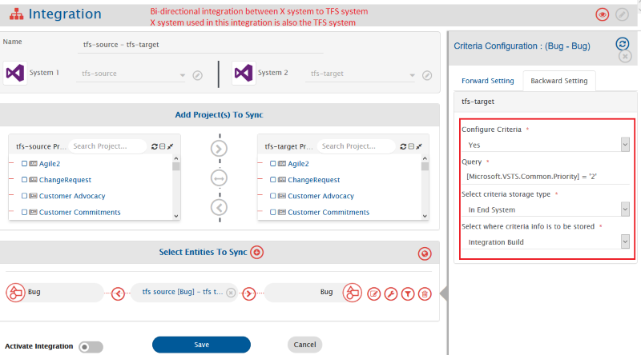
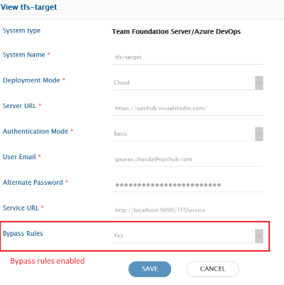
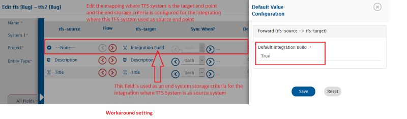

1. Inline images that are added using the Microsoft's "Test & Feedback" tool and identity images (user profile images) will not be synchronized.
2. When TFS\ADO is a source end point, any change performed in link/relationship among entities, will be synchronized to target with next Update on those entities.
   * Reason: ADO\TFS API Limitations.
3. If link/relationship's comment is updated in TFS/ADO, then this comment update will not be synchronized to the target system.
   * In above mentioned case, the processing failure will be observed in the <code class="expression">space.vars.SITENAME</code>.
4. Links of 'Build', 'Integrated in Release', 'Pull Request', 'Tag' (Repository Tag), 'Versioned Item', 'Wiki page', 'GitHub Commit', 'GitHub pull request' and 'GitHub Issue' are not supported.
5. Synchronization of Kanban Board field is supported for ADO/TFS version 2019 and above.
6. Comment Author details in case of 3-way integration with Team Foundation Server as middle system \[System 1 -> Team Foundation Server -> System 2]
   * This limitation is only applicable only in case integrations have more than 2 systems involved. For example, if we have 1 integration from System 1 to Team Foundation Server and then Team Foundation Server to System 2.
   * In this case, if Impersonation is configured for Team Foundation Server \[and in system configuration username given is IntegrationUser] and Changed By field is mapped in System 1 -> Team Foundation Server integration, then if user1 adds a comment in System 1 and if that gets synchronized to Team Foundation Server with user1 \[Assumption: user1 is present in System 1 and TFS], but the Team Foundation Server to System 2 will still have Comment author as IntegrationUser (Not user1).
7. Entity created by an integration user won't get polled if that particular entity does not meet the criteria.
   * This limitation is applicable when bi-directional integration is configured and the criteria is configured with an end system storage settings. Further, only if the bypass rule is enabled for the system Azure DevOps.
   * OIM polls the entity created by an integration user even though the entity does not meet the criteria. But due to certain API limitations this won't be possible for the system with above configuration.
   * Example: Suppose bi-directional integration is being configured between X system and TFS system. Further, criteria with end system storage is configured for the integration between **TFS Bug to X System Bug**, and the bypass rule is enabled for the TFS system used with integration between **X System Bug to TFS Bug**. Those entities which are created by OIM into TFS system via integration **X System Bug to TFS Bug** won't get polled by integration of **TFS Bug to X System Bug**, given those entities are not meeting the criteria configured for the integration **TFS Bug to X System Bug**. Refer the below screenshots for more clarity on the configuration along with the workaround.
   * **Workaround:** Edit the mapping of the **X System Bug to TFS Bug** to map the field used for an end system storage criteria setting on integration **TFS Bug to X System Bug** to -NONE- with value as 'True'.

8. For Team Foundation Server with version equal to or above 2017, the Remote URL will be different from the remote URLs of the older versions of Team Foundation Server. Also, for Azure DevOps, the Remote URLs will be different.
