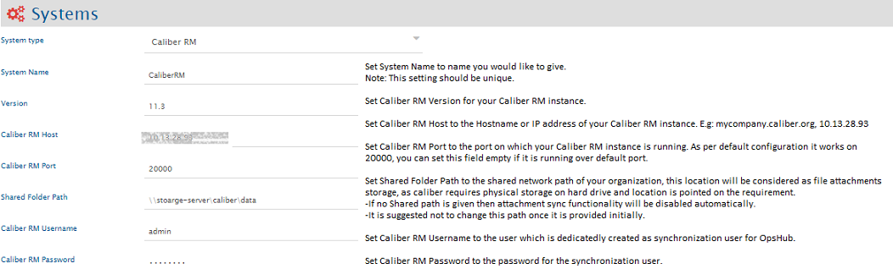

# OpenText Project and Portfolio Management(PPM)

## Prerequisites

### User Privileges

* Create one user for Caliber RM System, dedicated to <code class="expression">space.vars.SITENAME</code>. User should not be used to do any other operations from System's User-Interface.
* User should have access to the projects that are required to be integrated. For this, if user belongs to some group, then that group should have rights to access projects. This can be done with Administrator tool, by selecting a project and checking its Group Assignment.

### Additional Caliber RM Library Configuration

This configuration is required before creating mappings or integrations with Caliber RM.

* Stop the Server Service before making changes for this configuration.
* Copy all the jar files from the `<Caliber Installation Directory (Borland)>\CaliberRM SDK 11.3\lib` directory and put those jar files under `<OpsHub Installation Directory>\OpsHubServer\lib` directory.
* Start the Server Service.

### Limitations

* Criteria-based synchronization is not supported.
* Responsibilities assignment for group and member is not supported.
* Text References and Web References type of attachments are not supported.

## System Configuration

Before you continue to the integration, you must first configure Caliber RM. Click [System Configuration](../integrate/system-configuration.md) to learn the step-by-step process to configure a system. Refer the screenshot given below for reference.

If the system is deployed on HTTPS and a self-signed certificate is used, then you will have to import the SSL Certificate to be able to access the system from <code class="expression">space.vars.SITENAME</code>. Click [Import SSL Certificates](../getting-started/ssl-certificate-configuration.md) to learn how to import SSL certificate.

## Mapping Configuration

Map the fields between Caliber RM and the other system to be integrated to ensure that the data between both the systems synchronizes correctly.\
Click [Mapping Configuration](../integrate/mapping-configuration.md) to learn the step-by-step process to configure mapping between the systems.

## Integration Configuration

Set a time to synchronize data between Caliber RM and the other system to be integrated. Also, define parameters and conditions, if any, for integration.\
Click [Integration Configuration](../integrate/integration-configuration.md) to learn the step-by-step process to configure integration between two systems.
