# Codebeamer/Codebeamer X

## Pre-requisites

### User privileges

* Create one user in codebeamer/codebeamer X that is dedicated to <code class="expression">space.vars.SITENAME</code>. This user should not do any operations from the system's interface. This user should not do any operations from the system's interface. This user's timezone should be same as end system's server timezone. Refer to [Add User](codebeamer.md#add-user) section to create a user in codebeamer/codebeamerX.
* The user must be a member of all the projects that needs to be synchronized. To add a Project member refer to section [Add Project Member](codebeamer.md#add-project-member).
* The User group of user should have the following permissions. Refer to section [Add User Group](codebeamer.md#add-user-group) to create user group.
  * Own Account - Admin
  * Account - View Email Address
  * Group - View
  * Time Zone and Date Format - Edit if Owner
  * Rest / Remote API - Access
* The user should have below mentioned permissions over tracker. Please refer to [Add User Permission Over Tracker](codebeamer.md#add-user-permission-over-tracker) section to add user permissions over tracker.
  * Item - View Any
  * Item - Add
  * Item - Edit Any
  * Tracker - Mass Edit
  * Item - Close
  * Item - Delete
  * Item - History View
  * Item - View Comments/Attachments
  * Item - Add Comment/Attachment
  * Item - Edit Comment/Attachment - Own
  * Item - Edit Comment/Attachment - Any
  * Item - View Associations
  * Item - Edit Associations
* To synchronize Test case from any connector to codebeamer/codebeamer X, Integration User should be project admin and project admin role should have both read and edit permissions.

## System Configuration

Before you continue with the integration, you must first configure codebeamer/codebeamer X system in <code class="expression">space.vars.SITENAME</code>.

Click [System Configuration](../integrate/system-configuration.md) to learn the step-by-step process to configure a system.

Refer to the following screenshot for reference: **codebeamer**

<div align="center">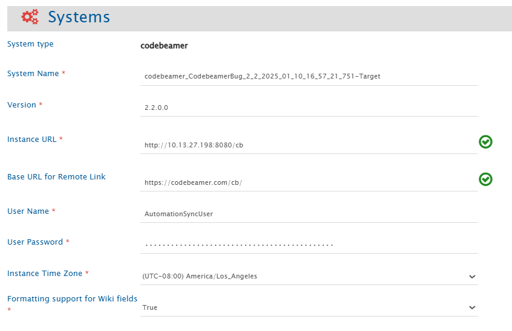</div>

**codebeamer X**

<div align="center">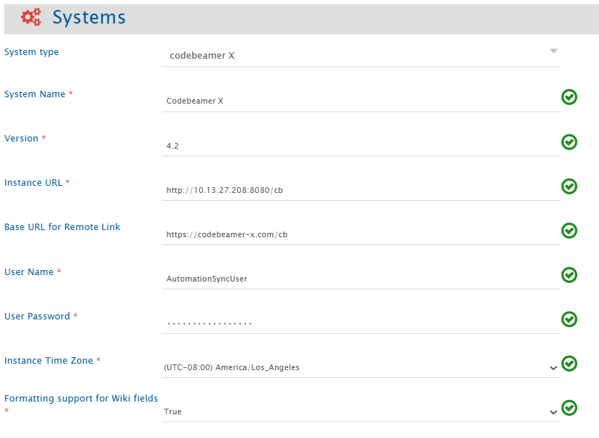</div>

### codebeamer/codebeamer X System Form Details

| **Field Name**                         | **When field is visible on the System form** | **Description**                                                                                                                                                                                                                                                                                                                                                                                                                                                                                                                                                                                                                                                                                                                                                                                                                                                                                                                                                                                                                                                                                                                                                                                                                                                                                                              |
| -------------------------------------- | -------------------------------------------- | ---------------------------------------------------------------------------------------------------------------------------------------------------------------------------------------------------------------------------------------------------------------------------------------------------------------------------------------------------------------------------------------------------------------------------------------------------------------------------------------------------------------------------------------------------------------------------------------------------------------------------------------------------------------------------------------------------------------------------------------------------------------------------------------------------------------------------------------------------------------------------------------------------------------------------------------------------------------------------------------------------------------------------------------------------------------------------------------------------------------------------------------------------------------------------------------------------------------------------------------------------------------------------------------------------------------------------- |
| **System Name**                        | Always                                       | Provide codebeamer/codebeamerX System Name                                                                                                                                                                                                                                                                                                                                                                                                                                                                                                                                                                                                                                                                                                                                                                                                                                                                                                                                                                                                                                                                                                                                                                                                                                                                                   |
| **Version**                            | Always                                       | Provide the version for the codebeamer/codebeamerX system. Refer to section [Find version of codebeamer/codebeamerX Instance](codebeamer.md#find-version-of-codebeamer-codebeamer-x-instance), to determine the version of codebeamer/codebeamerX system.                                                                                                                                                                                                                                                                                                                                                                                                                                                                                                                                                                                                                                                                                                                                                                                                                                                                                                                                                                                                                                                                    |
| **Instance URL**                       | Always                                       | Provide Server URL of the codebeamer/codebeamerX instance. This URL will be used for communicating with codebeamer/codebeamerX system API. The format of the URL would be: `http://[host name]:[port no]/cb` or `http://[your_domain_name]/cb`. Example: `http://10.13.27.200:8080/cb` or `http://10.13.27.208:8080/cb`.                                                                                                                                                                                                                                                                                                                                                                                                                                                                                                                                                                                                                                                                                                                                                                                                                                                                                                                                                                                                     |
| **Base URL for Remote Link**           | Always                                       | <p>Provide different Instance URL of the codebeamer/codebeamerX instance. This URL is used for generating the Remote Link. For example, if the Instance URL is <code>http://10.11.152.136:8080/cb</code> or any API node URL, but Remote Link needs to be generated with a different Instance URL such as <code>http://domain.com:8080/cb</code>.<br><strong>Note</strong>:If "Base URL for Remote Link" is empty, It will use Instance/Server URL to generate Remote Link if configured on Integration.</p>                                                                                                                                                                                                                                                                                                                                                                                                                                                                                                                                                                                                                                                                                                                                                                                                                 |
| **User Name**                          | Always                                       | Provide the username of a dedicated user who will be used for communicating with codebeamer/codebeamerX API. This user should have the required privileges as mentioned in section, [User privileges](codebeamer.md#user-privileges).                                                                                                                                                                                                                                                                                                                                                                                                                                                                                                                                                                                                                                                                                                                                                                                                                                                                                                                                                                                                                                                                                        |
| **User Password**                      | Always                                       | Enter password of the user added above.                                                                                                                                                                                                                                                                                                                                                                                                                                                                                                                                                                                                                                                                                                                                                                                                                                                                                                                                                                                                                                                                                                                                                                                                                                                                                      |
| **Instance Time Zone**                 | Always                                       | <p>Provide the codebeamer/codebeamerX instance's timezone.<br><strong>Note</strong>:The instance's timezone and the service user's timezone should be same. To verify the user's timezone, navigate to <code>System Administration / Server Status Dashboard / JVM system properties / user.timezone</code>.</p>                                                                                                                                                                                                                                                                                                                                                                                                                                                                                                                                                                                                                                                                                                                                                                                                                                                                                                                                                                                                             |
| **Formatting support for Wiki fields** | Always                                       | <p>Select <strong>True</strong> if you want to enable synchronization of formatting for the 'Wiki' fields of codebeamer/codebeamerX instances.<br>This step involves an additional action of placing a JAR file on the codebeamer/codebeamerXs' server.<br>To obtain this JAR, there are two approaches outlined below:<br><strong>Approach 1</strong>: Use the JAR already built by OpsHub. Refer to <a href="codebeamer.md#wiki-formatting-jar-download">Wiki formatting JAR download</a> section below to download the correct JAR based on your Codebeamer version.<br><strong>Approach 2</strong>: Build your own JAR. Refer to the steps for <a href="codebeamer.md#how-to-generate-the-html-to-jspwiki-conversion-jar">How to generate conversion JAR</a>.<br>Copy the JAR file to the <code>&#x3C;CB_INSTALLATION>/tomcat/webapps/cb/WEB-INF/lib</code> folder, and then restart the codebeamer/codebeamerX server to apply the changes.<br>Select <strong>False</strong> if you do not want to enable the synchronization of formatting for Wiki fields. In this case, the Wiki field's value will be displayed as plain text when synchronizing the Wiki fields to codebeamer/codebeamerX. For more details, please refer to <a href="codebeamer.md#known-limitationsbehavior">Known Limitations/Behavior</a>.</p> |

### Wiki Formatting JAR Download

Download the JAR file that matches your Codebeamer version.

| Codebeamer Version            | Download                                                                                                                                                                                                            |
| ----------------------------- | ------------------------------------------------------------------------------------------------------------------------------------------------------------------------------------------------------------------- |
| Versions earlier than **3.2** | Click [here](https://opshubtrial-my.sharepoint.com/:u:/g/personal/support_opshub_com/EVFSOUYC091GttarNbMULEoBVPpTsljgG-sYLbdlLrINJA?e=R3tCBq) to download the jar                                                   |
| **3.2.x**                     | Click [here](https://opshubtrial-my.sharepoint.com/:u:/g/personal/support_opshub_com/IQDn8HqgOp1yTaCU15Yff5CnAW_iJLYW-7GpLeUGLoW-wsw?e=r5rSKF) to download the jar                                                  |
| Versions later than **3.2.x** | Pre-built JAR is not available for these versions, but you can easily build your own JAR. Refer to the steps for [How to generate conversion JAR](codebeamer.md#how-to-generate-the-html-to-jspwiki-conversion-jar) |

## Mapping Configuration

Map the fields between codebeamer/codebeamer X and the other system to be integrated to ensure that the data between both the systems synchronize correctly.

Click [Mapping Configuration](../integrate/mapping-configuration.md) to learn the step-by-step process to configure mapping between the systems.

### Test Step Field Configuration

For mapping additional fields for test steps like 'Critical' and other custom fields, advance XSLT will be modified. Add the following sample xslt in default xslt to map additional fields:

```xml
<xsl:element name="additionalFields">
    <xsl:element name="Id">
        <xsl:value-of select="additionalFields/Id"/>
    </xsl:element>
    <xsl:element name="Critical">
        <xsl:value-of select="additionalFields/Critical"/>
    </xsl:element>
    <xsl:element name="Additional_Field_Name">
        <xsl:value-of select="additionalFields/Additional_Field_Name"/>
    </xsl:element>
    <xsl:element name="MutiValued_Additional_Field_Name">
        <xsl:for-each select="additionalFields/MutiValued_Additional_Field_Name/string">
            <fieldvalue>
                <xsl:value-of select="text()"/>
            </fieldvalue>
        </xsl:for-each>
    </xsl:element>
</xsl:element>
```

> **Note**: For Test Step field all the columns must have some value. Null value or empty string will work only for text and lookup fields, not for integer, decimal, duration, boolean or date fields. `codebeamer/codebeamerX` will throw an error if fields or their values are absent. Based on this, the user can provide advance XSLT which provides default values as well.

### Synchronizing Test Step Results Field

* The "Test Step Results" field of the Test Run entity's behaviour as in `codebeamer/codebeamerX`:
  * When a test run is created, `codebeamer/codebeamerX` creates a child run for each associated test case, and the original run serves as the Parent(Main) Run.
  * When `codebeamer/codebeamerX` is the target system in <code class="expression">space.vars.SITENAME</code>:
    * <code class="expression">space.vars.SITENAME</code> will consider the test steps available at the time of Test Run creation to update the test step result. Consequently, the source system's test step data will be discarded. If the number of test steps to be updated differs from the test steps on the targeted Test Runs, the <code class="expression">space.vars.SITENAME</code> will fail to update the Test Step Results.
      * Reason: Test Step Results are associated with the specific version of the test case. Hence, only Test Step Results can be updated, and the original test steps cannot be updated.
    * If the "Test Step Results" need to be updated more than once, ensure that the <code class="expression">space.vars.SITENAME</code> is configured in a way that the status is updated to a valid value to allow further updates to the Test Step Result. It can be achieved using the [Workflow Transition](../integrate/mapping-configuration.md#workflow-transition).
      * Reason: Test Step Results can be updated only when the Parent (Main) Test Run and Child Test Run are not in a Finished, Suspended, or Closed state. Additionally, once the Test Step Results are updated, `codebeamer/codebeamerX` sets the status of the test run to "Finished", which means it cannot be updated until it is restarted/ its status is updated.

> **Note**: Since `codebeamer/codebeamerX` creates the child test run, configure the Status field settings with the "Set" distribution rule so the Child Test Run's status can also be updated based on the status of the Parent Test Run.

* The below functionalities are not supported for this field:
  * Test Step Results for a test run with multiple test case linkages.
  * Inline file/image synchronization
  * Reconciliation

### Synchronizing the Emojis

* When the codebeamer is the source system, advanced mapping is required for the synchronization of emojis of HTML fields.
* Given below is the sample advanced mapping for synchronizing the smile emoji from codebeamer to Visual Studio Team Services(ADO).

```xml
 <Repro-space-Steps xmlns:xsl="http://www.w3.org/1999/XSL/Transform">    
       <xsl:variable name="Description" select="SourceXML/updatedFields/Property/Description"/>
       <xsl:value-of select="replace($Description,'','&amp;#128522;')"/>
</Repro-space-Steps>
```

> **Note**:In the advanced mapping, the emoji image will be replaced by the target format of specified emoji image. For multiple image occurances, they all must be replaced by target format of emojis.

### Comments and Attachments Configuration

Comments and Attachments do not exist independently. These are added through a section on a tracker named **Comments/Attachments**

* If both comments and attachments are mapped in Mapping Configuration, then inline image inside comments will be synchronized to target along with attachments.
* If only comments are mapped in Mapping Configuration, then only comments will be synchronized along with inline images inside comments. If there are comments which have attachments, but they are not inline, then they will not be synchronized.
* If only attachments are mapped in Mapping Configuration then no comments will be synchronized. Only attachments will synchronize to the target system.

### Relationship Configuration

In codebeamer/codebeamerX, Associations and Reference fields will be supported as relationships.

#### Associations

* All associations will be synchronized as links to the target system.
* On <code class="expression">space.vars.SITENAME</code> User Interface, for every association type, two link types will be shown.
* Associations added by marking Reverse Order check box on codebeamer/codebeamerX User Interface (refer to the following screenshot) will be marked as "\<association\_name> (reverse order)" on <code class="expression">space.vars.SITENAME</code> User Interface.
* Associations added without marking Reverse Order check box on codebeamer/codebeamerX User Interface will be marked as "\<association\_name>" on <code class="expression">space.vars.SITENAME</code> User Interface.

<div align="center">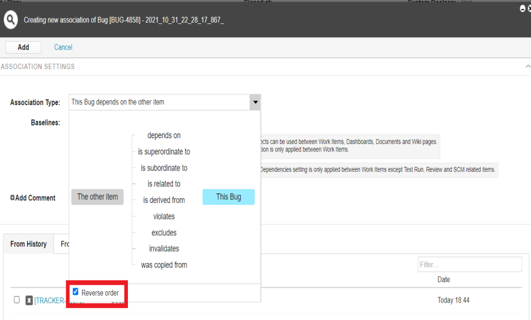</div>

<div align="center">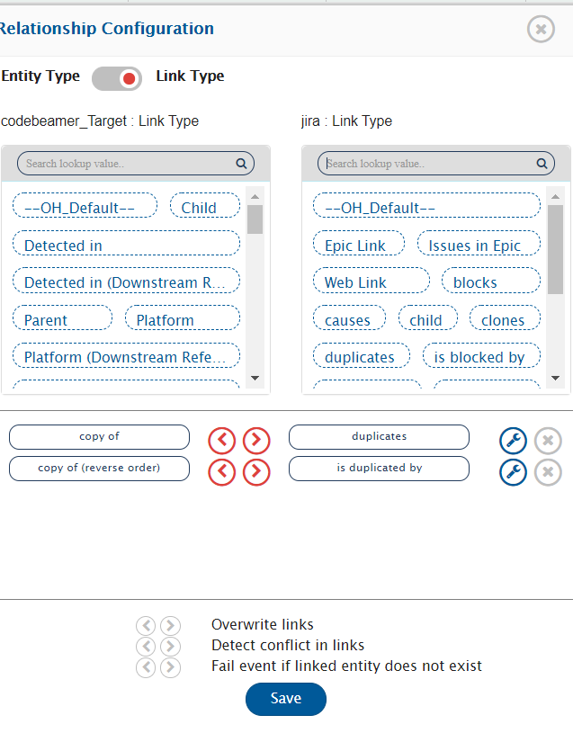</div>

#### Reference fields

* Reference fields are the fields that refer to some other codebeamer/codebeamerX entity.
* Reference fields will be synchronized through relationships. For references, the names of the Reference fields will be shown in link type mapping of the Relationship Configuration, as shown in screenshot below:

<div align="center">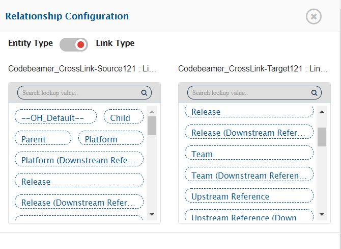</div>

* Custom reference field's name would also be shown in the link types.
* For synchronizing reference fields value, map the reference field as links, as shown in screenshot below:

<div align="center">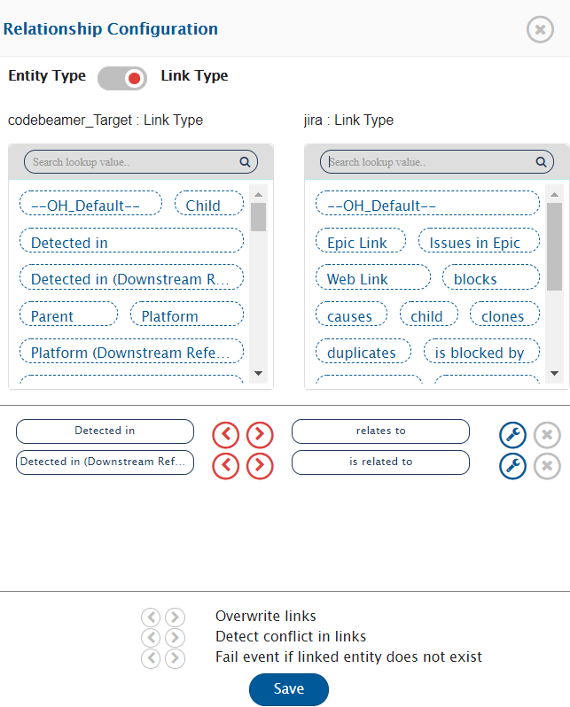</div>

> **Note**: Reference fields in field mapping will be read-only fields.

#### Mapping for Entity mention field

* When codebeamer/codebeamerX is configured as source system in the integration and its field/comment type is rich text (HTML), then the entity mention synchronization is supported.
* Click on [Mention-Setting](../integrate/mapping-configuration.md#mention-setting) to know more about entity mention mapping and synchronization behavior in general.

### Advance Workflow Transition

To understand the need for handling workflow transition in codebeamer/codebeamerX, let us take an example: A 'Bug' in codebeamer/codebeamerX, when created should have 'New' status. It's status can then be set to 'Verified' or 'In progress' or 'Closed'. But it's status cannot be directly marked as 'Closed' from 'Verified' state because of the state transition constraints configured through codebeamer/codebeamerX tracker state transition.

Here is the diagram for this example:

<div align="center">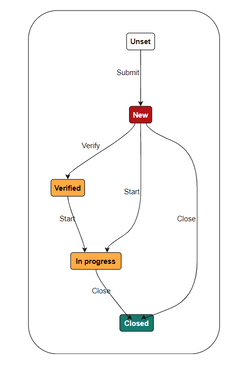</div>

In such scenarios, simply mapping State field and their look-up values can cause failure(s). If a codebeamer/codebeamerX Bug is in 'Verified' state and through the integration the status of it is attempted to be updated to 'Closed', codebeamer/codebeamerX will throw an error that the possible transition for codebeamer/codebeamerX Bug is from 'Verified' to 'In progress' and then from 'In progress'' to 'Closed'.

#### Solution for handling workflow transition

This issue can be resolved by following any of these approaches:

**1. Add/Edit Workflow transition XML in Mapping configuration of** <code class="expression">space.vars.SITENAME</code>

Click [Workflow Transition](../integrate/mapping-configuration.md#workflow-transition) to learn when and how to configure workflow transition xml mapping. With this option, <code class="expression">space.vars.SITENAME</code> makes the required intermediate status transition automatically as per the transition(s) configuration on the end system.

**2. Add State Transitions in codebeamer/codebeamerX** For step-by-step instructions for configuring any-to-any transition refer: [Configure a new State Transition](codebeamer.md#configure-a-new-state-transition).

### Mapping for Soft Delete Configuration

* When Codebeamer is the target system in the integration, the Soft Delete operation is performed by default in the synchronization of the [Source Delete event](../integrate/source-delete-synchronization.md).
* After the Soft Delete operation is performed by <code class="expression">space.vars.SITENAME</code> in Codebeamer, the entity will be deleted in the Codebeamer. It can be found in the "Trash" of the corresponding project, where it existed earlier.
* To only enable the Logical Delete operation in the target, "OH Soft Delete" field should be mapped with the default value, "No" in the [Delete Mode](../integrate/mapping-configuration.md#delete-mode) mapping.

### Rank

* Codebeamer allows to organize the tracker items in tree structure. To synchronize the tracker items maintaining the tree structure, below configurations need to be performed in <code class="expression">space.vars.SITENAME</code>.
  * Configure the **Hierarchy Child** and **Hierarchy Parent** relationship as per the standard [relationship configuration](../integrate/mapping-configuration.md#relationships).
  * Enable the rank synchronization, as described in [Rank configuration](../integrate/mapping-configuration.md#configuration) section.
    * Here make sure, the overwrite option is enabled for the Codebeamer system for OH ENABLE RANK field.

**Known Limitations**:

* When Codebeamer is configured as the source system in <code class="expression">space.vars.SITENAME</code>:
  * When rank change is performed on tracker item within same parent item, any field needs to be updated after changing the rank of the tracker item.
    * Reason: When rank is changed for any tracker item within the same parent, neither its **Updated** time is changed nor revision gets generated in codebeamer.

### Mapping For Test Run

* Codebeamer allows the creation of only a Test Run (Parent). The corresponding Test Run (Child), which contains the result information, is automatically generated.
* <code class="expression">space.vars.SITENAME</code> supports independent synchronization of both entities. To configure this, set the appropriate field value for Test Run Type (for writing) and define the Criteria (for reading):
  * **Test Run (Parent)**
    * To read only the Test Run (Parent), set the criteria as: parentId IS NULL
    * To create a Test Run (Parent), set the **Test Run Type** to **Parent**
  * **Test Run (Child)**
    * To read only the Test Run (Child), set the criteria as: parentId IS NOT NULL
    * To create a Test Run (Child), set the **Test Run Type** to **Child**
      * Additionally, configure the **Parent Test Run** relationship. This is not a mandatory link type for Child creation, but if it's defined and contains valid data, <code class="expression">space.vars.SITENAME</code> will not create a new child. Instead, it will locate the automatically generated Test Run (Child) under the specified parent and update it.
      * If this relationship is not configured, <code class="expression">space.vars.SITENAME</code> will first create a new Test Run (Parent) and then update the Test Run (Child). The source entity will always be associated with the Test Run (Child), based on the Test Run Type being set to Child.

## Integration Configuration

In this step, set a time to synchronize data between codebeamer/codebeamerX and the other system to be integrated. Also, define parameters and conditions, if any, for integration.

Refer to [Integration Configuration](../integrate/integration-configuration.md) to learn the step-by-step process to configure the integration between two systems.

<div align="center">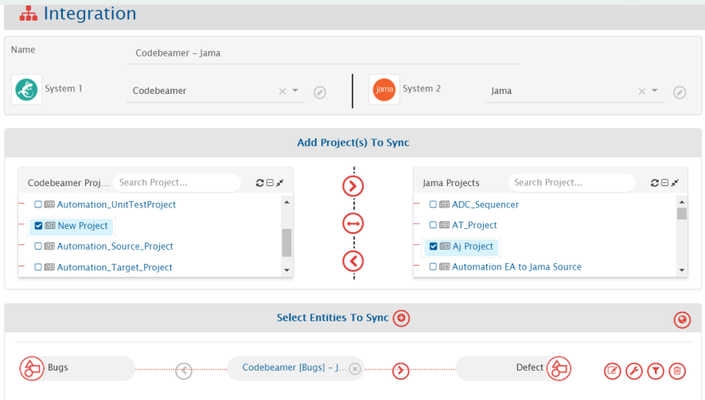</div>

### Criteria Configuration

If you want to specify conditions for synchronizing an entity between codebeamer/codebeamerX and the other system to be integrated, you can use the Criteria Configuration feature.

Go to Criteria Configuration section in [Integration Configuration](../integrate/integration-configuration.md) page to learn in detail about Criteria Configuration.

To configure criteria in codebeamer/codebeamerX, integration needs to be created with codebeamer/codebeamerX as the source system. Set the **Query** as per cbQL Format.

* If field is of lookup type, then criteria query will be like `projectId.trackerId.fieldName = 'field-value'` or `workspaceId.trackerId.fieldName = 'field-value'`.
* To find out Tracker ID, refer to section [How to find Tracker Id](codebeamer.md#how-to-find-tracker-id).
* For custom fields: `trackerTypeId.customFieldPropertyName = 'field-value'`
* For custom Choice fields: `projectId.trackerTypeId.customFieldPropertyName = 'field-value'` or `workspaceId.trackerTypeId.customFieldPropertyName = 'field-value'`
  * To find out custom field property name, refer to section [Find Custom Field Property Name](codebeamer.md#find-custom-field-property-name)
* To know more about cbQL query in codebeamer/codebeamerX, refer to: [cbQL in codebeamer/codebeamerX](https://codebeamer.com/cb/wiki/871101)

**Criteria samples**

| **Field Type**          | **Criteria Description**                                                                                                                                                                      | **Criteria snippet**                               |
| ----------------------- | --------------------------------------------------------------------------------------------------------------------------------------------------------------------------------------------- | -------------------------------------------------- |
| **Lookup**              | Synchronizes all the entities having priority as "High". Here, 1 is codebeamer/codebeamer X's project/workspace id and 2 is tracker's id.                                                     | `'1.2.priority' = 'High'`                          |
| **Date**                | Synchronizes all the entities whose startDate is greater than the given date.                                                                                                                 | `startDate > '2021-01-01'`                         |
| **Text**                | Synchronizes all the entities containing 'item' within Summary field.                                                                                                                         | `summary LIKE '%item%'`                            |
| **User**                | Synchronizes all the entities assigned to user with id 3. Refer to section [Determine User ID](codebeamer.md#determine-user-id)                                                               |                                                    |
| to find id of user.     |                                                                                                                                                                                               |                                                    |
| **User** and **Lookup** | Synchronizes all the entities which are assigned to user with id 3 and has 'Priority' as 'High'. Here, 1 is codebeamer/codebeamer X's project/workspace id and 2 is tracker's id.             | `assignedTo = 3 and '1.2.priority' = 'High'`       |
| **Lookup** or **Text**  | Synchronizes all the entities having Priority as 'High' or containing 'item' within Summary field. Here, 1 is codebeamer/codebeamer X's project/workspace id and 2 is tracker's id            | `'1.2.priority' = 'High' or summary LIKE '%item%'` |
| **Custom Field**        | Synchronizes all the entities belonging to tracker type 1, whose field with Property Name as customField\[1] has value 'Verified'                                                             | `'1.customField[1]' = 'Verified'`                  |
| **Custom Choice Field** | Synchronizes all the entities belonging to codebeamer/codebeamer X project/workspace having Id as 1 and tracker type 2, whose field with Property Name as choiceList\[1] has value 'Option A' | `'1.2.choiceList[1]' = 'Option A'`                 |

> **Note**: For the integration with multiple projects configuration, query specific to each configured project/workspace can be combined using `or`.

### Target LookUp Configuration

* Provide query in Target Search Query such that it is possible to search the entity in the codebeamer/codebeamer X as target system. Set the **'Query'** as per cbQL Format.
  * Syntax: \[Target Field] = @\[Source-Field-Name]@
  * Replace \[Target Field] as per the cbQL query.
* To know more about cbQL query in codebeamer/codebeamer X, refer to this link: [cbQL in codebeamer/codebeamer X](https://codebeamer.com/cb/wiki/871101).

**Sample queries:**

*   **Target Lookup Query for the constraint on the `single field`:**

    `Summary = '@Summary@'`

    **Description**: It represents the query, which will select entities whose Summary field value is same as the value of the Source system's Summary.
*   **Target Lookup Query for the constraint on the `multiple fields`:**

    * If the user needs to query on multiple fields, the user can provide multiple field values separated by **AND** or **OR** operators.

    `Summary = '@Summary@' and startDate = '@Start Date@'`

    **Description**: This query will select entities whose Summary field value is same as the value of the Source system's Summary and Start Date is same as value mentioned in Start Date of Source System.
*   **Target Lookup Query for the constraint on the `custom field`:**

    * Syntax: `'trackerTypeId.customFieldPropertyName' = '@[Source-Field-Name]@'`
    * To find out custom field property name, refer to section [Find Custom Field Property Name](codebeamer.md#find-custom-field-property-name)

    `'16869.customField[1]' = '@oh_internal_id@'`

    **Description**: It represents the query, which will select entities belonging to tracker type 16869, whose field with Property Name as customField\[1] has value same as the value of the Source system's entity id.

## Known Limitations/Behavior

1. Once the tracker is configured in the <code class="expression">space.vars.SITENAME</code>, it must not be renamed or else the integration configured for that tracker item would be invalid.
2. Following tracker item types/entities will not be supported:
   * **Working Sets** (earlier known as Branches): Synchronize is only applicable for Master Branch. All the revisions which are done on the tracker item in the master (merge operations or normal revisions) will be synchronized.
   * **Baselines**: Synchronize will not consider the Baselines and will be only considering the HEAD\Default Baseline.
   * **SCM commits and repositories**: Any SCM related entities such as SCM commits or Pull requests will not be supported.
   * **Wiki pages and documents**: Non ALM type of entities such as wiki pages and documents will not be supported.
   * **Timekeeping tracker types (Worklogs)** will not be supported.
3. Currently, Table type fields are not supported.
4. Adding an association does not change the modified time of the entity. Hence, entity's associations will not synchronize until the next update on the entity updates its modified time.
5. JSPWiki fields will be shown as HTML in <code class="expression">space.vars.SITENAME</code>.
6. When codebeamer is the source system in <code class="expression">space.vars.SITENAME</code>, and the content or name of inline image/file in JSPWiki field contains special characters like `•, €, £, ¥, ©, ®, ™, µ, α, β, π, Ω, Σ, °, Δ, ☺, ♥, ₹, ¿, ¡, …, À, à , Â, Ã, Ä, Å, Æ, Ç, È, É, Ê, Ë, Ì, à , Î, à , Ñ, Ò, Ó, Ô, Õ, Ö, Ù, Ú, Û, Ü, ß, à , á, â, ã, ä, å, æ, ç, è, é, ê, ë, ì, í, î, ï, ñ, ò, ó, ô, õ, ö, ù, ú, û, ü, ÿ, Ğ, ğ, İ, ı, Œ, œ, Ş, ş, Ÿ,` etc, then due to API limitations, such characters might get lost during the synchronization. Additionally, formatting of the content will also not be preserved.
7. Lookup values for **Repository Choice field** will not be loaded. If the field is mapped and contains a value, then its value will be synchronized as plain text.
8. Currently, only Wiki is supported as Description format.
9. History for Test Step will not be synchronized. Test Step will be synchronized in the current state only.
10. For test runs, mapping **Test case link** is mandatory.
11. A link to another entity can be added multiple times on the same entity using different link types. In codebeamer/codebeamer X’s case, only the latest link type is returned, and so only that will be synchronized.
12. Inline documents will not be synchronized to codebeamer/codebeamer X.
13. History for attachments and links is not supported. They will be synchronized in the current state only.
14. **Read-only Fields**: There's no API that can be used to find read-only fields, so some fields may be shown as writable even when they are read-only.
15. **Calculated Fields**: Calculated fields are read-only from User Interface, hence they will be read-only.
16. **Mandatory Fields**: In codebeamer/codebeamer X, there are two ways in which a field can be set as mandatory:
    * **Mandatory in Status**:
      * Fields mandatory in all statuses:
        * Fields that are mandatory across all statuses are treated as globally mandatory.
        * A value for these fields must be provided in <code class="expression">space.vars.SITENAME</code> either by:
          * Setting a default value for this field, or
          * Mapping it from the source system
        * If a value is not provided, the sync will fail with an error message:
          * OH-Connector-0059: Error occurred while processing entity, because "ReferenceField" is mandatory for Bugs. Either it is not configured in issue relationship panel or configured link entity is not found.
      * Fields mandatory in specific statuses only:
        * Fields that are mandatory in only certain statuses are treated as non-mandatory by default in <code class="expression">space.vars.SITENAME</code>
        * Their mandatory behavior is enforced only during specific workflow transitions.
        * To enforce mandatory conditions for specific statuses, configure Workflow Transition mappings. Refer to: [Workflow Transition](../integrate/mapping-configuration.md#workflow-transition) for details on XML mapping.
        * Reference fields (fields linking to other items)
          * If a reference field is mandatory in a specific workflow step, a business validation error may occur if the value is not syncing to codebeamer/codebeamer X with error message: "Mandatory field value is missing"
          * This happens because <code class="expression">space.vars.SITENAME</code> does not enforce these mandatory rules by itself for workflow-specific fields; the end system enforces them.
          * To prevent errors, ensure the appropriate relationship or reference mappings are correctly set in <code class="expression">space.vars.SITENAME</code>.
    * **Mandatory if**: Uses a computed formula to determine if the field is mandatory. These cannot be retrieved through API and hence will be shown as non-mandatory in mapping configuration.
17. **Tracker Item Choice and Project Choice Field**:
    * No API to retrieve tracker-wise lookup values for Tracker Item Choice.
    * Will retrieve all trackers from all projects.
    * For Project Choice Field, all projects will be retrieved.
18. Entity can get locked in codebeamer/codebeamer X. User must edit and click Cancel/Save to unlock manually.
19. Parent and Child are not supported in codebeamer/codebeamer X across tracker types.
20. For Test Cases, if status is **Accepted** or **Rejected**, fields like Test Step, Pre Action, and Post Action cannot be edited.(To edit these fields, change status to redesign and then edit.)\_
21. Attachment with fileComment is supported as a write operation. It will be read as a comment with an attachment when Codebeamer is the source system.
22. If **False** is selected in codebeamer/codebeamer X system configuration for **"Formatting support for Wiki fields"**, then:
    * As **target system**: Wiki fields sync as plain text.
    * As **source system**: Formatting is preserved, but updates will convert content to plain text (both source and target will lose formatting).
    * Wiki Link/URL should not be mapped\*\* in the mapping as they will lead to processing failures in synchronization.
23. For syncing of emojis in HTML fields with codebeamer as source system:

    * **Advanced Mapping** is used.
    * The emoji image is replaced with the target-specific emoji format.

    **Replace function syntax in advanced mapping:**

    ```xml
    <xsl:value-of select="replace(fieldName, image tag of the emoji to be replaced, Format of the emoji in the target system)"/>
    ```
24. Diagram synchronization is **not supported** in rich text field.
25. For **Test Sets** entity, it is recommended to configure **"Test Cases"** link with the setting: **Fail if not found** **Reason**: Due to API limitations, other-way link operation is not supported.
26. Creating a Duplicate Item:
    * When duplicating an item in Codebeamer, any inline files embedded within wiki fields are copied as reference links in the new item. These references point to the original files in the source item.
    * Behavior of <code class="expression">space.vars.SITENAME</code>:
      * When syncing the duplicated entity to the target system, <code class="expression">space.vars.SITENAME</code> retrieves the actual images or files linked in the original item and syncs them to the corresponding target entity of the duplicated item.
    * Modifying the Original Entity:
      * If an inline file is removed from the original item, the reference to that file in the duplicated item becomes invalid.
      * In this case, with the sync of the original entity <code class="expression">space.vars.SITENAME</code> will remove the inline file from the corresponding target entity.
      * However, the duplicated entity itself remains unchanged, meaning it will not be updated unless explicitly modified by the user.
    * Modifying the Duplicated Entity:
      * If a user updates the wiki field in the duplicated item (e.g., by modifying the reference to the inline file), <code class="expression">space.vars.SITENAME</code> will sync the changes to the target system.
      * Importantly, the file attachment itself will not be removed from the target system entity, as it was already removed from the original entity.
27. For Test Run type entity, `Test Step Results` field cannot be synchronized for parent test runs.
    * Reason: Parent test runs in Codebeamer/CodebeamerX act as aggregated entities and do not maintain step-level execution data. Test step execution and results are stored only at the child test run level. Therefore, <code class="expression">space.vars.SITENAME</code> does not support synchronization of `Test Step Results` for parent test runs.
    * To synchronize the `Test Step Result` use test run type as child.

## Appendix

### Find version of codebeamer/codebeamer X Instance

To find the codebeamer / codebeamer X version, follow the steps given below:

* Login to codebeamer / codebeamer X.
* The version is mentioned:
  * **For codebeamer**: at the bottom of the page
  * **For codebeamer X**: in the help section as shown in the screenshots below:

**codebeamer:**

<div align="center">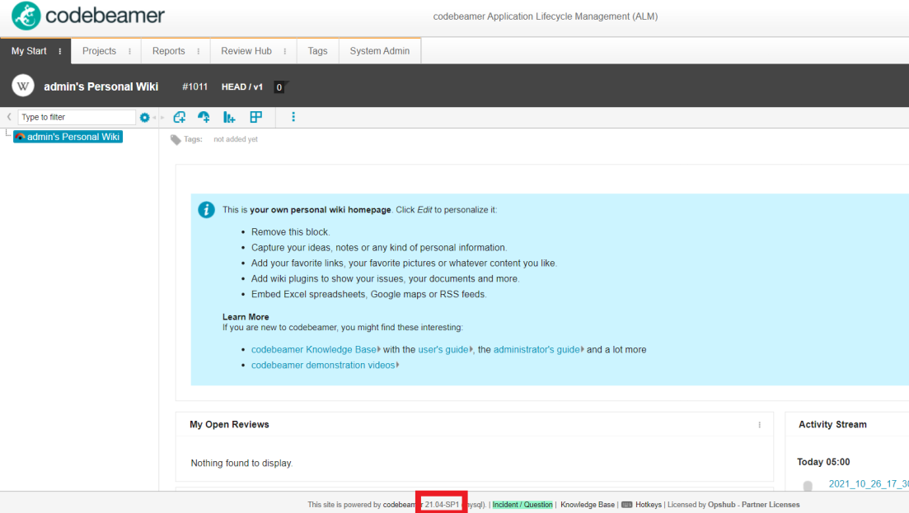</div>

**codebeamer X:**

<div align="center">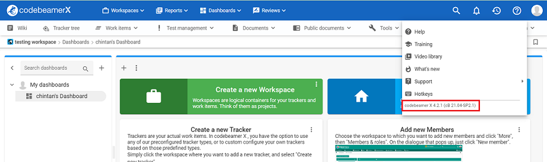</div>

### Add User

#### Add User Group

* Login to codebeamer / codebeamer X with the Admin User.
* Select **System Admin** tab.
* Select **User Groups**.

**codebeamer:**

<div align="center">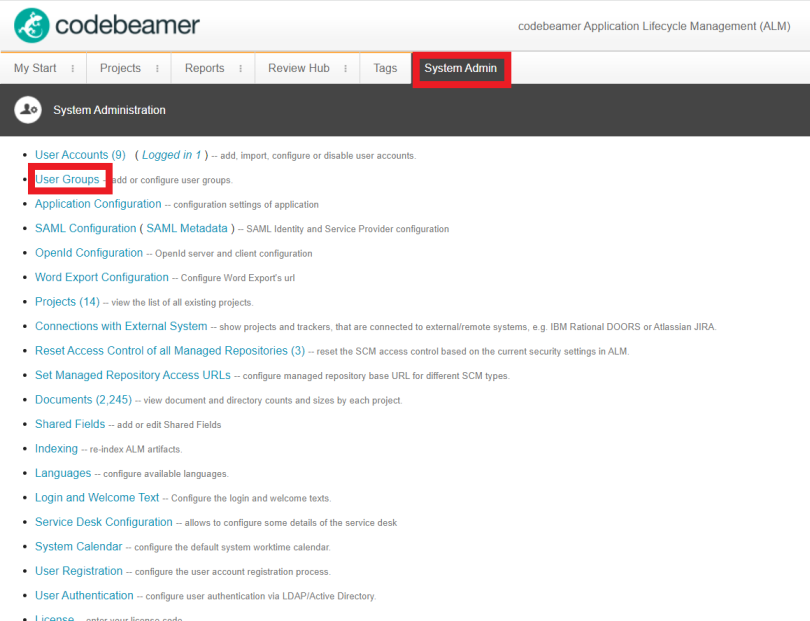</div>

**codebeamer X:**

<div align="center">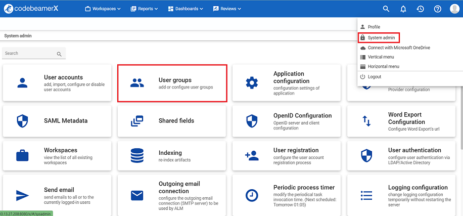</div>

* Click on **New Group** link as shown in the screenshots below:

**codebeamer:**

<div align="center">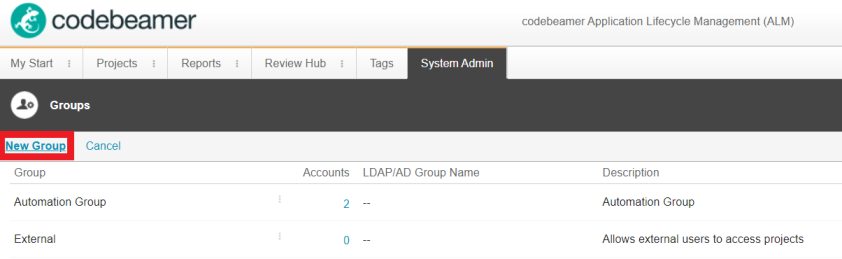</div>

**codebeamer X:**

<div align="center">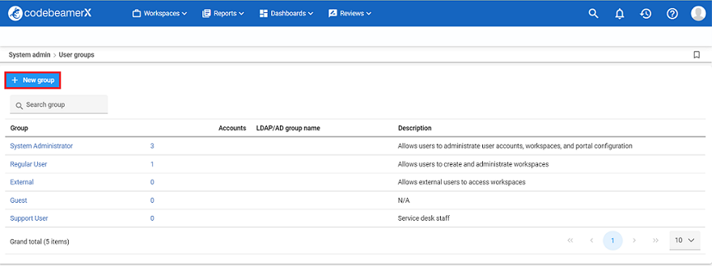</div>

* Fill in the details for the new user group. This user group should have the required privileges as mentioned in section, [User privileges](codebeamer.md#user-privileges).

**codebeamer:**

<div align="center">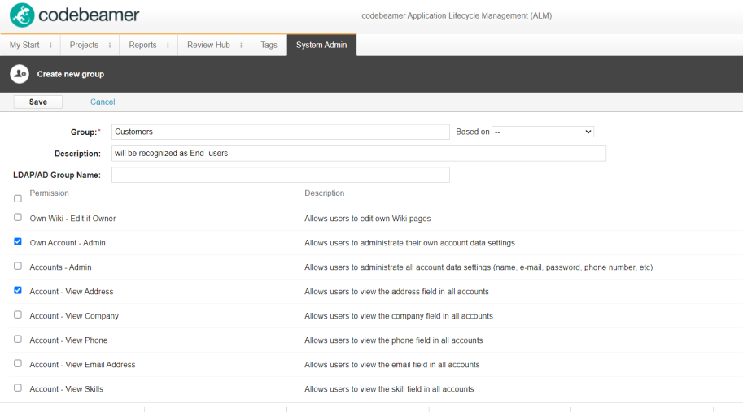</div>

**codebeamer X:**

<div align="center">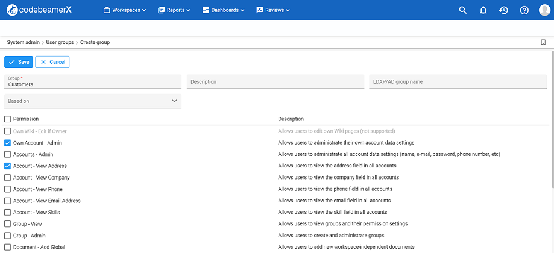</div>

* Click on **Save** button.

### Add User Account

* Login to codebeamer / codebeamer X with the Admin User.
* Select **System Admin** tab.
* Select **User Accounts** link as shown in the screenshots below:

**codebeamer:**

<div align="center">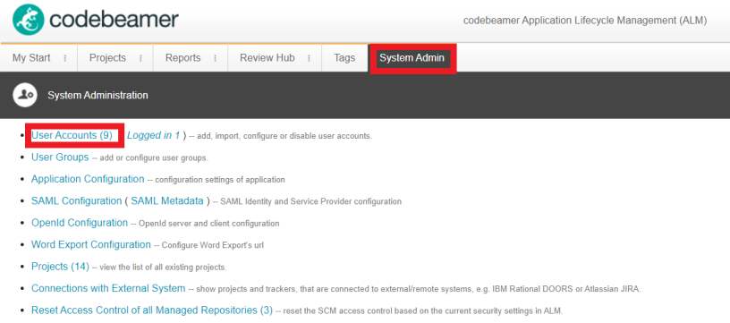</div>

**codebeamer X:**

<div align="center">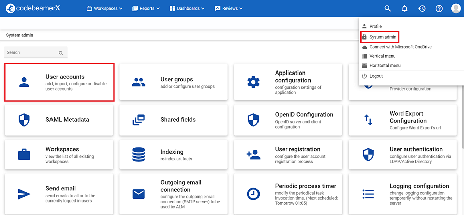</div>

* Click on **New Account** link as shown in the screenshots below:

**codebeamer:**

<div align="center">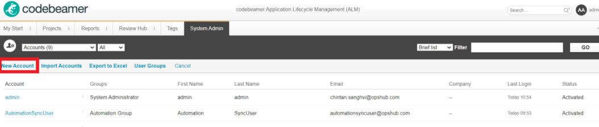</div>

**codebeamer X:**

<div align="center">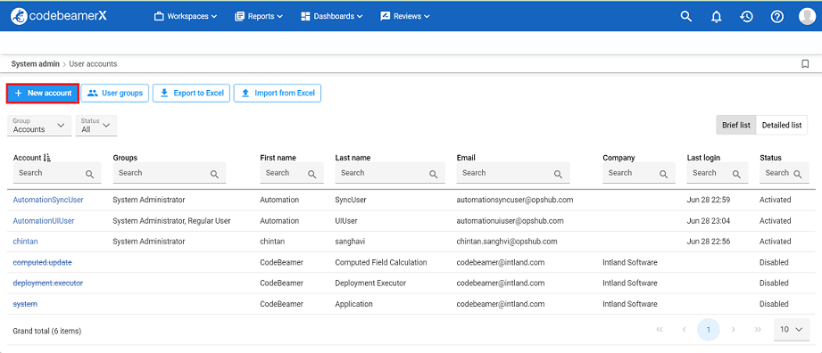</div>

* Fill in the details for new user account and click on **Save** button as shown in the screenshots below:

**codebeamer:**

<div align="center">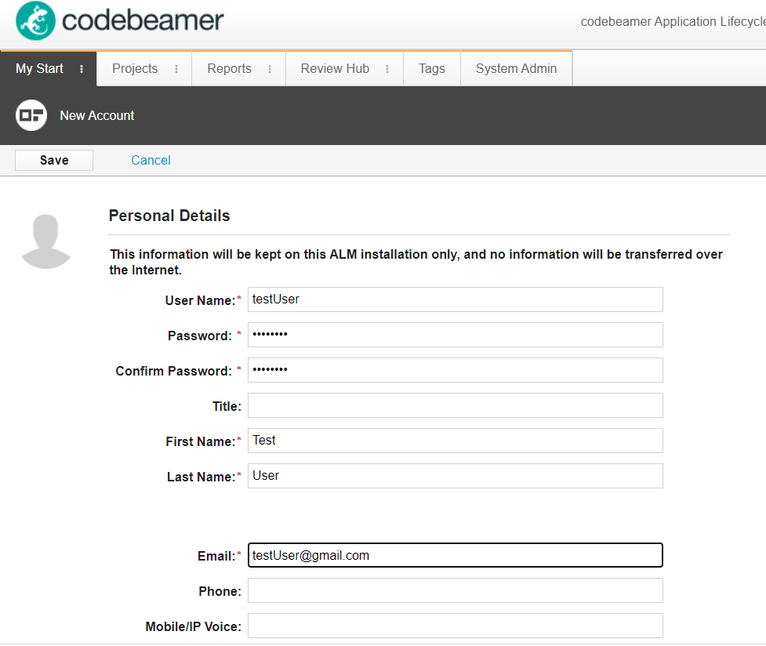</div>

<div align="center">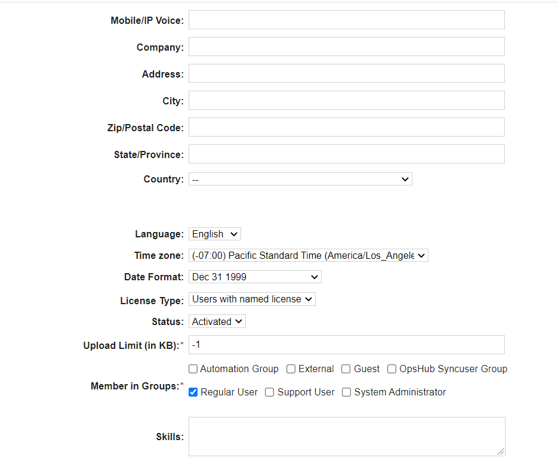</div>

**codebeamer X:**

<div align="center">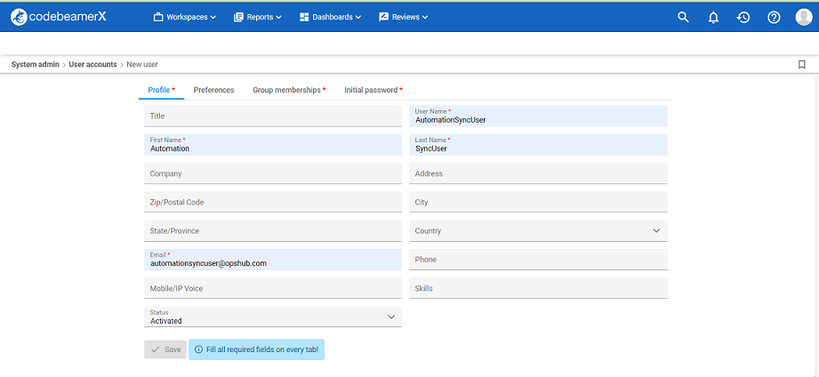</div>

<div align="center">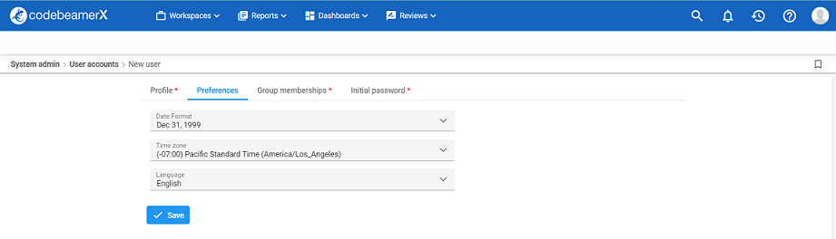</div>

<div align="center">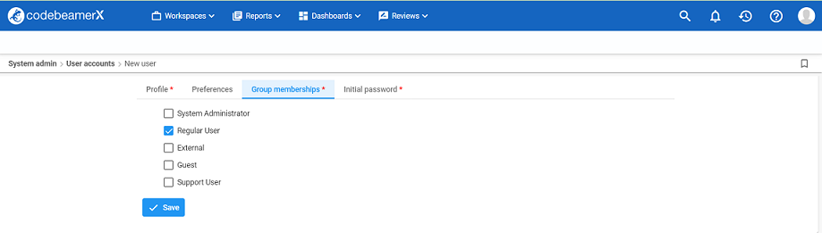</div>

<div align="center">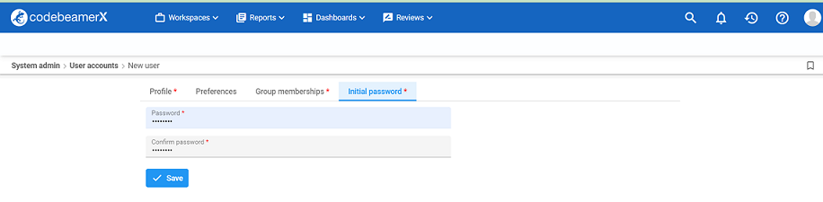</div>

### Add Project Member

**Project Admin can directly add Project Members**

* Login to codebeamer / codebeamer X with user having the project administrator role for the project in which you want to add member.
* Open a **project** (codebeamer) / **workspace** (codebeamer X) in which you want to add member.
* Click the **three dots** (codebeamer) / **dropdown** (codebeamer X) beside Admin tab.
* Click **Members** (codebeamer) / **Members & roles** (codebeamer X) option.

**codebeamer X:**

<div align="center">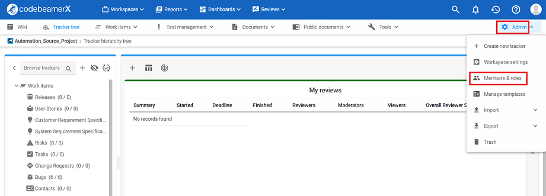</div>

* Click "**Add New Member**" (codebeamer) / "**New Member**" (codebeamer X) link as shown in screenshot below:

**codebeamer:**

<div align="center"></div>

**codebeamer X:**

<div align="center">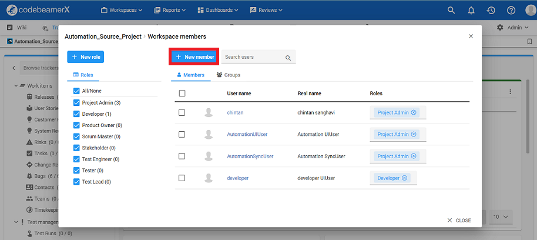</div>

* For further steps, refer to the codebeamer / codebeamer X documentation for adding a project member: [Add new Member](https://codebeamer.com/cb/wiki/11113#section-Add+or+invite+members)

**Members added by Project Admin via User's Join Request (Only for codebeamer)**

* If project membership is **Public with join approval**, then any user can request to join, but project administrators must approve each join request.
* Login as user who wants to become a member and follow the steps mentioned in the section, [hbMake Join Request for a Project](codebeamer.md#make-join-request-for-a-project) for further details.
* Login as Project Administrator and follow the steps below to approve the join request:
  * Open a project for which you want to approve join request for Users.
  * Click the three dots provided beside the Admin tab.
  * Click on the Members option.

<div align="center">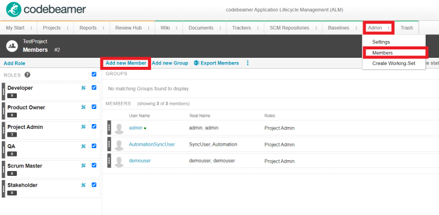</div>

* Click three blue dots and select "Join Requests" option as shown in the screenshot below:

<div align="center">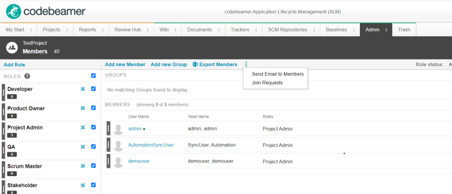</div>

* Click the green check mark to approve the request and red mark to decline as shown in the screenshot below:

<div align="center">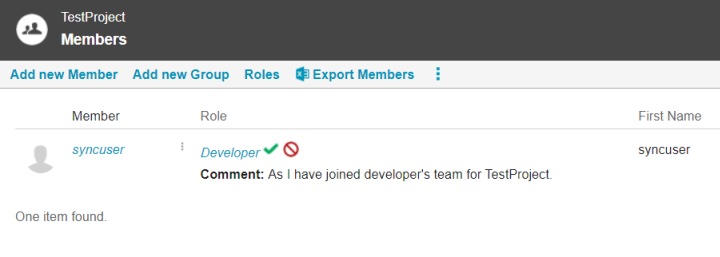</div>

* Provide Notification Comment and select Accept/Reject button accordingly as shown in the screenshot below:

<div align="center">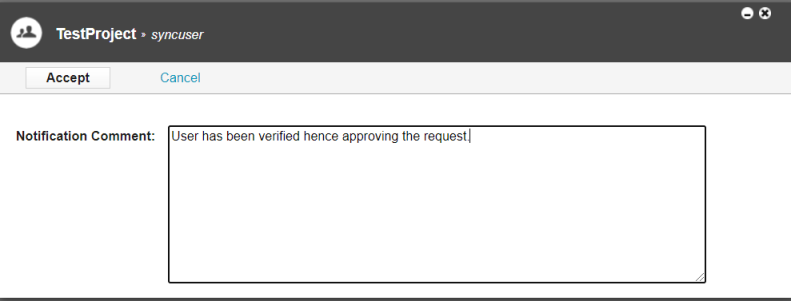</div>

**Joining a public project without further approval (Only for codebeamer)**

* If project Membership is **Public**, then any user can join any time, without further approval.
* Login as user who wants to become Member and follow the steps mentioned in section [Make Join Request for a Project](codebeamer.md#make-join-request-for-a-project)

**Make Join Request for a Project (Only for codebeamer)**

* Click on "Projects" tab.
* Click on "Available to Join" tab.
* Click on the Project link for which you want to make a join request as shown in the screenshot below:

<div align="center">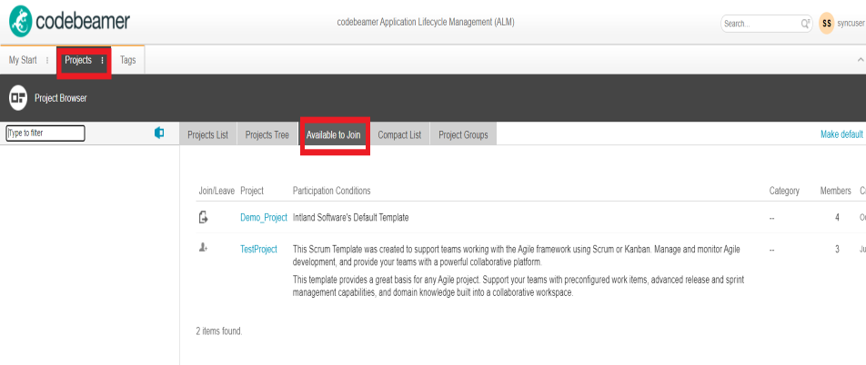</div>

* Enter joining comment and click on Submit button as shown in the screenshot below:

<div align="center">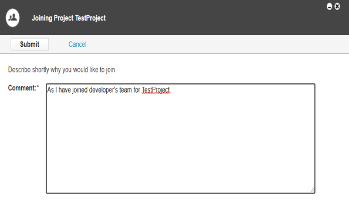</div>

### Add User Permission Over Tracker

* Open the **project** (codebeamer) / **workspace** (codebeamer X) where you want to add custom field.
* Select "**Trackers**" (codebeamer) / "**Tracker tree**" (codebeamer X) tab.
* Right click on the tracker name for which you want to add custom field.
* Select the Configure option.

**codebeamer:**

<div align="center">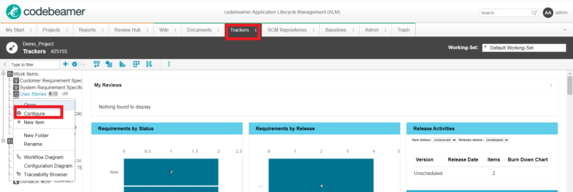</div>

**codebeamer X:**

<div align="center">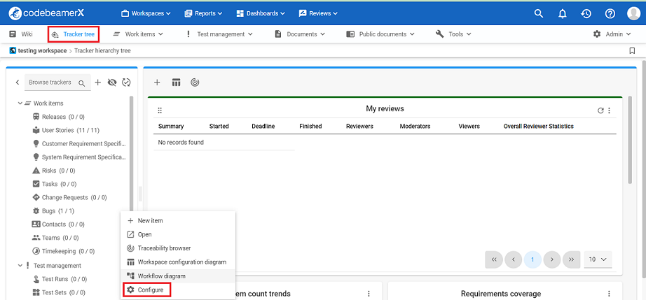</div>

* Select "Permissions" tab as shown in the screenshot below:

**codebeamer:**

<div align="center">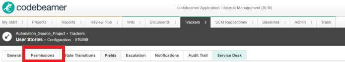</div>

**codebeamer X:**

<div align="center">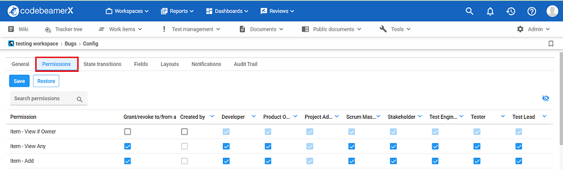</div>

* Provide permissions mentioned in [User privileges](codebeamer.md#user-privileges) section for the role assigned to the user.

### How to find Tracker Id

* Open the **project** (codebeamer) / **workspace** (codebeamer X) where your tracker is present whose ID you want to find.
* Select "**Trackers**" (codebeamer) / "**Tracker tree**" (codebeamer X) tab.
* Click on the tracker name for which you want to find the ID.
* From URL you will get the tracker Id.

**codebeamer:**

<div align="center">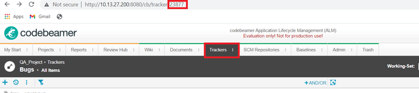</div>

**codebeamer X:**

<div align="center">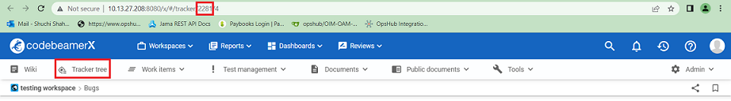</div>

### Add Custom Field

For creating custom field in codebeamer / codebeamer X, follow the steps given below:

* Open the **project** (codebeamer) / **workspace** (codebeamer X) in which you want to add custom field.
* Select **Trackers** (codebeamer) / **Tracker tree** (codebeamer X) tab.
* Right click on the tracker name for which you want to add custom field.
* Select the Configure option.

**codebeamer:**

<div align="center"></div>

**codebeamer X:**

<div align="center"></div>

* Select **Fields** tab as shown in the screenshot below:

**codebeamer:**

<div align="center">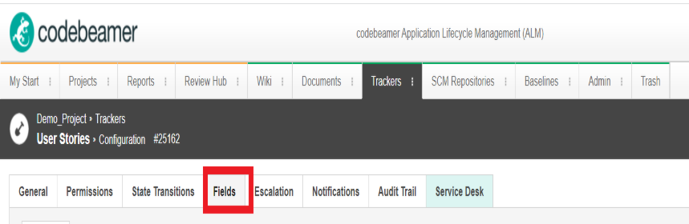</div>

**codebeamer X:**

<div align="center">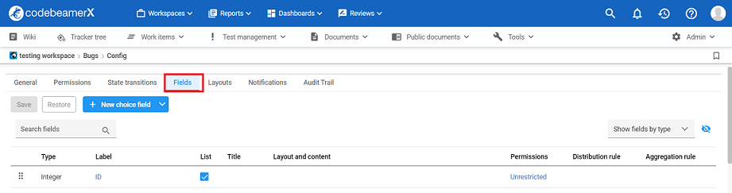</div>

* Scroll down to extreme bottom of the page and click on **More fields...** (codebeamer) / **New Choice Field** (codebeamer X) drop-down list.
* Select **New Choice Field** option to add a choice type field or **New Custom Field** option to add other types of custom fields.

**codebeamer:**

<div align="center">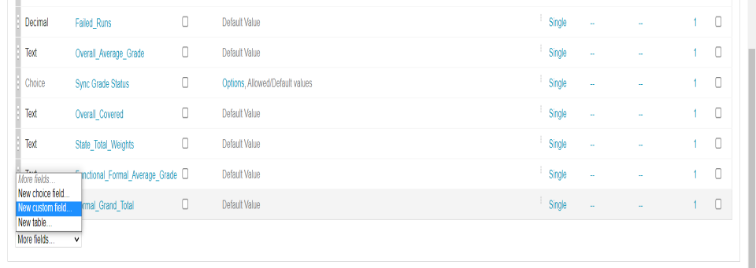</div>

**codebeamer X:**

<div align="center">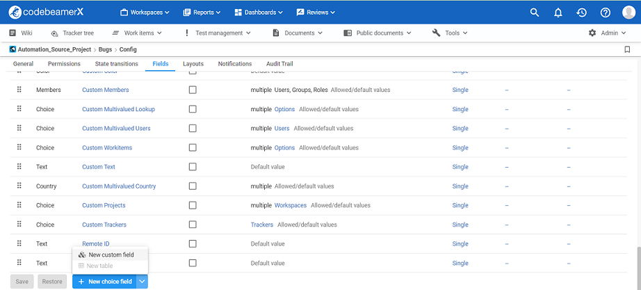</div>

* Fill in the details for new field to be added.
* Click on **OK** and **Save** buttons to save the changes.

### Find Custom Field Property Name

* Open tracker item configuration.
* Select **Fields** tab.
* Select the option **Show property name** just above the list of fields to display property name of all the fields.

**codebeamer:**

<div align="center">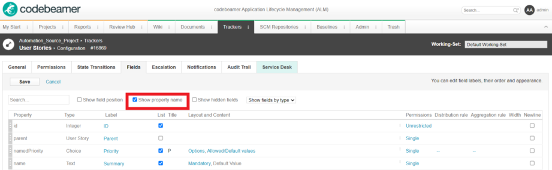</div>

**codebeamer X:**

<div align="center">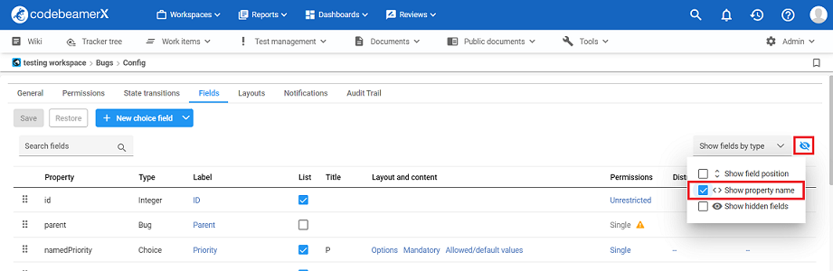</div>

* Highlighted text in the image below shows property name for custom field "Custom Text".

**codebeamer:**

<div align="center">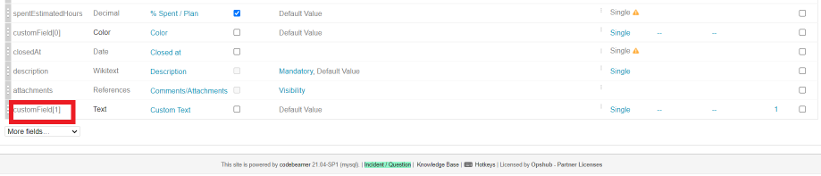</div>

**codebeamer X:**

<div align="center">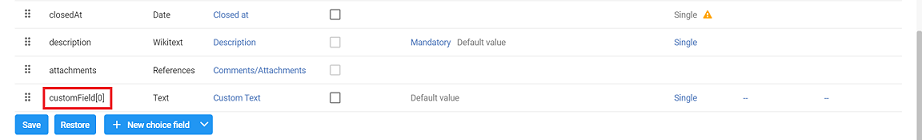</div>

### Determine User ID

* Login to codebeamer / codebeamer X with user having the project administrator role. The project administrator and user must be the members of the project for which user ID has to be found.
* Open a **project** (codebeamer) / **workspace** (codebeamer X) in which the user is already a member for whom he/she wants to find the user ID.
* Click the **three dots** (codebeamer) / **dropdown** (codebeamer X) provided beside Admin tab.
* Click on **Members** (codebeamer) / **Members & roles** (codebeamer X) option.
* Click on the Member link for which the user wants to find user id.

**codebeamer:**

<div align="center">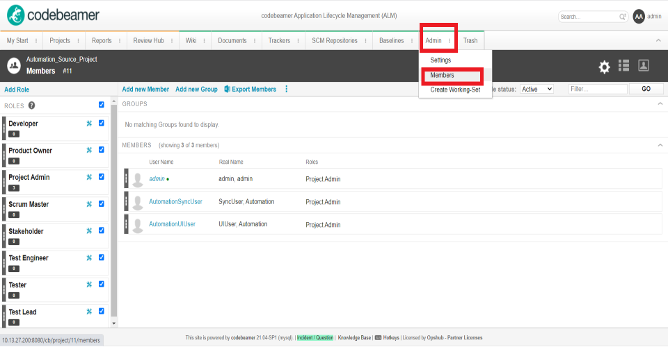</div>

**codebeamer X:**

<div align="center">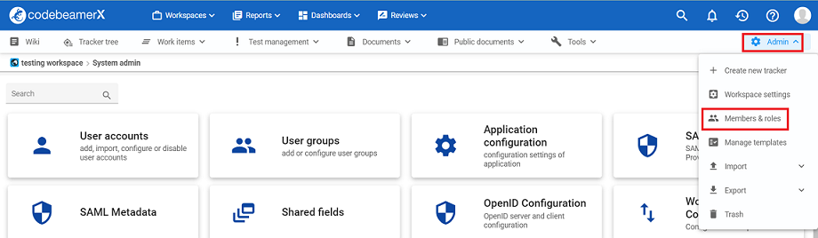</div>

* Account ID is the required user ID as shown in the screenshot below:

**codebeamer:**

<div align="center">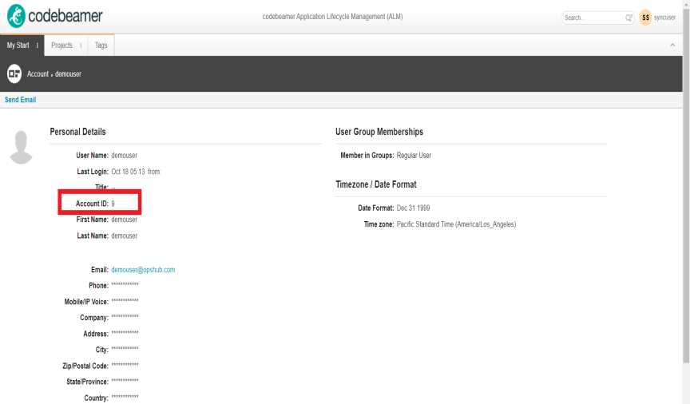</div>

**codebeamer X:**

<div align="center">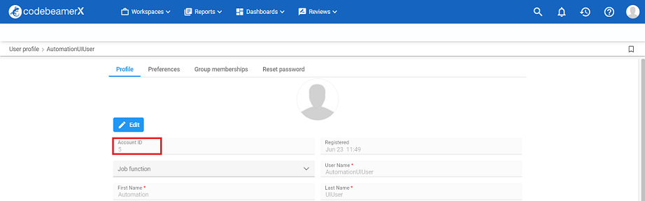</div>

### Configure a new State Transition

Following are the steps to configure any-to-any transition:

* Open the **project** (codebeamer) / **workspace** (codebeamer X) for which the transition(s) needs to be configured.
* Select **Trackers** (codebeamer) / **Tracker tree** (codebeamer X) tab.
* Right click on the tracker name for which you want to add state transition.
* Select the Configure option.

**codebeamer:**

<div align="center"></div>

**codebeamer X:**

<div align="center"></div>

* Select **State Transitions** tab as shown in the screenshot below:

**codebeamer:**

<div align="center">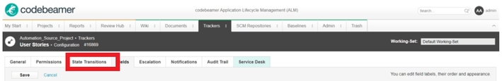</div>

**codebeamer X:**

<div align="center">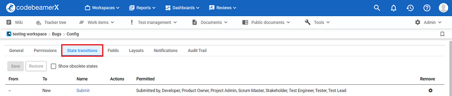</div>

* Look at the existing State Transitions. The possible transitions are:
  * New to Verified
  * New to In progress
  * New to Closed
  * Verified to In progress
  * In progress to Closed

<div align="center"></div>

* Here, no direct transition is possible from Verified to Closed. To add this state transition, click on **More fields...** (codebeamer) / **More...** (codebeamer X) drop-down list.
* Select **State Transition** option.

**codebeamer:**

<div align="center">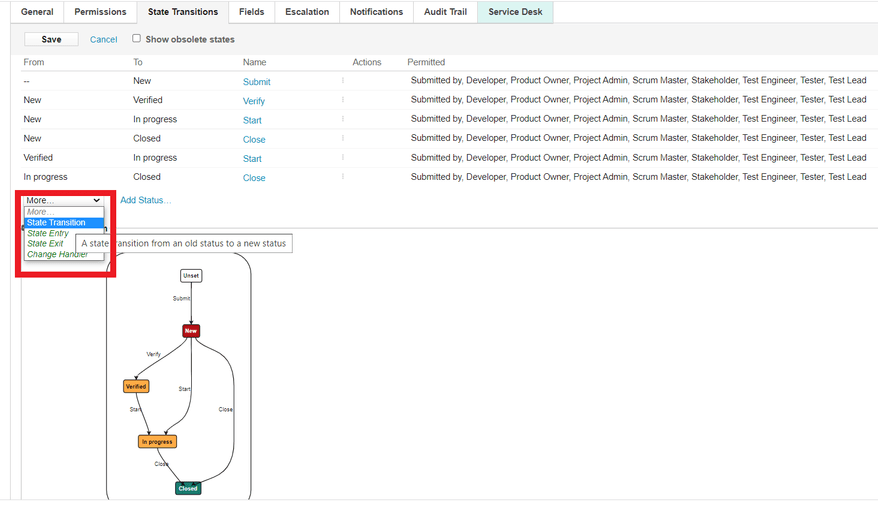</div>

**codebeamer X:**

<div align="center">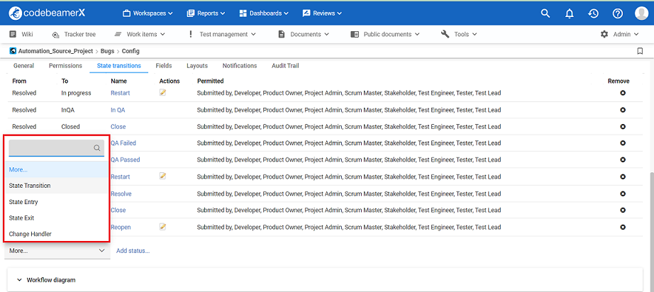</div>

* Provide the details.

**codebeamer:**

<div align="center">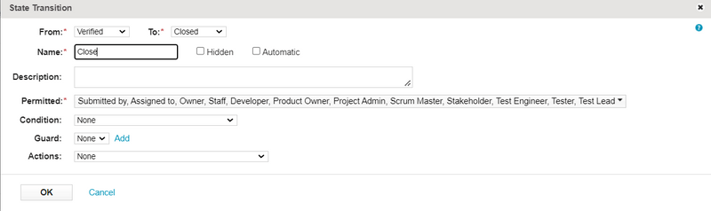</div>

**codebeamer X:**

<div align="center">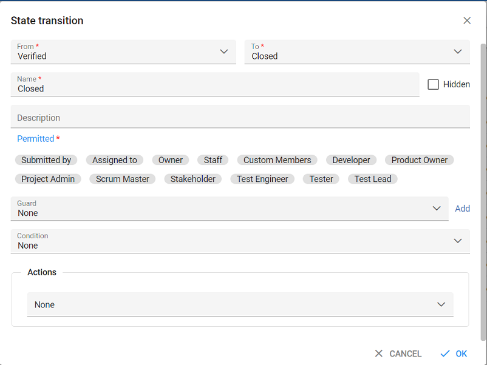</div>

* Click on **OK** and **Save** buttons to save the changes.

### How to Generate the HTML to JSPWiki Conversion JAR

1. Download the zip file from [here](https://opshubtrial-my.sharepoint.com/:u:/g/personal/support_opshub_com/ES82OMoxmvJKvZ-P72JL-ScBeg6_W_38JGyU-KXm7FqJKQ) and extract it.
2. Open the extracted folder and locate the `gradle.properties` file. In this file, for the `cbHome` parameter, specify the path to your **codebeamer / codebeamer X** installation directory.
3.  Open the command prompt (it is recommended to run as Administrator) inside the extracted folder and execute the command:

    ```
    gradlew build
    ```

    to generate the build files.

> **Note**: After running the command mentioned above, a `build` folder will be generated inside the extracted folder.

4. Now, navigate to the `build` folder, and you will find a file named OpsHubcodeBeamerHTMLToJSPWiki-1.0 inside the `libs` folder.
