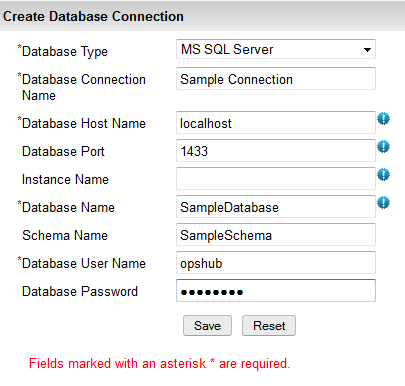
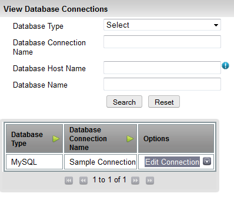
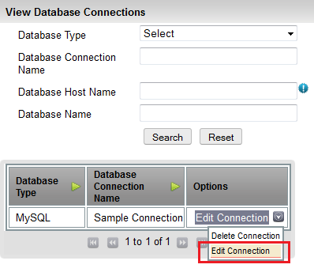

# Database Configuration

## Prerequisites

1. Few Systems supported by <code class="expression">space.vars.SITENAME</code> require Database Connection. By default, <code class="expression">space.vars.SITENAME</code> is deployed on HSQL Database Server, MSSQL Database Server, MySQL Database Server, PostgreSQL Database Server or Oracle Database Server.
2. If Database Connection requires connection to database other than the Database server on which <code class="expression">space.vars.SITENAME</code> is deployed, then follow the given steps below:
   * Download the required database driver on which you want new database connection to be created. For downloading, refer the links below:
     * MySQL Server: [MySQL Server Driver](https://dev.mysql.com/downloads/connector/j/5.0.html)
     * MS SQL Server: [MS SQL Server Driver](http://www.microsoft.com/enus/download/details.aspx?displaylang=en\&id=11774)
     * Oracle Server: [Oracle Server Driver](http://www.oracle.com/technetwork/database/enterprise-edition/jdbc-10201088211.html)
     * PostgreSQL Server: [PostgreSQL Server Driver](https://jdbc.postgresql.org/download/)
     * HSQLDB Server: No need for any jar download. It is already bundled with <code class="expression">space.vars.SITENAME</code>.
3. Stop the <code class="expression">space.vars.SITENAME</code> Server.
4. Copy the downloaded driver into `[Installation Directory]\OpsHubServer\lib` folder.
5. Start <code class="expression">space.vars.SITENAME</code> Server.

## Create Connection

Steps for Creating Database Connection:

1. Login into <code class="expression">space.vars.SITENAME</code>.
2. Navigate to **Administration -> Connection Management**.
3. Click on **Create Connection**.
4. Select **Database Type** from the drop-down menu, for which you want to create database connection.
5. Enter **Database Connection** name of your choice.
6. Enter **Database HostName** of the database server.
7. Enter **Database Port** on which the database server is running on. Port may not be required in case of database is on named instance on MS SQL Server.
8. Enter **Instance Name** in case of database is on named instance in MS SQL Server.
9. Enter **DatabaseName** of the database server. In case of HSQLDB it should be complete Path of the Database. For example: `file:<database/path>` or `hsql://localhost/`
10. If the database type requires schema to be entered, then optionally enter **Database Schema Name**.
11. Enter **Database User Name**; as in case of HSQLDB enter `SA`.
12. Enter **Database Password** of the database server. In case of HSQLDB keep it blank.
13. Click on **Save** button to save the Database Configuration.

## View Connections

Steps for viewing Database Connections:

1. Navigate to **Administration -> Connection Management**.
2. Click on **View Connections**.
3. This will display all the configured connections.

## Edit Connection

1. Navigate to **Administration -> Connection Management**.
2. Click on **View Connections**.
3. Click on **Edit Connection** next to the Database Connection you want to edit in the configured connections.
4. Edit the properties you want to change.
5. Click on **Save** button, for saving the edited connection.
