# HubSpot

## Prerequisites

### User privileges

* Create one user in HubSpot that is dedicated for <code class="expression">space.vars.SITENAME</code>. This user shouldn't perform any other action from HubSpot's user interface. This user is referred as 'Integration User' in the documentation.
  * For this user to perform operations in HubSpot, various permission scopes are required, as outlined below. To know more about the permission scopes refer to [Manage Scopes in HubSpot](https://developers.hubspot.com/docs/guides/apps/authentication/scopes).
  * To know more about the User permissions in HubSpot refer to [HubSpot user permission guide](https://knowledge.hubspot.com/user-management/hubspot-user-permissions-guide).
* User can use Access-Key based authentication or OAuth 2.0 authentication mode to communicate with API for HubSpot
  * If you want to use **Access Token** based authentication then using the user created above, create a **Private App** in HubSpot to generate the **Access Token** and obtain the **Application Id** which is required in the system configuration form. Refer to [Create Private App in HubSpot](hubspot.md#create-private-app-in-hubspot) to know how to create private app in HubSpot.
  * If you want to use **OAuth 2.0 Access** based authentication then using the user created above, create a **Public App** in HubSpot to generate the **Oauth 2.0 Token** and obtain the **Application Id** which is required in the system configuration form. Refer to [Create Public App in HubSpot](hubspot.md#create-public-app-in-hubspot) to know how to create public app in HubSpot.

### Required Scope/Permission

* When configuring a Private App/Public App to work with HubSpot, it’s important to assign only the necessary scopes based on the operations plan to perform as per business need. These scopes control what data can access or modify using private App.
* To **add or remove scopes** in private app, refer to [Managing Permission Scopes in HubSpot Private/Public App](hubspot.md#managing-permission-scopes-in-hubspot-private-public-app) section.

> **Note** :If required scopes are missing or insufficient, the integration may fail. Always ensure the Private App has the necessary permissions before starting the integration setup.

#### For Read

* `crm.objects.<<entity_type>>.read`: Required to read data from the entity.
* This includes all necessary permissions to fetch detailed information about the specified entity types.\
  For example, `crm.objects.deals.read`.

> **Note** : If your Deals are associated with other HubSpot objects such as Tickets or Contacts, and you wish to sync those as well, you’ll need to include their respective read scopes.

* For example:
  * `crm.objects.tickets.read`: To read associated Tickets.
  * `crm.objects.contacts.read`: To read associated Contacts.

#### For Write

* `crm.objects.<<entity_type>>.write`: Required to write data to the entity.
* This includes all necessary permissions to update or create the specified entity types.\
  For example, `crm.objects.deals.write`.

#### For Managing Attachments

* `crm.objects.notes.read`
* `crm.objects.notes.write`
* `files`

> **Note** : These scopes are needed to read/write Notes and Files, allowing you to sync attachments between HubSpot and another system. Attachments are handled in HubSpot via Notes and Files.

## System Configuration

* As you kickstart the integration, the user must first configure HubSpot system in <code class="expression">space.vars.SITENAME</code>. Click [System Configuration](../integrate/system-configuration.md) to learn step-by-step process to configure a system. Refer to the following screenshot:

<div align="center">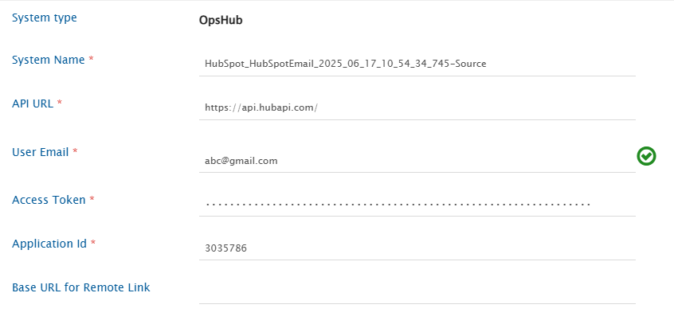</div>

* If Authentication Type is Oauth Token,following will be the form:

<div align="center">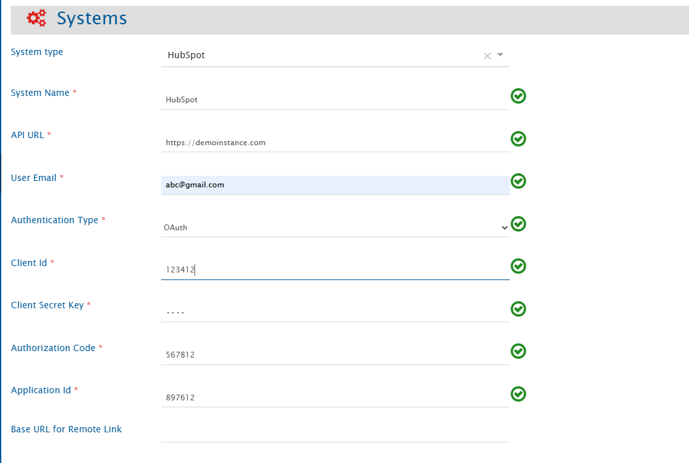</div>

**HubSpot System form details**

| **Field Name**               | **When is the field visible**       | **Description**                                                                                                                                                                                                                                                                                                                                                                            |
| ---------------------------- | ----------------------------------- | ------------------------------------------------------------------------------------------------------------------------------------------------------------------------------------------------------------------------------------------------------------------------------------------------------------------------------------------------------------------------------------------ |
| **System Name**              | Always                              | Provide a name to the HubSpot system.                                                                                                                                                                                                                                                                                                                                                      |
| **API Url**                  | Always                              | Provide server URL of the HubSpot instance. This URL will be used for communicating with HubSpot system API. The example format of the URL would be: `https://api.hubapi.com`.                                                                                                                                                                                                             |
| **User Email**               | Always                              | Provide the user email of a dedicated user who will be used for communicating with HubSpot API. This user should have the required privileges to use the HubSpot API. For more details on the required privileges, refer to [User privileges](hubspot.md#user-privileges) section.                                                                                                         |
| **Authentication Type**      | Always                              | Select the authentication type you would like to use for communicating with HubSpot API.                                                                                                                                                                                                                                                                                                   |
| **Access Token**             | Authentication type is Access Token | Provide the HubSpot private app access token for the specified user. This token must have sufficient permissions to enable communication with the HubSpot API.                                                                                                                                                                                                                             |
| **Client ID**                | Authentication type is OAuth 2.0    | Provide the HubSpot public app's Client ID. This token must have sufficient permissions to enable communication with the HubSpot API. Refer to [OAuth 2.0 Authorization Token Generation in HubSpot](hubspot.md#oauth-2.0-authorization-token-generation-in-hubspot) section to know how to get the Client ID.                                                                             |
| **Client Secret**            | Authentication type is OAuth 2.0    | Provide the HubSpot public app's Client Secret to connect with the HubSpot API. Refer to [OAuth 2.0 Authorization Token Generation in HubSpot](hubspot.md#oauth-2.0-authorization-token-generation-in-hubspot) section to know how to get the Client Secret.                                                                                                                               |
| **Authorization Code**       | Authentication type is OAuth 2.0    | Provide the HubSpot public app's Authorization Code to connect with the HubSpot API. Refer to [OAuth 2.0 Authorization Token Generation in HubSpot](hubspot.md#oauth-2.0-authorization-token-generation-in-hubspot) section to know how to get the Authorization Code. If the scopes or permissions of the app are changed at any point, you must regenerate the Authorization Code again. |
| **Application Id**           | Always                              | Provide the Application ID set up for the specified dedicated user to connect with the HubSpot API. Refer to [Prerequisites](hubspot.md#prerequisites) section to know how to get the Application Id.                                                                                                                                                                                      |
| **Base URL for Remote Link** | Always                              | <p>Provide a different instance URL of the HubSpot instance. This URL will be used for generating the Remote Link.<br><strong>Note</strong>: If "Base URL for Remote Link" is empty, it will use Instance/Server URL to generate Remote Link if configured on Integration.</p>                                                                                                             |

```
                                |
```

## Mapping Configuration

Map the fields between HubSpot and the other system to be integrated to ensure that the data between both the systems synchronize correctly. Refer to the following screenshot:

<div align="center">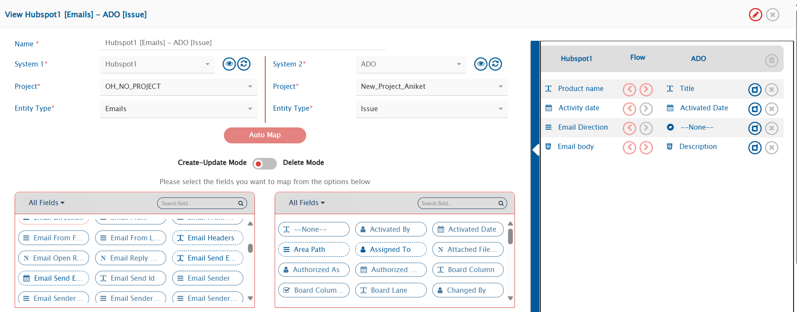</div>

Click [Mapping Configuration](../integrate/mapping-configuration.md) to learn the step-by-step process to configure mapping between the systems.

### Comments and Attachments Configuration

* In HubSpot, the Note is supported as both entity and comment. If user has configured comments synchronization between HubSpot and other end system, then each Note added in the HubSpot's common entities like Deal, Tickets, Contacts etc. will create a new comment to the end system and vice versa.
* If the user has configured Note to sync as an entity and not as a comment then it will sync according to other end system's configured entity.
* In HubSpot, whenever an attachment is added to one of the common entities mentioned above, a separate **Note** is created and associated with that entity. This Note contains the added attachment. So, if the user has configured Notes to be synced as an entity, these Notes created for attachments will also be synced to the end system.
* Apart from this, if HubSpot is configured as the target system, each attachment added from the source system will create a new Note associated with the synced entity, containing the attachment.

<div align="center">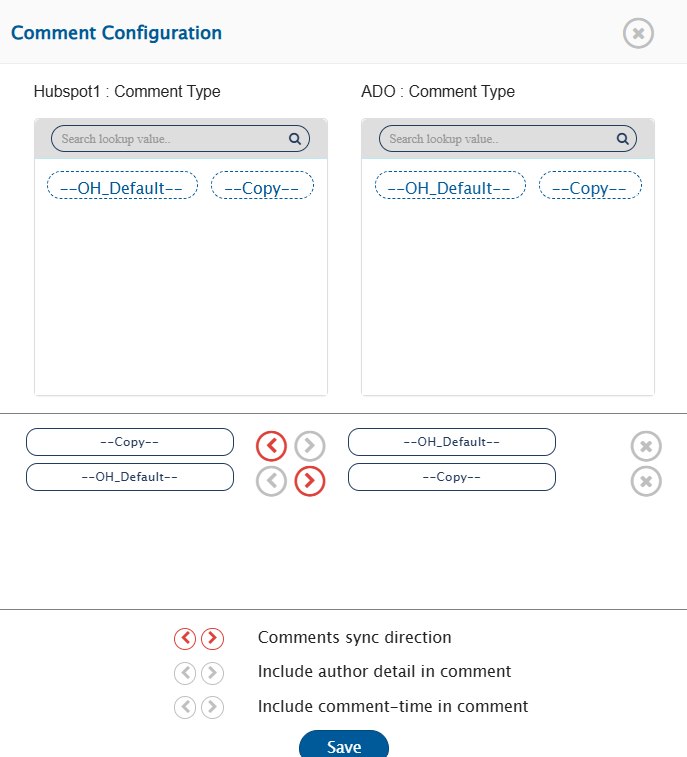</div>

* Refer to the screenshot below:

<div align="center">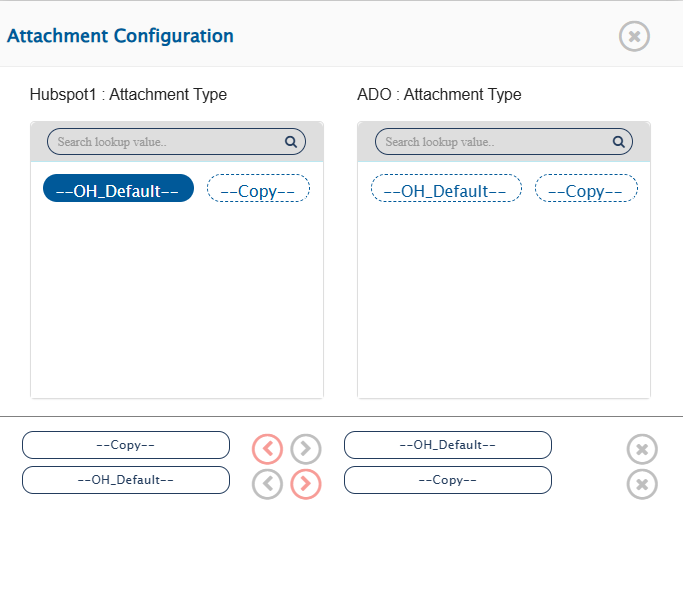</div>

### Mandatory Links

* When entities like Notes, Emails and Meetings are created in HubSpot they must be associated with the HubSpot's common entities like Deals, Tickets, Contacts, Companies, etc. Otherwise, these entities are not individually visible on the HubSpot's interface. Therefore, to sync these type of entities, any of the common HubSpot entities mentioned is required as a mandatory relationship linkage.

## Integration Configuration

Set a time to synchronize data between HubSpot and the other system to be integrated. Also, define parameters and conditions (if any) for integration. Refer to [Integration Configuration](../integrate/integration-configuration.md) to learn the step-by-step process to configure the integration between two systems.

<div align="center">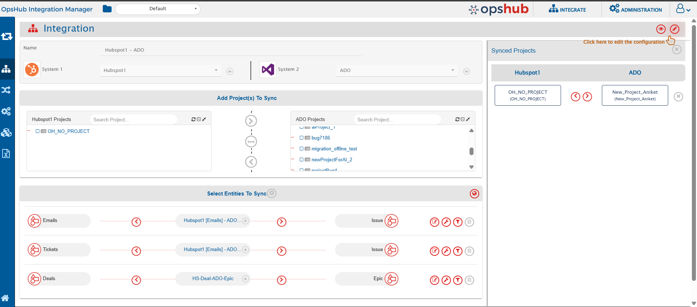</div>

### Criteria Configuration

If the user wants to specify conditions for synchronizing an entity from HubSpot as source system to the other system, the criteria must be configured. Navigate to Criteria Configuration section on [Integration Configuration](../integrate/integration-configuration.md) page to learn in detail about Criteria Configuration.

Set the **Query** as per <code class="expression">space.vars.SITENAME</code>'s Native query format. While adding the criteria, user needs to add the internal names of the fields on which the criteria have to be applied. Given below are the sample snippets of how the HubSpot queries can be used as criteria query in <code class="expression">space.vars.SITENAME</code>:

**Criteria samples:**

| **Field Type** | **Criteria Description**                                                             | **Criteria snippet**                                                                                                     |
| -------------- | ------------------------------------------------------------------------------------ | ------------------------------------------------------------------------------------------------------------------------ |
| `dealstage`    | Synchronize all deal type of entities having deal's stage as "Appointment Scheduled" | `[{"condition":"EQUALS","field":"dealstage","value":"appointmentscheduled"}]`                                            |
| `createdate`   | Synchronize all deal type of entities created after June 15,2025                     | `[{"condition":"GREATER_THAN","field":"createdate","value":"2025-06-15T03:00:29.864Z"}]` _(timestamp in HubSpot format)_ |
| `dealname`     | Synchronize all deal type of entities with deal name, "new"                          | `[{"condition":"EQUALS","field":"dealname","value":"new"}]`                                                              |

* To get the internal field name for the HubSpot's entities, refer to the [Appendix](hubspot.md#appendix) section.
* When the user wants to sync all Deal entities with the dealname set to 'new', the corresponding HubSpot Search API request to apply this criteria is shown below.

```
{
    "filterGroups": [
        {
            "filters": [
                {
                    "propertyName": "dealname",
                    "operator": "EQ",
                    "value": "new",
                    "values": null
                }
            ]
        }
    ]
}
```

* Now for this search request, the user needs the OIM Criteria query to filter the records. Hence, its corresponding OIM criteria query will be:

```
[{"condition":"EQUALS","field":"dealname","value":"new"}]
```

### Target LookUp Configuration

* Provide Query in Target Search Query field such that it is possible to search the entity in the HubSpot as the target system. In the target search query field, the user can provide a placeholder for the source system's field value in the '@'.
* To learn in detail about how to configure Target LookUp, refer to **Search in Target Before Sync** section on [Integration Configuration](../integrate/integration-configuration.md) page.
* Overall, Target LookUp Query is similar to [Criteria configuration](hubspot.md#criteria-configuration), except that the value part contains a field name with '@' instead of static value.

**Target LookUp query samples:**

| **Field Type** | **Target LookUp usecase**                                                        | **Snippet**                                                                 |
| -------------- | -------------------------------------------------------------------------------- | --------------------------------------------------------------------------- |
| `Description`  | Target LookUp on the entity having the source entity's id in 'description' field | `[{"condition":"EQUALS","field":"description","value":"@oh_internal_id@"}]` |

## Known Behaviour

* In HubSpot, user mention is only supported in the entities of type Notes, Emails, Calls, Meetings, Tasks.
* Grouping of criteria like - (condition1 and condition2) or (condition1 and condition3) is not supported in criteria as well as Target LookUp.
* Hierarchy sync is not supported in HubSpot.
* While applying criteria configuration, note that HubSpot's Search API accepts only 5 filters. Since <code class="expression">space.vars.SITENAME</code> applies two of these filters internally, users can add a maximum of 3 additional filters to define the criteria.
* While using a query for criteria or target lookup, if a text-type field is used, the query will not execute if the field value is null.\
  For example: `[{"condition":"EQUALS","field":"dealname","value":null}]` – this query will not be executed as HubSpot API expects a value in text fields.
* For Comment synchronization:
  * In the current HubSpot integration setup, **Notes** from HubSpot are synced as **Comments** on the corresponding end system entity and vice versa.
  * When a Note — let's say, Note-A is added to an entity like Deal-1, the same Note-A can also be associated with other entities such as Deal-2. If the sync time of Deal-2 is later than the creation time of Note-A, then Note-A might be skipped during the sync for Deal-2.

**Example**

| Action                                             | Result                                                                                      |
| -------------------------------------------------- | ------------------------------------------------------------------------------------------- |
| Note A created and associated to Deal 1            | Synced as a Comment                                                                         |
| Note A later associated to Deal 2 (unchanged Note) | Might **NOT** sync to Deal 2 if Note's Last Modified Time is before the current sync window |
| Note A later associated to Ticket-1                | Synced as Comment, if Ticket-1 integration sync time is behind Note A creation time         |

* To ensure that Notes are reliably synced when associated with new entities, the user must update the Note (e.g., by adding a space, punctuation mark, or any minor change) before associating it with another entity. This updates the Last Modified Time, ensuring the Note falls within the polling window and is picked up for synchronization.

## Troubleshooting Guide

* If during synchronization you get any `"VALIDATION_ERROR"` failure, it means the data coming from the other system's entity is not proper, or fields mapped in the configuration have a missing mandatory field, causing HubSpot's validation to fail.\
  For example, a field has been provided with an invalid value (e.g., `'email'` field has plain text instead of valid email).
* This error occurs because some fields in HubSpot are mandatory during entity creation, but their metadata doesn't indicate so.\
  To fix:
  * Use the internal name of the field from the error.
  * Check if failure is due to a missing mandatory field or invalid data.
  * Refer to [Get Internal Field Names for HubSpot Entities ](hubspot.md#get-internal-field-names-for-hubspot-entities)for internal-to-display name mapping.

## Appendix

### Add User to HubSpot private/public app

1. Log in to HubSpot using a user account with **Super Admin** or **User & Team management** permissions.
2. Click on the **Settings** icon at the top right corner.

<div align="center">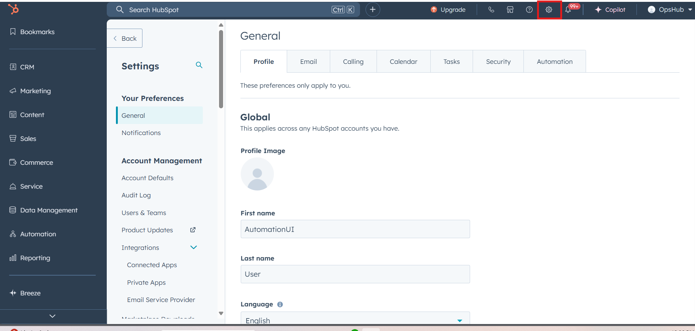</div>

3. In the left sidebar, navigate to **Users & Teams**.
4. Click on the **Create User** button at the top right.

<div align="center">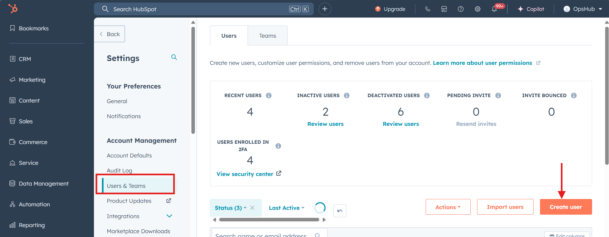</div>

5. Enter the **email address** of the user to invite.
6. Click **Next**, review the invite, and click **Send**.

> **Note** :

* The user will receive an invitation email to join HubSpot.
* You can later modify the user’s permissions via **Users & Teams**.

<div align="center">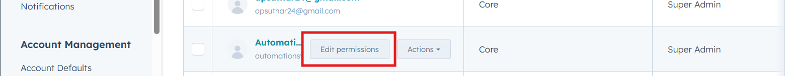</div>

* See [User Privileges](hubspot.md#user-privileges) for required permissions for different actions.

### Create Private App in HubSpot

1. Log in to your HubSpot Account with Admin privileges using the same user that you want to use as Integration User.
2. Navigate to **Settings → Integrations → Private Apps**.

<div align="center">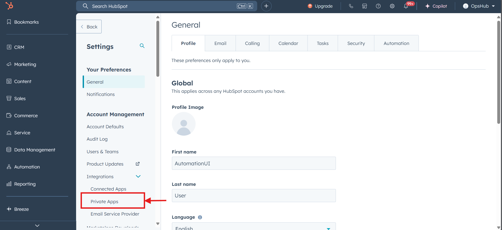</div>

3. Click **Create a Private App**.
4. Provide the App's Name (e.g., "<code class="expression">space.vars.SITENAME</code> Integration").

<div align="center">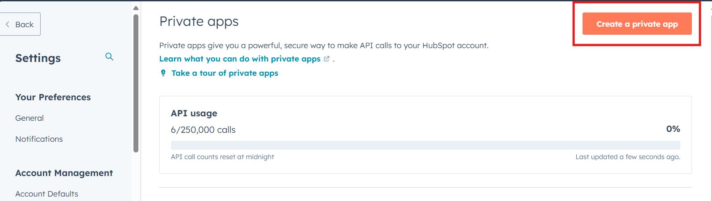</div>

5. Under **Scopes**, provide required scopes mentioned in \[User privileges]]\(#user-privileges).

<div align="center">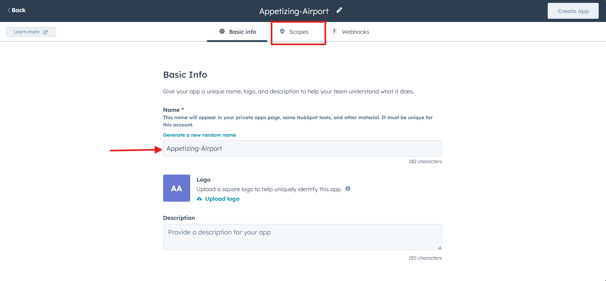</div>

6. Click **Create App**.
7. Copy the Access Token (Auth Token).
   * To know more details about this private app, refer to [HubSpot Private App Documentation](https://developers.hubspot.com/docs/guides/apps/private-apps/overview)
   * This token will be used in the **API Token** field during system configuration in <code class="expression">space.vars.SITENAME</code>.
   * Refer to [Steps to Get the Application ID for HubSpot ](hubspot.md#steps-to-get-the-application-id-for-hubspot)for details.

***

### Create Public App in HubSpot

1. Log in to your HubSpot Account with Super Admin privileges using the same user that you want to use as Integration User.
2. Navigate to **Settings → Integrations → Legacy Apps**.

<div align="center">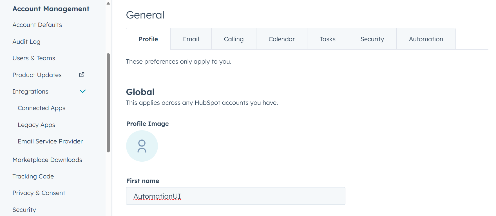</div>

3. Click **Create a Public App**.
4. Provide the App's Name (e.g., "<code class="expression">space.vars.SITENAME</code> Integration").

<div align="center">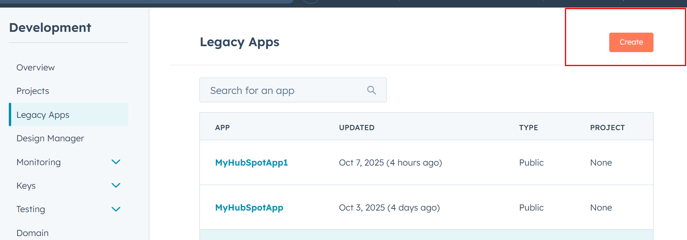</div>

5. Once App Name is given, go to Auth Section.

<div align="center">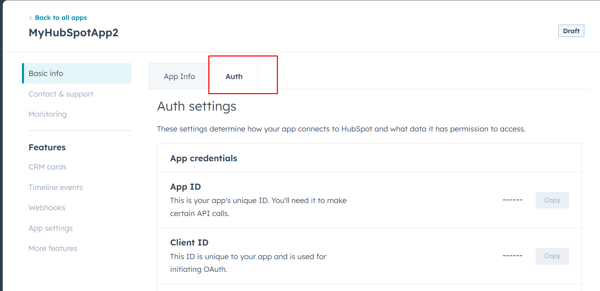</div>

6. You will find Application ID, Client ID and Client Secret (Automatically generated by HubSpot). Under Sample URL (keep it empty for now). Under Redirect URL give your applications URL \[Eg. https://hubspot.app.com].
7. Under **Scopes**, provide the required scopes mentioned in the [User privileges](hubspot.md#user-privileges) section.

<div align="center"></div>

8. Click **Create App**.
9. Copy the Application ID, Client ID and Client Secret.
   * To know more details about this public app, refer to [https://developers.hubspot.com/docs/apps/legacy-apps/public-apps/overview](https://developers.hubspot.com/docs/apps/legacy-apps/public-apps/overview).
   * This token will be used in the **Oath Token** field during system configuration in <code class="expression">space.vars.SITENAME</code>.

***

### Steps to Get the Application ID for HubSpot

1. Once the Private App is created, navigate to that app.
2. In the URL of the created app, the last part of the URL represents the required Application ID.
3. Example URL: https://app.hubspot.com/private-apps/45105664/2851633 → Here, 2851633 is the Application ID

<div align="center">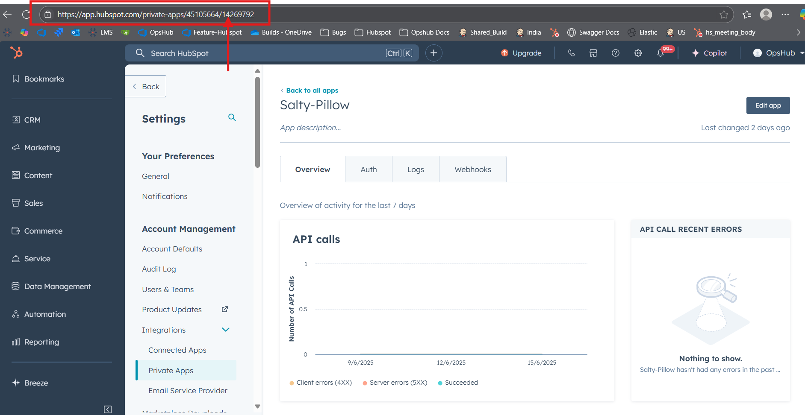</div>

### Managing Permission Scopes in HubSpot Private/Public App

1. Log in to HubSpot using a user with **Super Admin** permissions.
2. Go to **Settings → Account → Integrations → Private Apps**.
3. From the list of Private Apps, **select the Private App** you want to update.

<div align="center"></div>

4. Navigate to the **Edit** button and go to the **Scopes** tab within the selected Private App.

<div align="center">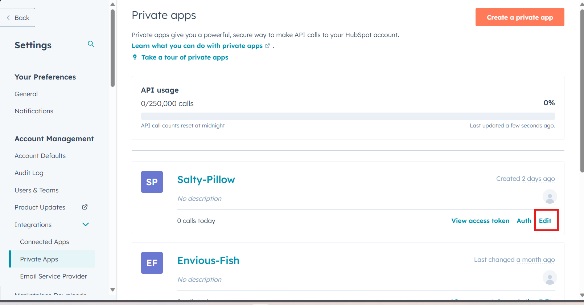</div>

5. **Add or remove scopes** as needed by selecting or deselecting the checkboxes next to the permissions the user wants to grant or revoke for the app.

<div align="center">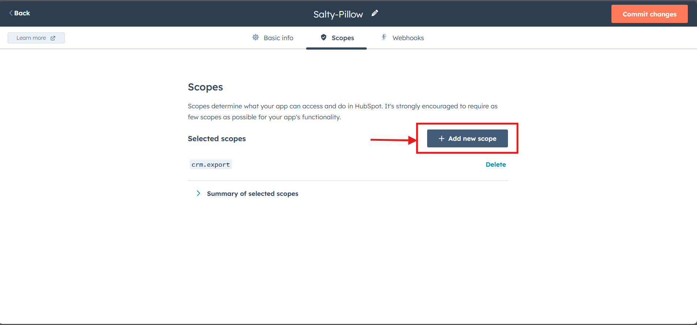</div>

6. Click **Save** to apply changes.

> **Note** :

* Changing scopes **will invalidate the existing access token**. A new token needs to be generated after saving.
* Ensure the new scopes match the requirements of the integration you are configuring.
* Assign only necessary scopes to follow best security practices.

***

### Get Internal Field Names for HubSpot Entities

In HubSpot, each property (field) of an entity (like Contacts, Companies, Deals, etc.) has an **internal name** used for API calls and integrations.

### How to View Internal Field Names

1. Log in to your HubSpot account.
2. Navigate to **Settings → Data Management → Objects**. Choose the entity (e.g., Deals).

<div align="center">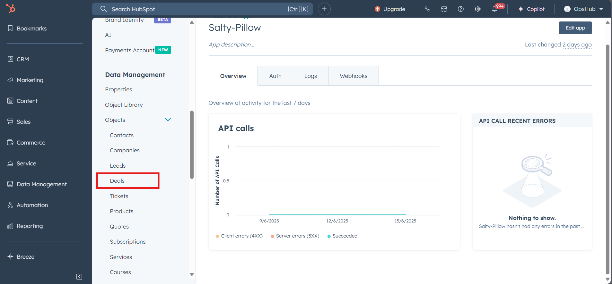</div>

3. Click **Manage Deal Properties** to view all deal entity fields.

<div align="center">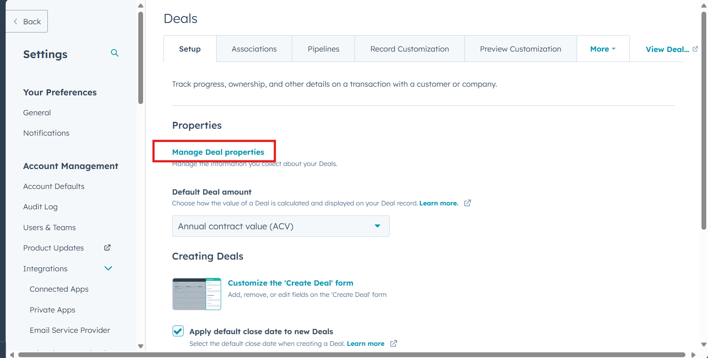</div>

.

4. Click any property to view its details.

### For Each Property

* **Label**: User-friendly display name.
* **Internal Name**: Actual key used in API requests (e.g., `dealname`, `company_size`).

<div align="center">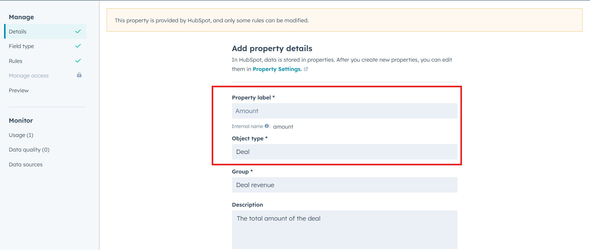</div>

### Lookup Values

* If the property is a **dropdown (enumeration)** or **association/lookup**, its internal name will be shown.
* Each dropdown option has a corresponding internal value used in API payloads. For example:

| Field Label     | Internal Name  |
| --------------- | -------------- |
| Deal Name       | dealname       |
| Lifecycle Stage | lifecyclestage |
| Company Size    | company\_size  |

### OAuth 2.0 Authorization Token Generation in HubSpot

#### Prerequisites

This authentication guide will show how to enable OAuth 2.0 Authentication in HubSpot with Opshub.

Before you can start using OAuth with HubSpot, you’ll need to have:

* A **developer account**
* An **app (legacy public app only)** associated with your developer account. Refer to [Create Public App in HubSpot](hubspot.md#create-public-app-in-hubspot) to know how to create public app in HubSpot.
* A **HubSpot account** to install your app in (you can use an existing account or create a test account)
* You must be a **Super Admin** to install an app in a HubSpot account

When you create a system form in HubSpot, you will be given two options for authentication type:

1. **Access Token**
2. **OAuth**

<div align="center">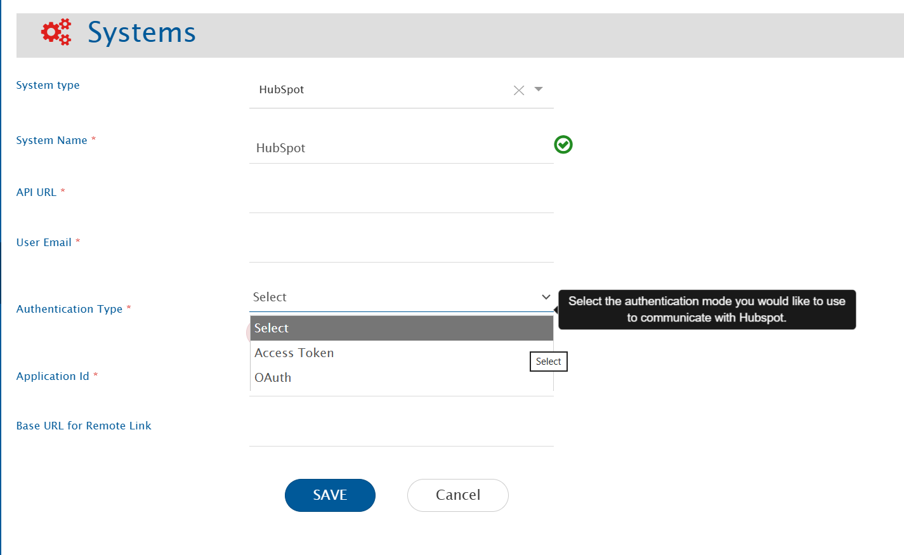</div>

After selecting **OAuth**, you will be prompted to enter the following details:

* **Client ID**
* **Client Secret**
* **Authorization Code**

<div align="center"></div>

To obtain the required details for OAuth setup:

1. Go to your **Public App Settings** in the HubSpot developer account.
2. In the **Auth** section, you will find the following values:
   * **Client ID**
   * **Client Secret**
3. To get the **Authorization Code**:
   * Add a redirect URL → the base URL of your HubSpot instance (e.g., `https://app.hubspot.com`) inside your public app at HubSpot instance.
   * Assign the required scopes/permissions to your app based on your needs. See: [Scopes Documentation](https://developers.hubspot.com/docs/apps/legacy-apps/authentication/scopes).
   * After this, an **Install URL** will be automatically generated.
   * Open this Install URL in your browser.
   * You will be redirected to another URL. From this URL, copy the value of the `code` parameter.

<div align="center">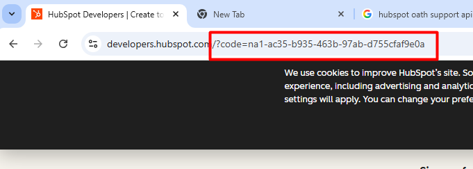</div>

> **Example:**\
> `https://developers.hubspot.com/?code=na1-ac35-b935-463b-97ab-d755cfaf9e0a`

4. Take this `code` value and enter it into the OpsHub system form along with the Client ID and Client Secret.
5. To know more on HubSpot OAuth, refer to [https://developers.hubspot.com/docs/apps/legacy-apps/authentication/working-with-oauth](https://developers.hubspot.com/docs/apps/legacy-apps/authentication/working-with-oauth)

## Important Note

* If the scopes or permissions of the app are changed at any point, you must follow the entire **Authorization Code Flow** again.\
  This means generating a new Install URL, approving the app, and retrieving a fresh `code` parameter to update in the OpsHub system form.
* The `code` used once by anyone, the same code **cannot be reused**.\
  You must **regenerate a new code** and update it in the system form.
* **Additionally**, one HubSpot application can be linked to **only one user's usecase**.\
  If another user requires access, they must create or authorize a **separate HubSpot application**.
