# Jira Align

## Prerequisites

### User privileges

* Create a user in Jira Align that is dedicated for <code class="expression">space.vars.SITENAME</code>. This user shouldn't perform any other action from Jira Align's user interface. This user is now referred as 'Integration User' in the document further.
* The Integration User should be assigned a role that has sufficient permissions to interact with the Jira Align APIs. Below are the details for permissions required for the role assigned to integration user.
  *   When Jira Align is the source endpoint:

      > **Note**: In Jira Align, all the entity types are distributed among different levels called: administration, portfolio, solution, team, program, product. Hence, for different entities, permissions have to be given at different levels, and these levels are called 'Sections'.
* The following table mentions the permissions required for an Integration User to synchronize the entities:

**Access needed for Entity Types**

| **Entity Type**         | **Section**         | **Permission to give in Additional Options**   |
| ----------------------- | ------------------- | ---------------------------------------------- |
| **Portfolio**           | Administration      | Add Agile Objects, Manage Agile Objects(Admin) |
| **Program**             | Administration      | Add Agile Objects, Manage Agile Objects(Admin) |
| **Region**              | Administration      | Add Agile Objects, Manage Agile Objects(Admin) |
| **City**                | Administration      | Add Agile Objects, Manage Agile Objects(Admin) |
| **Customer**            | Administration      | Add Agile Objects, Manage Agile Objects(Admin) |
| **Ideation**            | Enterprise, Product | Add Agile Objects, Manage Agile Objects(Admin) |
| **Theme**               | Portfolio           | Add Agile Objects, Manage Agile Objects(Admin) |
| **Initiative**          | Portfolio           | Add Agile Objects, Manage Agile Objects(Admin) |
| **Portfolio Objective** | Portfolio, Solution | Add Agile Objects, Manage Agile Objects(Admin) |
| **Capability**          | Solution            | Add Agile Objects, Manage Agile Objects(Admin) |
| **Value Stream**        | Solution            | Add Agile Objects, Manage Agile Objects(Admin) |
| **Epic**                | Program, Product    | Add Agile Objects, Manage Agile Objects(Admin) |
| **Program Objective**   | Program             | Add Agile Objects, Manage Agile Objects(Admin) |
| **Program Increment**   | Program             | Add Agile Objects, Manage Agile Objects(Admin) |
| **Story**               | Team                | Add Agile Objects, Manage Agile Objects(Admin) |
| **Defect**              | Team                | Add Agile Objects, Manage Agile Objects(Admin) |
| **Team Objective**      | Team                | Add Agile Objects, Manage Agile Objects(Admin) |
| **Task**                | Team                | Add Agile Objects, Manage Agile Objects(Admin) |
| **Sprint**              | Team                | Add Agile Objects, Manage Agile Objects(Admin) |

* In the Appendix section, refer to [Grant permissions to Jira Align user](jira-align.md#grant-permissions-to-jira-align-user) for step-wise details on how to grant permissions to a Jira Align user.
* To learn how to add a user in Jira Align, refer to [Add User](jira-align.md#add-user) section.

### Entity Details

| **Entity Type**       | **Project Type** | **projectFieldInternalName** | **Read Support** | **Write Support** | **Reading Mechanism** |
| --------------------- | ---------------- | ---------------------------- | ---------------- | ----------------- | --------------------- |
| **Portfolio**         | ENTERPRISE       | -                            | true             | true              | NON\_TIMESTAMP        |
| **Program**           | PORTFOLIO        | portfolioId                  | true             | true              | HISTORY               |
| **Region**            | ENTERPRISE       | -                            | true             | true              | NON\_TIMESTAMP        |
| **City**              | ENTERPRISE       | -                            | true             | true              | NON\_TIMESTAMP        |
| **Customer**          | ENTERPRISE       | -                            | true             | true              | NON\_TIMESTAMP        |
| **Ideation**          | ENTERPRISE       | -                            | true             | true              | HISTORY               |
| **Theme**             | ENTERPRISE       | -                            | true             | true              | HISTORY               |
| **Initiative**        | PROGRAM          | primaryProgramId             | true             | true              | HISTORY               |
| **Objectives**        | PROGRAM          | programId                    | true             | true              | HISTORY               |
| **Capability**        | PROGRAM          | primaryProgramId             | true             | true              | HISTORY               |
| **Value Stream**      | ENTERPRISE       | -                            | true             | true              | NON\_TIMESTAMP        |
| **Epic**              | PROGRAM          | primaryProgramId             | true             | true              | HISTORY               |
| **Program Increment** | PORTFOLIO        | portfolioId                  | true             | true              | HISTORY               |
| **Story**             | PROGRAM          | programId                    | true             | true              | HISTORY               |
| **Defect**            | PROGRAM          | programId                    | true             | true              | HISTORY               |
| **Task**              | PROGRAM          | -                            | true             | true              | HISTORY               |
| **Sprint**            | PROGRAM          | programId                    | true             | true              | NON\_TIMESTAMP        |

> **Note**: For entity type as objectives, please provide "tier" as 1 for team objective, 2 for program objective, 4 for portfolio objective.

## System Configuration

Before the user starts with the integration configuration, first configure Jira Align system.

Click [System Configuration](../integrate/system-configuration.md) to learn the step-by-step process to configure a system.

Refer the screenshot given below:

<div align="center">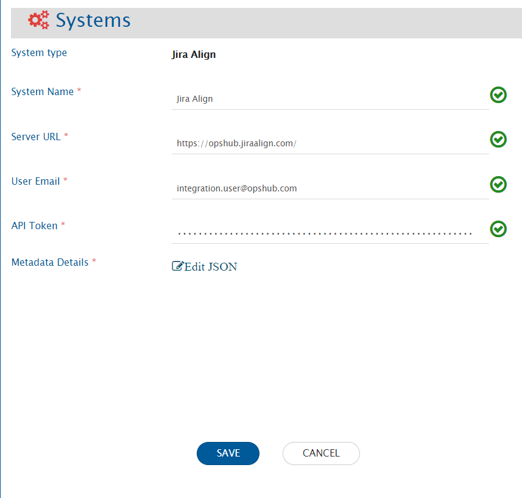</div>

**Jira System form details**

| **Field Name**       | **Description**                                                                                                                                                                                                                                                                                                                                                                                     |
| -------------------- | --------------------------------------------------------------------------------------------------------------------------------------------------------------------------------------------------------------------------------------------------------------------------------------------------------------------------------------------------------------------------------------------------- |
| **System Name**      | Provide System name                                                                                                                                                                                                                                                                                                                                                                                 |
| **Server URL**       | Provide Server URL of the Jira Align instance. This URL will be used for comminucating to Jira Align API. The format of the URL will be: https://\[nameOfYourJiraInstance]. Example: myopshub.jiraalign.com/                                                                                                                                                                                        |
| **User Email**       | Provide the email Id of a dedicated user who will be used for communicating with Jira Align API. This user should have the required privileges to use the Jira Align API. For more details on the required privileges, please refer to [User privileges](jira-align.md#user-privileges) section.                                                                                                    |
| **API Token**        | Provide the API token generated in Jira Align for the user given in 'User Email' field. For help on how to generate API token, please refer to section.                                                                                                                                                                                                                                             |
| **Metadata Details** | This data is pre-populated in JSON format according to our knowledge of system metadata (entity type, field names, lookup...), the user can edit it based on his/her Jira Align instance details for system/custom metadata. For the format and guidance related to filling these details in JSON form, please refer to [Understanding JSON Input](jira-align.md#understanding-json-input) section. |

### Understanding JSON Input

* The field metadata details needed for integrating Jira Align system with other systems are provided at the time of system configuration in the field 'Metadata details' in the form of JSON.
* For an entity, internal name of the entity is given as the API endpoint name of the entity.For example - for entity "Epic", the API end point name is - "Epics"
* If the internal name is not given correct, it will lead to failures in the integration.
* This internal name is used in "lookup" field and the entities fields of the other entities as well.
* If any system/custom field is added in the entity metadata, ensure that the field is activated from the Detail Panel Settings in the instance.
* If any system/custom field is marked as mandatory in the entity metadata, ensure that the field is required from the Detail Panel Settings in the instance.
* Refer to [Understanding JSON Metadata Input](../integrate/system-configuration.md#understanding-json-metadata-input) for more details on the JSON inputs
  * Refer to [JSON Metadata Sample](sample-json-file-for-jira-align.md) for a sample JSON for Jira Align entities.

## Mapping Configuration

Map the fields between Jira Align and the other system to be integrated to ensure that the data between both the systems synchronizes correctly.

<div align="center">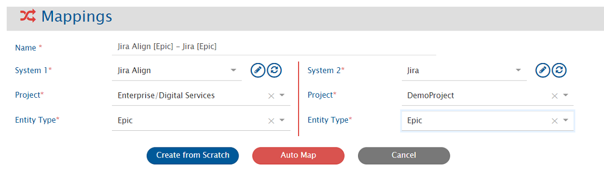</div>

Click [Mapping Configuration](../integrate/mapping-configuration.md) to learn the step-by-step process to configure mapping between the systems.

> In Jira Align, entity type selection in mapping depends on the project. To learn how, please refer [Project Selection](jira-align.md#project-selection).

## Integration Configuration

Set a time to synchronize data between Jira Align and the other system to be integrated. Also, define parameters and conditions, if any, for integration.

Click [Integration Configuration](../integrate/integration-configuration.md) to learn the step-by-step process to configure integration between two systems.

<div align="center">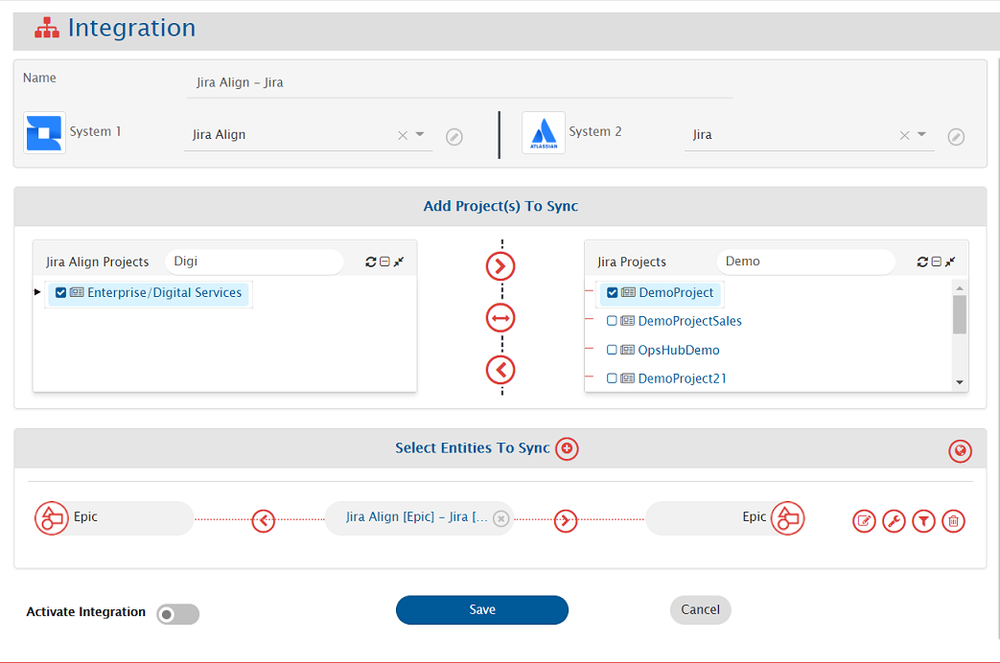</div>

> In Jira Align, entity type selection in integration configuration depends on the project selection. To learn how, please refer: [Project Selection](jira-align.md#project-selection).

### Criteria Configuration

If the user wants to specify conditions for synchronizing an entity from Jira Align as source system to the other system, he/she can use the Criteria Configuration.

* Go to **Criteria Configuration** section on the [Integration Configuration](../integrate/integration-configuration.md) page.
* Set the `Query` field using Jira Align native query format (e.g., `priority eq 1`).

For more details on how to configure criteria in Jira Align native query format, refer: [Jira Align Query Documentation](https://help.jiraalign.com/hc/en-us/articles/360048085774-10X-API-2-0-GET-Usage-and-Filters). The queries used in filter section in plain text can be used as criteria query.

Given below are the sample snippets of how the Jira Align queries can be used as criteria query in <code class="expression">space.vars.SITENAME</code>:

**Criteria Samples**

| **Field Type** | **Criteria Description**                                                                       | **Criteria Snippet**                                                                                                               |
| -------------- | ---------------------------------------------------------------------------------------------- | ---------------------------------------------------------------------------------------------------------------------------------- |
| Lookup         | Synchronize all entities which have high priority                                              | <p>priority eq 2<br>Here, priority 2 belongs to the value 'high'.</p>                                                              |
| Date           | Synchronize all entities created after 10 March 2021                                           | <p>createdDate ge 2021-03-10T00:00:00Z<br>Format of date in Jira Align is: yyyy-MM-dd'T'HH:mm:ss'Z'</p>                            |
| User           | Synchronize all entities which was created by user 'ABC'                                       | <p>createdBy eq 1159<br>Here, 1159 is the uid of the user 'ABC' which can be obtained from 'People' table on Jira Align UI.</p>    |
| User + Lookup  | Synchronize all entities which was created by user 'ABC' and also has 'Priority' as 'Critical' | <p>createdBy eq 1159 and priority eq 1.<br>Here, priority 1 belongs to the value 'critical'.</p>                                   |
| Lookup         | Synchronize all entities which has 'Priority' as 'Critical' or 'Priority' as 'High'            | <p>priority eq 1 or priority eq 2.<br>Here, priority 1 belongs to the value 'critical' and priority 2 belongs to value 'high'.</p> |

### Target LookUp Configuration

Provide Query in Target Search Query field such that it is possible to search the entity in the Jira Align as the destination system. In the target search query field, the user can provide a placeholder for the source system's field value in the '@' . Go to **Search in Target Before Sync** on the [Integration Configuration](../integrate/integration-configuration.md) page. Overall, Target Lookup Query is similar to [Criteria Query](jira-align.md#criteria-query), except that the value part contains a field name with '@' instead of static value. Given below is the sample snippet of how the Jira Align queries can be used as target entity lookup query in <code class="expression">space.vars.SITENAME</code>:

**Target Lookup Query Samples**

| **Field Type** | **Target Lookup Use Case**                           | **Snippet**                           |
| -------------- | ---------------------------------------------------- | ------------------------------------- |
| Text           | Match entity having source ID in `description` field | `description eq '@source_system_id@'` |

For more details on how to configure criteria in Jira Align, refer: [Jira Align Query Documentation](https://help.jiraalign.com/hc/en-us/articles/360048085774-10X-API-2-0-GET-Usage-and-Filters) for more details. The queries used in filter section in plain text can be used as criteria query.

## Known Behaviour

### Project Selection

* For Jira Align system, user can organize their data at different levels, i.e., Enterprise, Portfolio or Program \[as defined below]. Different entities can reside on different levels, for e.g., the Epic can belong to Program while Objective can belong to Portfolio. For more details on Project entity, please refer to [Entity Details](jira-align.md#entity-details) section.
* **Enterprise**
  * **Portoflio**
    * **Program**

And this hierarchy is inclusive of Parent. For example, Epic can be organized at Program level, and the user can create an integration with Program/Portfolio/Enterprise setting for their integration. While Objective can belong to Portfolio level, and user can create an integration with Portfolio/Enterprise setting for their integration.

> **Note**: The information related to the mandatory single field value field is to be given in the JSON input in the section, **entities->systemSpecific->projectEntityType**

## Known Limitations

* Limitations due to the lack of API:
  * Synchronization of comments and attachments is not supported.
  * If in the Jira Align more than one user having same full Name then we return the first value that matches the fullName.
    * **Reason: Jira Align API does not give any identification for two different users having same full name.**
  * For user type field synchronization advance mapping would be needed in the below mentioned usecase.
    * **If the first name or last name of the user is changed.**
  * Fields available in the following sections are not supported:
    * Value
    * Finance
    * Responsibility Matrix
    * Skill set
    * Design
    * Members
    * Program, Products and Regions(Section): Regional Allotment(field), Program Allotment(field)
  * When Jira Align is target endpoint:
    * Synchronization of Ideation's Category field:
      * The category field should be marked as mandatory in the fields JSON metadata input and in the field mapping.
      * In the field configuration, the **sync when** should be configured to create only.
  * When Jira Align is source endpoint:
    * Conflict detection is not supported for 'State' field in the 'Epic' entity type.
* When Jira Align is source endpoint, below entities will be synchronized without history. They will be synchronized with the entity state/details available at the time of synchronization.
  * Product, Value Stream, Release Vehicle, Snapshot, Region, Portfolio, Theme, Program, Program Increment, Team, Sprint
* In case of One to Many links from Epic to Capability and Capability to Feature, configure link from child to parent, that is from Capability to Epic and enable **fail if not found** criteria.
  * **Reason**: API limitation from Jira Align.\*\*
* When a link is added from Epic to Feature or vice versa, an additional update is needed as the last updated time of the entity does not change by adding link.

## Appendix

### Add user

1. Login to Jira Align using the user with privileges to create a new user.<br>
2. Go to **Administration** Section.<br>

<div align="center">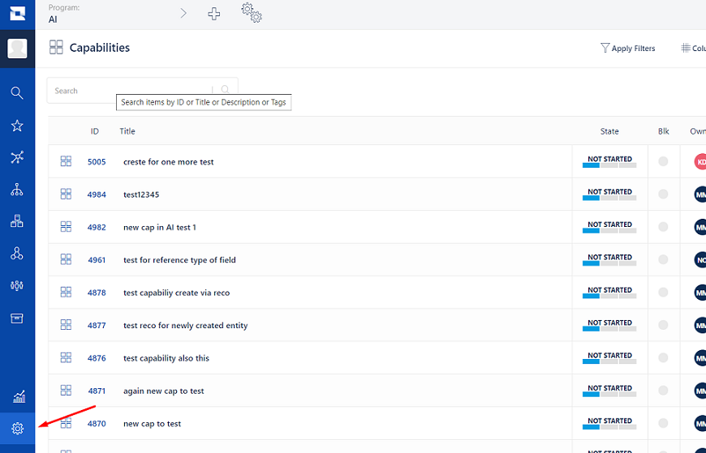</div>

3. Navigate to _People_<br>

<div align="center">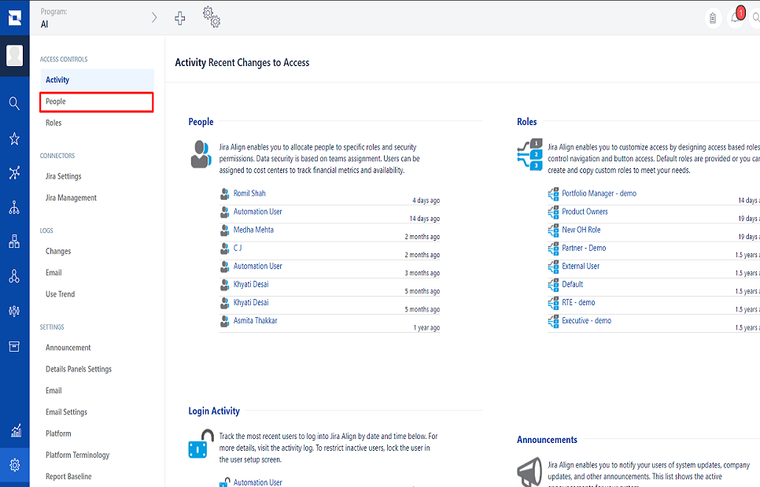</div>

4. Click on the **Add User** button on top right corner of the users' list.<br>

<div align="center">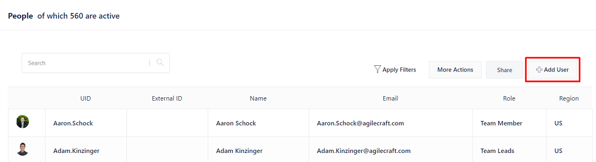</div>

5. Fill the details regarding user. For the 'Role', select the roles having permissions mentioned in \[\[#User privileges|User privileges]] Section<br>

<div align="center">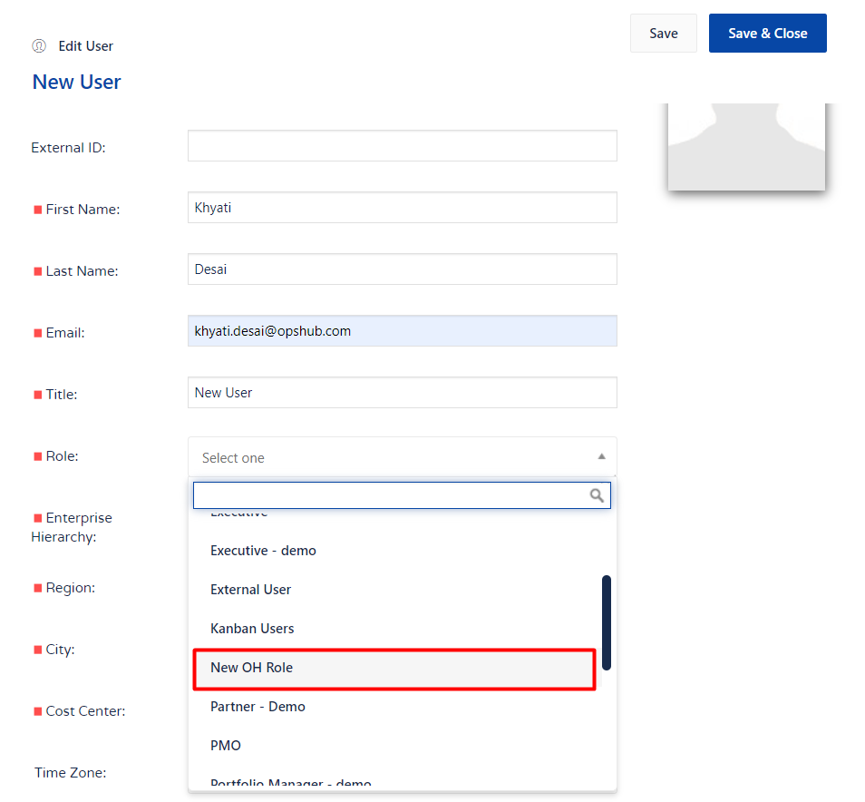</div>

6. Save changes

### Grant permissions to Jira Align user

1. Login to Jira Align using the user with privileges to create a new user.<br>
2. Go to **Administration->Roles** Section.<br>

<div align="center"></div>

<div align="center">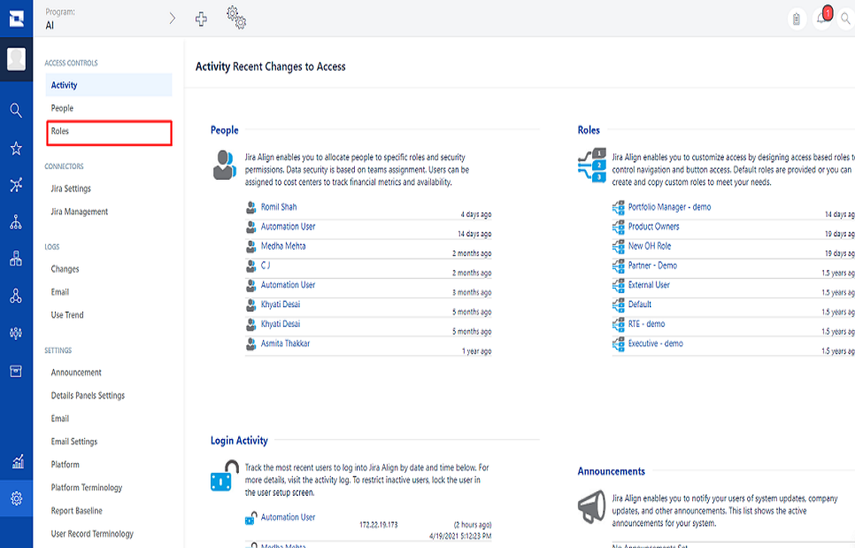</div>

3. Select a Role you want to give to integration user.<br>

<div align="center">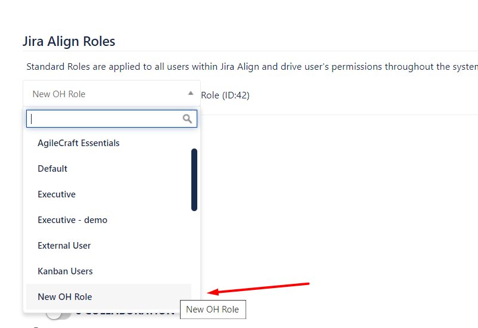</div>

4. Give permissions as per mentioned in the [User privileges](jira-align.md#user-privileges) Section to this role.<br>
5. For example, to give Administration access: click the '+' sign on the left side of **Administration** section and enable the needed permissions.<br>

<div align="center">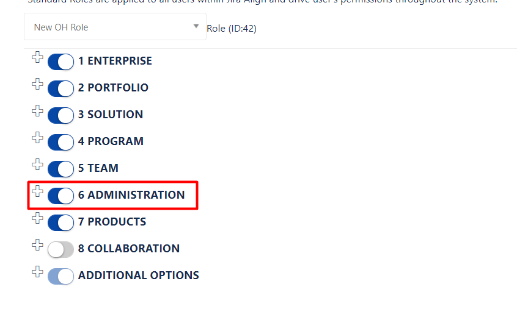</div>

<div align="center">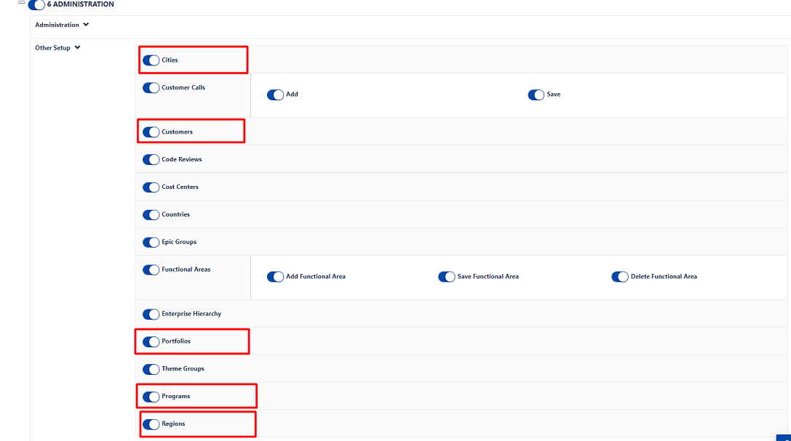</div>

### Steps for generating the Bearer token

1. Go to User menu and then navigate to Edit Profile option.<br>

<div align="center">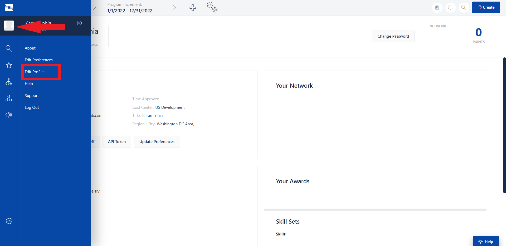</div>

2. In the Account Details section, click API Token.<br>

<div align="center">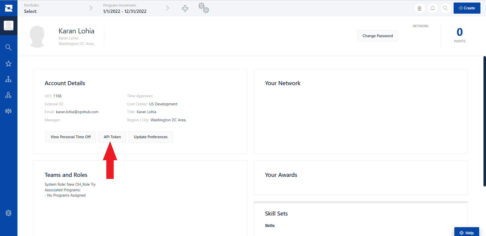</div>

3. Click "Generate new API Token" and copy the "API 2.0 Token".<br>

<div align="center">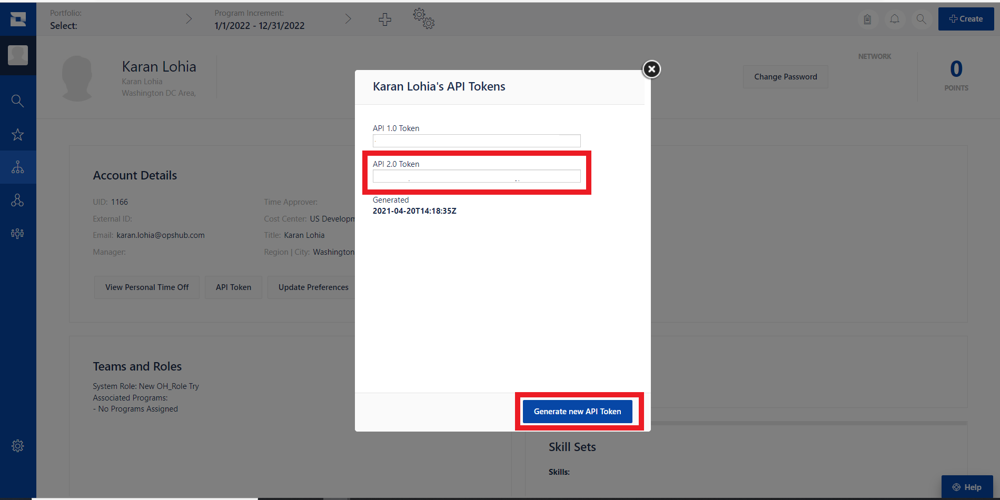</div>

4.  Add "Bearer" at the begining of the copied token to make it in the form of `Bearer <API 2.0 Token>`. For example:

    ```
    User Token Copied: `user:1166|{.%Bb8_V6LPX5JY}03j|v+t<#M~V}8r`  
    Change to: `Bearer user:1166|{.%Bb8_V6LPX5JY}03j|v+t<#M~V}8r`
    ```
