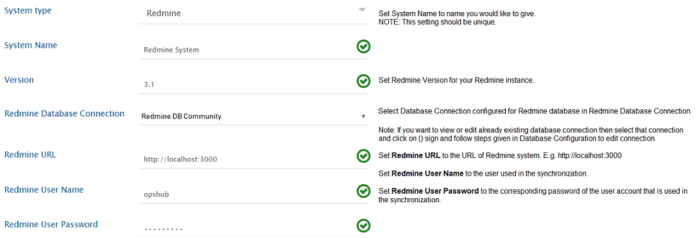
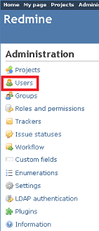
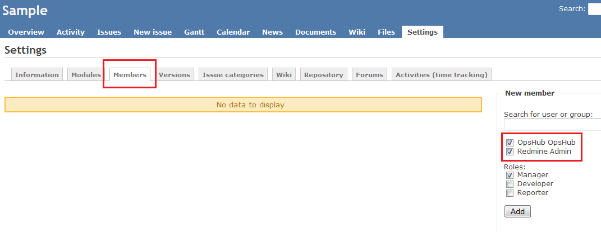
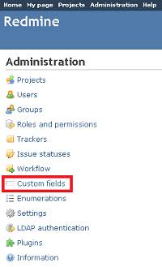
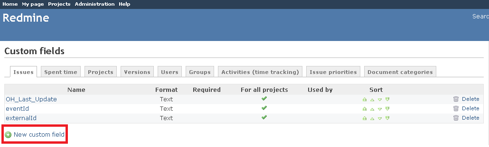
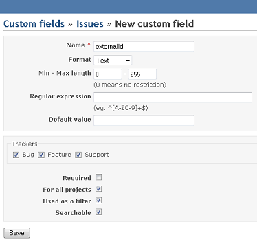
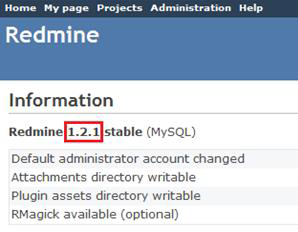
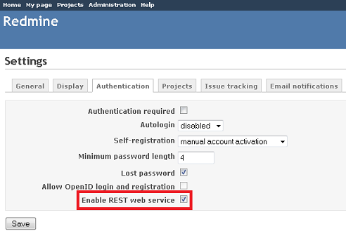

# Redmine

## Prerequisites

### User Privileges

* Create one Redmine user dedicated to <code class="expression">space.vars.SITENAME</code>. User should not do any operations from system's user interface.
* The user created for synchronization should have access to the project that will be configured for synchronization. This user should have both administrator rights as a user and reporter rights at the project level. For detailed information on how to add a user, refer to the [Add User](redmine.md#add-user) section. For further details on how to assign users to the projects, refer to the [Assigning User to Projects](redmine.md#assigning-user-to-projects) section.
* Enable REST API service for Redmine, if it is not already enabled. For further details, refer to the [Redmine Configuration](redmine.md#redmine-configuration) section.

### End System Storage Criteria

* To configure the End System Storage Criteria with the Custom Field in <code class="expression">space.vars.SITENAME</code>, the "Used as a filter" option needs to be enabled for this selected Custom Field. For more details, refer to [Custom Field Configuration](redmine.md#custom-field-configuration).

### Redmine Database Information

Given below are the configuration parameters for the Redmine database to create an integration configuration.

* Redmine Database Type
* Redmine Database Host
* Redmine Database Port
* Redmine Database Name
* Redmine Database Username
* Redmine Database Password

## System Configuration

Before you continue to the integration, you must first configure Redmine. Click [System Configuration](../integrate/system-configuration.md) to learn the step-by-step process to configure a system. Refer the screenshot given below for reference.

**Redmine System form details**

| **Field Name**                  | **When field is visible on the System form** | **Description**                                                                                                                                                                                                                                        |
| ------------------------------- | -------------------------------------------- | ------------------------------------------------------------------------------------------------------------------------------------------------------------------------------------------------------------------------------------------------------ |
| **System Name**                 | Always                                       | Provide system name                                                                                                                                                                                                                                    |
| **Version**                     | Always                                       | Provide version like 3.1.2, 3.4.5. To know your version, refer to [How to find Redmine's version](redmine.md#find-version) section.                                                                                                                    |
| **Redmine Database Connection** | Always                                       | Select an already created Database connection or if the Database connection is not configured for Redmine, then click the + sign and follow steps given on the [Database Configuration](database-configuration.md) page to create database connection. |
| **Redmine URL**                 | Always                                       | Format: \[http/https]://\[RedmineServerHost]/\[RedmineServerPort]                                                                                                                                                                                      |
| **Redmine User Name**           | Always                                       | Provide the username of the Redmine user created for <code class="expression">space.vars.SITENAME</code>. Please refer to [User Privileges](redmine.md#user-privileges) for more details.                                                              |
| **Redmine User Password**       | Always                                       | Provide Redmine Users password                                                                                                                                                                                                                         |

If the system is deployed on HTTPS and a self-signed certificate is used, then you will have to import the SSL Certificate to be able to access the system from <code class="expression">space.vars.SITENAME</code> Click [Import SSL Certificates](../getting-started/ssl-certificate-configuration.md) to learn how to import SSL certificate.

## Mapping Configuration

Map the fields between Redmine and the other system to be integrated to ensure that the data between both the systems synchronizes correctly. Click [Mapping Configuration](../integrate/mapping-configuration.md) to learn the step-by-step process to configure mapping between the systems.

## Integration Configuration

In this step, set a time to synchronize data between ServiceNow and the other system to be integrated. Also, define parameters and conditions, if any, for integration.\
Click [Integration Configuration](../integrate/integration-configuration.md) to learn the step-by-step process to configure integration between two systems.\
Refer [Custom Field](redmine.md#custom-field-configuration) section in appendix to learn how to create custom fields.

## Criteria Configuration

* If you want to specify conditions for synchronizing an entity between Redmine and the other system to be integrated, you can use the Criteria Configuration feature.
* Go to Criteria Configuration section on [Integration Configuration](../integrate/integration-configuration.md) page for further details.
* To configure criteria in Redmine, integration needs to be created with Redmine as the source system. <code class="expression">space.vars.SITENAME</code> supports criteria on native queries which are supported by Redmine Rest API. The format of criteria query is \[Internal Name] = \[Value of Id for desired property]
* Some of the properties on which <code class="expression">space.vars.SITENAME</code> support queries are as follows:
  * Tracker
  * Status
  * Assigned To
  * Priority
  * Custom Fields

The relative ids for the properties are given in the table below:

| **Property Name** | **Internal Name** | **Description**                                                                                                   |
| ----------------- | ----------------- | ----------------------------------------------------------------------------------------------------------------- |
| Tracker           | tracker\_id       | To know more about trackers\_id, refer to https://www.redmine.org/projects/redmine/wiki/Rest\_Trackers            |
| Status            | status\_id        | To know more about status\_id, refer to https://www.redmine.org/projects/redmine/wiki/Rest\_IssueStatuses         |
| Assigned To       | assigned\_to\_id  | To know more about users\_id, refer to https://www.redmine.org/projects/redmine/wiki/Rest\_Users)                 |
| Priority          | priotity\_id      | To know more about proirity\_id, refer to https://www.redmine.org/projects/redmine/wiki/Rest\_Enumerations)       |
| Custom Fields     | cf\_x             | To know more about custom\_fields\_id, refer to https://www.redmine.org/projects/redmine/wiki/Rest\_CustomFields) |

### Sample Query

* Polling all the issues with status 'Closed'.
  * Let the id of status closed under issue\_statuses table be 3. So, query formed will be: 'status\_id=3'
* Polling the issues with custom description having value 'hello'.
  * Let the id of custom description field be 3. So, query formed will be: 'cf\_3=hello'.
* Polling the issues with more than one criteria: For example, poll the issues having status as 'Closed' and custom description as 'hello'. For more details about criteria query with more than one parameters, refer to https://www.redmine.org/projects/redmine/wiki/Rest\_Issues.
  * The query formed will be 'cf\_3=hello\&status\_id=3'.

## Target Lookup Configuration

Provide Query in Target Search Query field so that it is possible to search the entity in Redmine when it is the target system.\
Go to **Search in Target Before Sync** section on [Integration Configuration](../integrate/integration-configuration.md) page to learn in detail about how to configure Target Lookup.\
Target LookUp configuration is similar to the Criteria Configuration where in the target search query field, you can provide a placeholder for the source system’s field value in-between ‘@’.

The internal names of the properties are listed in the table below, and can be used in the Target Lookup query:

| **Property Name** | **Internal Name** | **Description**                                                                                                         |
| ----------------- | ----------------- | ----------------------------------------------------------------------------------------------------------------------- |
| Tracker           | tracker\_id       | To know more about trackers\_id please refer to https://www.redmine.org/projects/redmine/wiki/Rest\_Trackers.           |
| Status            | status\_id        | To know more about status\_id please refer to https://www.redmine.org/projects/redmine/wiki/Rest\_IssueStatuses         |
| Assigned To       | assigned\_to\_id  | To know more about users\_id please refer to https://www.redmine.org/projects/redmine/wiki/Rest\_Users                  |
| Priority          | priotity\_id      | To know more about proirity\_id please refer to https://www.redmine.org/projects/redmine/wiki/Rest\_Enumerations        |
| Custom Fields     | cf\_x             | To know more about custom\_fields\_id, please refer to https://www.redmine.org/projects/redmine/wiki/Rest\_CustomFields |

### Sample Queries

* Target Lookup Query for a constraint on a **single field**:\
  `(subject=@Title@)`\
  **Description:** It represents a query that will select only entities that have the same "subject" field value as the source system's "title" field value.
* Target Lookup Query for constraints on **multiple fields**:\
  `(status_id=@State@&subject=@Title@)`\
  **Description:** It represents a query that selects only entities whose "status" field value matches the source system's "state" field value and whose "subject" field value matches the source system's "title" field value.

## Known Behaviour

* Comments Synchronization:
  * On enabling comments synchronization, Notes in the Redmine will be synchronized as comments at the other end point.
* Issues Synchronization:
  * Currently <code class="expression">space.vars.SITENAME</code> supports synchronization of the trackers under the issues type.
* SubTask Synchronization:
  * To synchronize subtasks, relationship should be configured in mapping configuration with link type as ParentChild.
* Version type Field:
  * For Version Type field , in case of multi-project sync, the values need to be same across all the projects in the Redmine, which are the part of the sync.
    * For the above field sync, the project needs to be selected at the mapping level.
      * Reason: Redmine API requires the project input to fetch the values of Version type field.
  * However, the fields shown at mapping level will not be project\[selected at mapping level] specific. The fields for all the projects will be visible at mapping level.
  * Reason: Redmine API does not provide a way to fetch the fields project-wise.

## Known Limitations

* Synchronization of issues that have change only in the related issues(relation link) for any entity will not sync to the target system:
  * Reason: When the related issues are changed in an entity(either a related issue is added or removed), in that case Redmine does not update the updated time of the entity.
  * Solution: To synchronize such related issues changes, an additional update is needed to any system or custom field of Redmine.
* Synchronization of the inline images:
  * Inline images are synchronized to the target system depending on whether the target system supports them or not.
  * The inline image may not synchronize properly in the below mentioned use case:
    * Referencing of the inline images with attachment is case insensitive in Redmine. For example, if the attachment name is Capture.PNG and the attachment refered as inline image is written as !Capture.png!, Redmine will still refer to 'Capture.PNG' attachment. The other end point system may not refer to the attachment if their is any mismatch in case of inline image and attachment.
* Issues' Synchronization:
  * <code class="expression">space.vars.SITENAME</code> does not provide support for field type coming from plugin(s) as of now.
* At least one issue of any type must be created in the Redmine instance before performing mapping configuration in the <code class="expression">space.vars.SITENAME</code>.

## Appendix

### Add User

1. Log in to Redmine as a user with **Administrator** rights.
2. Click on **Administration**.
3. Select **Users**.
4. Click the **+** sign to add a new user.
5. Enter **Login**, **First Name**, **Last Name**, **E-mail**, and **Password**.
6. Check the **Administrator** box.
7. Click the **Create** button.

### Assigning User to Projects

* Log in to Redmine as a user with Administrator rights.
* Click **Administration**.
* Select **Projects**.
* Click the project to which the user is to be assigned.
* Click **Members**.
* Select the user to be assigned, along with the Role.
* Click **Add** button.

### Custom Field Configuration

<code class="expression">space.vars.SITENAME</code> needs a few special fields to be defined on the entity that is being synchronized. These must be set up so that <code class="expression">space.vars.SITENAME</code> can track the integration status of each item.

* Log in to Redmine as a user with Administrator rights.
* Click Custom fields.

* Click the + Sign to add a new custom field.
* Enter custom field name.
* Select format Text.
* Set Maximum length to 255.
* Attach it to the all Tracker types.
* Check the options for For all Projects, Used as a Filter, Searchable.
* Click Save button.

### Find Version

1. Log in to Redmine as a user with Administrator rights.
2. Go to **Administration > Information**.
3. Click **Information**. It will display the Redmine version.

### Redmine Configuration

By default, Enable Rest API option is disabled in Redmine. Given below are the steps to enable REST API option:

1. Log in to Redmine as a user with Administrator rights.
2. Go to **Settings > Authentication** tab.
3. Under Authentication tab, check mark the option of **Enable REST web service** if it is not checked.
4. Press **OK** button.

