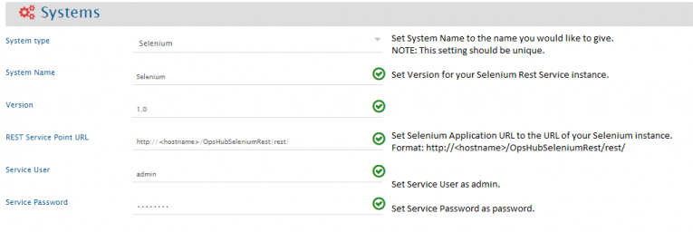

# Selenium

## Prerequisites

PHP Apache server is required to run Selenium Rest Service.

## System Configuration

Before you continue to the integration, you must first configure Selenium onto <code class="expression">space.vars.SITENAME</code>. Click [System Configuration](../integrate/system-configuration.md) to learn the step-by-step process to configure a system.

Refer to the screenshot given below for reference.

<div align="center"></div>

If the system is deployed on HTTPS and a self-signed certificate is used, then you will have to import the SSL Certificate to be able to access the system from <code class="expression">space.vars.SITENAME</code>. Click [Import SSL Certificates](../getting-started/ssl-certificate-configuration.md) to learn how to import SSL certificate.

## Mapping Configuration

Map the fields between Selenium and the other system to be integrated to ensure that the data between both the systems synchronizes correctly.\
Click [Mapping Configuration](../integrate/mapping-configuration.md) to learn the step-by-step process to configure mapping between the systems.

## Integration Configuration

Set a time to synchronize data between Selenium and the other system to be integrated. Also, define parameters and conditions, if any, for integration.\
Click [Integration Configuration](../integrate/integration-configuration.md) to learn the step-by-step process to configure integration between two systems.

## Appendix

### Selenium Rest Service Installation

* Extract zip file from `<OpsHub Installtion Directory>/Other_Resources/Resources/OpsHubSeleniumRest.zip` to PHP Public directory.\
  **For Example:** `E:/wamp/www/OpsHubSeleniumRest.zip`
* Open `config.php` file located at `OpsHubSeleniumRest/application/config/` directory and specify directory which you want to poll.

```php
/** 
 * Here User can define list of Selenium test directory 
 */
$config[SELENIUM_DIRS] = [
    "E:\\SeleniumTestScripts\\",
    "E:\\FormLoader\\test\\"
];
```

* Require enabling Apache service `rewrite_module`.
* Open `http://<hostname>/OpsHubSeleniumRest/rest/` URL to check service is properly deployed.

### Known Limitations

Only polling is supported for this connector.
