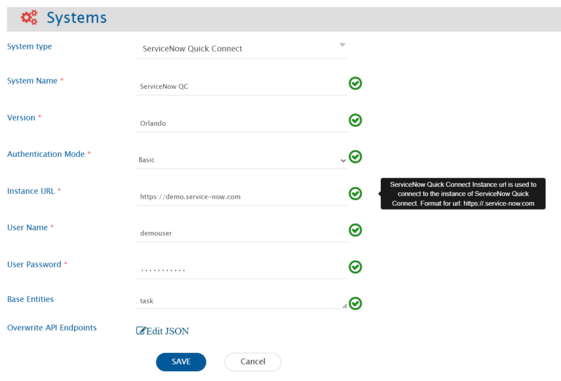
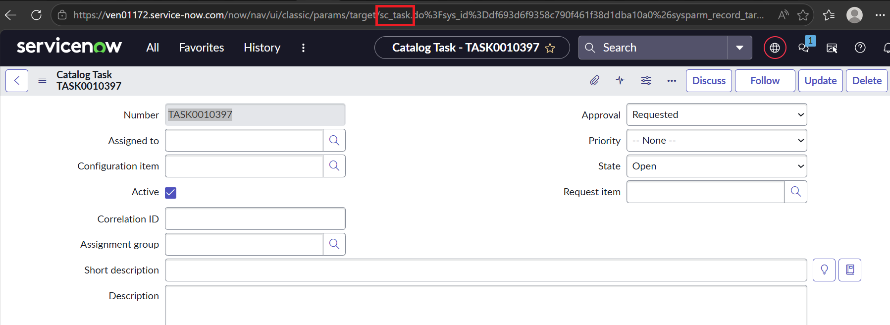
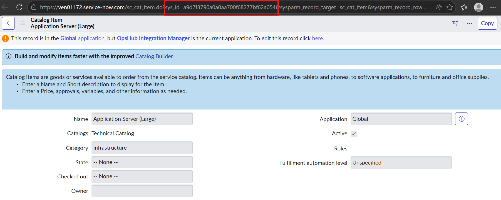

# ServiceNow Quick Connect

## Prerequisites

### User Privileges

*   Create one administrator user of ServiceNow Quick Connect system (please refer to [Add User](servicenow-quick-connect.md#add-user) section for creating a new user), dedicated to <code class="expression">space.vars.SITENAME</code>. User should not be used to do any operations from ServiceNow Quick Connect User-Interface.

    > **Note**: In case your ServiceNow Quick Connect is configured with SSO, you will have to create a normal service user account in ServiceNow Quick Connect and use that user in integration.
* In case if administrator user is not available, dedicated user should have access to tables mentioned below. Please note that Read, Write, Delete, etc mentioned in brackets beside table names, are the access permissions required on respective table. Refer to [Add user access for table](servicenow-quick-connect.md#add-user-access-for-table) for providing required permissions to the user.
  * sys \_attachment (Read, Write, Delete)
  * sys \_audit (Read, Read. \*)
  * sys \_db \_object (Read, Read. \*)
  * sys \_dictionary (Read, Read. \*)
  * sys \_choice (Read, Read. \*)
  * ecc \_queue (Write)
  * sys \_attachment \_doc (Read)
  * sys \_user (Read)
  * sys \_journal \_field (Read,Write,Delete)
  * sys \_glide \_object (Read)
  * task (Read, Read. \*)
  * User should have Read and Write access to all the entity table that needs to be synchronized. Eg., for incident to be synchronized, the user will need Read and Write access to the incident entity table.

> **Note**: In above permissions, Read. \* means there an ACL with \* selected in columns with Read permission is required. Please refer to [Add user access for table](servicenow-quick-connect.md#add-user-access-for-table) for providing Read. \* permission on a table.

* In case you want to use fields of type 'Reference' (e.g. Assignment group, Category, etc), some extra permissions need to be provided. Please refer to [Syncing reference fields](servicenow-quick-connect.md#syncing-fields) section for providing the required permissions.
* Please note, in addition to **Read.** \* ACL on a table (wherever applicable in the above list); to get access to all the fields, you must ensure that each field of the table meets the following conditions:
  * Field should be marked 'Active' (Active column of the field should be set to 'True').
  * If read ACL is applied on the field, you will get access to the field only when you meet all the below-mentioned criteria associated with the ACL:
    * The condition associated with ACL must evaluate to 'true'.
    * The script associated with ACL must evaluate to 'true' or return an answer variable with the value of 'true'.
    * You must have one of the roles in the required roles list associated with ACL. If the list is empty, this condition evaluates to 'true'.

### Syncing Fields

* Reference fields are the fields that refer to some other ServiceNow Quick Connect entity, i.e., fields whose values are the records of some other entity. E.g., Assignment Group field in Incident entity refers to Group entity.
* To sync such reference fields, the integration user must have 'read' permission for the columns sys \_id and name or number (whichever is available) of the table/entity that is being referred by the field. The **Allow access to this table via web services** check-box should be checked for allowing the access via REST API to the table being referred by the field.

> **Note**: The user must not change the field types of out of the box system fields.

### Turning on Auditing (History) for a Table

ServiceNow Quick Connect tracks incident, change, and problem history in the sys \_audit table. Enabling auditing tracks the creation and update of audited records. Audit must be enabled on the entity table (for example, not to its import set table but to the actual entity table like incident, problem, etc). To enable audit for a table, please refer to [Turn on auditing (history) for a table](servicenow-quick-connect.md#turn-on-auditing-history-for-a-table).

### Enable <code class="expression">space.vars.SITENAME</code> for ServiceNow Quick Connect Instance

* <code class="expression">space.vars.SITENAME</code> must be enabled for the ServiceNow Express instance. You can get this app from ServiceNow appStore: [https://store.servicenow.com/sn \_appstore \_store.do#!/store/application/8e6f0b610f8ce6001f6fc3ace1050ebb](https://store.servicenow.com/sn_appstore_store.do#!/store/application/8e6f0b610f8ce6001f6fc3ace1050ebb)

<div align="center"></div>

* On the <code class="expression">space.vars.SITENAME</code> App page, click on **Get** and provide your ServiceNow Quick Connect HI Credentials.
* You will see <code class="expression">space.vars.SITENAME</code> for ServiceNow Quick Connect in Downloads tab by navigating **System Applications -> Applications** in your ServiceNow Quick Connect instance \[The example below shows <code class="expression">space.vars.SITENAME</code> for ServiceNow Quick Connect Enterprise]. Click on Install for <code class="expression">space.vars.SITENAME</code> for ServiceNow Quick Connect applications.

<div align="center"></div>

* On successful installation, <code class="expression">space.vars.SITENAME</code> for ServiceNow Quick Connect application will be available.

### Configure Attachment or HTML//Rich type field

If attachments or HTML//Rich type supported fields are mapped, then keep the attachment filename's length to the maximum characters possible in ServiceNow Quick Connect. For configuring the attachment filename (maximum characters), refer to [How to change attachment table configuration](servicenow-quick-connect.md#how-to-change-attachment-table-configuration).

## System Configuration

Before you continue with the integration, you must first configure ServiceNow Quick Connect system. Click [System Configuration](../integrate/system-configuration.md) to learn the step-by-step process to configure a system. Refer to the screenshot given below:

<div align="center"></div>

ServiceNow Quick Connect system can be configured using either Basic or OAuth authentication.

| **Field Name**              | **When field is visible on the System form**  | **Description**                                                                                                                                                                                                                                                                                    |
| --------------------------- | --------------------------------------------- | -------------------------------------------------------------------------------------------------------------------------------------------------------------------------------------------------------------------------------------------------------------------------------------------------- |
| **System Name**             | Always                                        | Provide system name.                                                                                                                                                                                                                                                                               |
| **Version**                 | Always                                        | Provide instance version.                                                                                                                                                                                                                                                                          |
| **Instance URL**            | Always                                        | Provide the instance URL. - e.g. https://.service-now.com                                                                                                                                                                                                                                          |
| **Authentication Mode**     | Always                                        | <p>Two types of authentications are supported - 'Basic' or 'OAuth':<br>- For configuring a system using Basic Authentication, user needs to provide a username and password.<br>- For configuring a system using OAuth, user needs to provide username, password, client id and client secret.</p> |
| **User Name**               | For all authentication modes                  | Provide the username.                                                                                                                                                                                                                                                                              |
| **User Password**           | For all authentication modes                  | Provide the user password.                                                                                                                                                                                                                                                                         |
| **Client ID**               | Only when 'OAuth' authentication is selected  | Provide the Client ID.                                                                                                                                                                                                                                                                             |
| **Client Secret**           | Only when 'OAuth' authentication is selected. | Provide the Client Secret.                                                                                                                                                                                                                                                                         |
| **Base Entities**           | Always                                        | A ',' separated list of internal names of tables are expected in this field. All the tables extending the tables in this list will be available as entity types for synchronization.                                                                                                               |
| **Overwrite API Endpoints** | Always                                        | Default value is empty. Provide JSON to overwrite default API endpoints. Refer to [Overwrite API Endpoints using JSON](servicenow-quick-connect.md#overwrite-api-endpoints-using-json) section for more details.                                                                                   |

## Mapping Configuration

Map the fields between ServiceNow Quick Connect and the other system to be integrated to ensure that the data between both the systems synchronize correctly. Click [Mapping Configuration](../integrate/mapping-configuration.md) to learn the step-by-step process to configure mapping between the systems.

### Mapping Reference fields

* All the fields of type reference i.e. the fields that refer to some other ServiceNow Quick Connect entity will be treated as look-ups in <code class="expression">space.vars.SITENAME</code>.
* For such reference fields, you can define value mapping using either name or number.
* A maximum of 1000 lookup values will be loaded for a reference field. If you are not able to find your value in the look-up values loaded, you can map values using advanced mapping.
* Look-up values will be loaded if the entity referred to by a field has either a name or a number column.
  * If neither a name nor a number is present, the look-up value will be displayed as `<No name> (sys_id)`.
  * If lookups cannot be loaded due to any reason, you can still do advance mapping to map the fields.
* If lookups cannot be loaded due to any reason, you can still do advanced mapping to map the fields.
* If you want to do a direct mapping, i.e., if values in ServiceNow Quick Connect and other systems are same, then you need to use utility. Currently, OIMCoreUtility getEntityFieldValue is being used, which will give the display name corresponding to the internal id of the look-up value.

**Known limitation**:

* Multi-select type of fields that do not have reference to any other type of field (e.g., string type multi-select field) are not supported as the target fields in mapping.

### Affected CIs Field Configuration for the Change Request Entity Type

* The Affected CIs field in ServiceNow is a virtual field used to read and associate Configuration Items (CIs) with Change Request (CR).

**Known Behavior**:

* When ServiceNow is the source endpoint, any CI associated with a Change Request will be synchronized to the target system during the next update of that Change Request. **Reason**: When user associate CI with the Change Request **last updated** time will not be modified, so user need to update system or custom field of Change Request to reflect the changes.

### Catalog variables field configuration

* Catalog variables are available as fields under the Requested Item entity and can be extended to other entities through the [Overwrite API Endpoints using JSON](servicenow-quick-connect.md#overwrite-api-endpoints-using-json) configuration.
* > **Note**:This configuration is required as the end system API does not provide information about the entity types where catalog variables are supported.
* All variable types are supported, except Lookup Select Box, Lookup Multiple Choice, and Masked.
  * Refer to the [Known Limitations](servicenow-quick-connect.md#known-limitations) section for details on the known behavior of catalog variables.

## Integration Configuration

In this step, set a time to synchronize data between ServiceNow Quick Connect and the other system to be integrated. Also, define parameters and conditions, if any, for integration. Click [Integration Configuration](../integrate/integration-configuration.md) to learn the step-by-step process to configure integration between two systems.

### Integration Recommendations & Assumptions

For Issue Relationship configuration for a given entity type (e.g. incident), only those entity types (e.g. problem) will be shown to which any reference type of field exists in the given type (e.g. incident).

_For example_, if you are generating mapping for **Incident** entity type then **Problem** will be available under the section system entity types in Issue Relationship because in **Incident**, there is a field of reference type which refers to **Problem**. But if you are generating mapping for **Problem** then **Incident** won't be available under the section system entity types in Issue Relationship, because in **Problem**, there is no field of reference type that refers to 'Incident'. \&#xNAN;_From UI related incidents. list will be visible for a given **Problem**, but that's not considered as field._

### Target LookUp Configuration

Provide query in 'Target Search Query' such that it is possible to search the entity in the ServiceNow Quick Connect as destination system. General query Syntax: `[Target_System_Field_Referance_Name] operators( =, !=, starts with, contains, etc...) @Source_System_Field_name@`.

**Sample queries:**

* Target lookup query based on Description field `Description=@description@`
* Target lookup query based on State field `State!=@status@`
* Target lookup query based on Number field `Number=@RemoteID@`

### Criteria Configuration

**Query**

* **Criteria to get entities whose state is Open** Example: `state=1`
  * How to get value 1 for the state Open?\_

<div align="center"></div>

Right click on state field and click on **Show Choice** List.

<div align="center"></div>

Here, we can see the internal value `1` for `Open` state.

* **An example of criteria with one 'Lookup field'** `state=1^priority=1` `state=1^ORstate=2`
* **An example of criteria with one 'Lookup field and one Date field'** `state=1^date_time>2018-01-31 08:00:00`
* **An example of criteria with 'contains on text field or created by (or some other user field) = sys \_id of some user'** `sync=true^ORassigned_to=2a6e8a480fcee600fd4ec3ace1050e20`

### Entity Level Advance Configuration

#### Audit Filter Query

* The filter query helps to selectively process audits when fetching **update revisions** from ServiceNow.
* This query will be used to filter audits from the `sys_audit` table in ServiceNow.
  * To understand the syntax, refer to [Criteria Configuration](servicenow-quick-connect.md#criteria-configuration).
  * Example : Below is the query to filter out delete audits and audits made by John.

```
record_checkpoint!=-1^sys_created_by!=John
```

* Here make sure field names used in this query are of sys \_audit table.
* This field only filters update revisions.

## Known Limitations

* Only comments and work \_notes type comments are supported.
* Only name or number would be supported as display values for the look-up values of a reference field, i.e., if any field is marked for display in reference table then instead of that field either Name or Number will be shown. Look-up values will be loaded only if the response contains name or number.
* Look-up values will be loaded only when the integration user has the requisite 'read' permission on the required fields (sys \_id, name and number) of the reference table.
* Field of type 'Duration' is not supported.
* During write operation, if attachment/Inlinefile's name is greater than configured attachment filename's length in ServiceNow Quick Connect, it will result in processing failure or sync duplicate attachments.
* Synchronization of any entity type created under a private application scope is not supported.
* For history based synchronization, auto purging should be disabled for the sys \_audit table.
*   If the image is copied from an entity to another entity's field, there should not be more than one copied image in the field with the same name to sync such inline images.

    > **Note**: If ServiceNow Quick Connect is one of the systems in bidirectional integration and the user has more than one copied image with the same name in the field, it will be synchronized to the target system correctly. However, if the target system's field gets updated, those changes will replace all the images with the first copied image in the ServiceNow Quick Connect.
* When ServiceNow Quick Connect is the source endpoint and a Catalog Task is being synchronized, updates to variables made on the Requested Item or other associated tasks are synchronized only during the next update of the Catalog Task.
  * **Reason**: Updates on the Requested Item or other tasks do not modify the **last updated** timestamp of the Catalog Task, so a system or custom field update on the Catalog Task is required to reflect and synchronize the changes.
  * **Example**: A Requested Item (RITM) has multiple associated tasks, including Task T1 and Task T2. A user updates a catalog variable on the RITM or on Task T1. Since this update does not impact the last updated timestamp of Task T2, the change is not immediately synchronized for T2. The updated value will be synchronized only when Task T2 is updated later, causing its timestamp to refresh.
* Synchronization of **Lookup Select Box** and **Lookup Multiple Choice** variable types is not supported, as they can be linked to dynamic fields that may reference any column.
* Synchronization of **Masked** variable type is not supported, as the API does not return decrypted values for these fields. As a result, the actual stored data cannot be retrieved or processed.
* History-based synchronization of catalog variables is available only for the Requested Item entity. For all other entities (e.g., Catalog Task), only current-state synchronization is supported due to API limitation.

## Appendix

### Add User

* Open ServiceNow Quick Connect.
* Filter **Users** and click on **Users**.
* Click **New**.

<div align="center"></div>

* Fill the details in the form and make sure that active checkbox is enabled.

<div align="center"></div>

* Open created user and click **Edit Roles**.

<div align="center"></div>

* Add **admin** privileges from Collection and click **Save**. In case you cannot provide admin privileges, please refer to [User Privileges](servicenow-quick-connect.md#user-privileges) section for providing required permissions to the user.

<div align="center"></div>

### Add User Access for Table

In ServiceNow Quick Connect, permissions are provided to a role which is assigned to user. Create a new role for your user. Refer to [Create Role](servicenow-quick-connect.md#create-role) for creating a new role and assigning it to your user. For reference, we are taking example of sys\_audit table. Below steps are applicable for all the tables for which access needs to be provided to a user role. Provide 'read' access to a table

#### Provide 'read' access to a table

* Navigate to **System Definition > Tables** and open the definition for sys \_audit table.

<div align="center"></div>

* Click on 'add' button in the **Access Controls** section.
* Select 'read' option in the **Operation** field.
* Under **Requires role** section, add the role for which read access needs to be provided.

<div align="center"></div>

* Click **Submit** and then click **Update** to update the table access controls.

#### Provide 'write' access to a table

* Navigate to System Definition > Tables and open the definition for sys\_audit table.
* Click the 'add' button in the 'Access Controls' section.
* Select 'write' option in the 'Operation field'.
* Under 'Requires role' section, add the role for which read access needs to be provided.

<div align="center"></div>

* Click 'Submit' and then click 'Update' to update the table access controls.

#### Provide 'delete' access to a table

* Navigate to System Definition > Tables and open the definition for sys\_audit table.
* Click the 'add' button in the 'Access Controls' section.
* Select 'delete' option in the 'Operation field'.
* Under 'Requires role' section, add the role for which read access needs to be provided.

<div align="center"></div>

* Click 'Submit' and then click 'Update' to update the table access controls.

#### Provide 'read. \*' access to a table

* Navigate to System Definition > Tables and open the definition for sys\_audit table.
* Click the 'add' button in the 'Access Controls' section.
* Select 'read' option in the 'Operation field'.
* In the 'name' field, select table name in the first input box and '\*' in the second input box.
* Under 'Requires role' section, add the role for which read access needs to be provided.

<div align="center"></div>

* Click 'Submit' and then click 'Update' to update the table access controls.

### Create Role

* Navigate to **User administration > Roles**.

<div align="center"></div>

* Click **New**.
* Fill the required details and click **Submit**.


* This will create a new role. Now you need to assign this role to your user.
* Navigate to User Administration > Users.
* Open the user for which this role needs to be assigned.
* Click the 'Edit' under the 'Roles' section.

<div align="center"></div>

* Select the role from the left section and click the 'Add' button to add the role.

<div align="center"></div>

* Click 'Save'.

### Turn on Auditing (History) for a Table

* Navigate to **System Definition > Dictionary**.
* Select the table to audit.
* Select the dictionary entry for the table. The table name always has an empty column name and **Type** `Collection`.

<div align="center"></div>

* Set the value for the **Audit** column to **true**.

### How to change attachment table configuration

1. Click **Tables** from **System Definition** on left side panel. It will display list of tables as per next step

<div align="center"></div>

2. Click "Attachment" table from the displayed list. It will display list of attachment tables's columns as per next step.

<div align="center"></div>

3.Double click "Max Length" cell of the "File Name" column. It will open "Max Length" field in edit mode.

<div align="center"></div>

4. Change value to maximum possible length and click the save icon.

<div align="center"></div>

### Overwrite API Endpoints using JSON

* By default, APIs used for performing operations use the namespace `now`.
* If an instance uses a custom namespace or API endpoints, default configurations can be overwritten using **Overwrite API Endpoints** input in the system form.
* Standard table names will be appended after the provided API namespace URLs.
* Provide a JSON for the operations whose API endpoint needs to be overwritten. Entity wise or comment type wise endpoints can also be overwritten.

#### Template JSON

```json
{
  "ENTITY_META": {
    "default": {
      "apiUrl": "<api_url_to_be_appended_to_the_base_instance_url>",
      "methodType": "GET"
    }
  },
  "FIELDS_META": {
    "default": {
      "apiUrl": "<api_url_to_be_appended_to_the_base_instance_url>",
      "methodType": "GET"
    }
  },
  "USER_META": {
    "default": {
      "apiUrl": "<api_url_to_be_appended_to_the_base_instance_url>",
      "methodType": "GET"
    }
  },
  "READ_ENTITY_DETAILS": {
    "default": {
      "apiUrl": "<api_url_to_be_appended_to_the_base_instance_url>",
      "methodType": "GET"
    }
  },
  "READ_ENTITY_AUDITS": {
    "default": {
      "apiUrl": "<api_url_to_be_appended_to_the_base_instance_url>",
      "methodType": "GET"
    }
  },
  "CREATE_ENTITY": {
    "default": {
      "apiUrl": "<api_url_to_be_appended_to_the_base_instance_url>",
      "methodType": "POST"
    },
    "entityWise": [
      {
        "entityType": "<entityInternalName>",
        "apiCalls": [
          {
            "apiUrl": "<api_url_to_be_appended_to_the_base_instance_url>",
            "methodType": "POST",
            "executionOrder": 1,
            "queryParams": {}
          }
        ]
      }
    ]
  },
  "UPDATE_ENTITY": {
    "default": {
      "apiUrl": "<api_url_to_be_appended_to_the_base_instance_url>",
      "methodType": "PUT"
    }
  },
  "DELETE_ENTITY": {
    "default": {
      "apiUrl": "<api_url_to_be_appended_to_the_base_instance_url>",
      "methodType": "DELETE"
    }
  },
  "READ_ATTACHMENTS": {
    "default": {
      "apiUrl": "<api_url_to_be_appended_to_the_base_instance_url>",
      "methodType": "GET"
    }
  },
  "ADD_ATTACHMENTS": {
    "default": {
      "apiUrl": "<api_url_to_be_appended_to_the_base_instance_url>",
      "methodType": "POST"
    }
  },
  "DELETE_ATTACHMENT": {
    "default": {
      "apiUrl": "<api_url_to_be_appended_to_the_base_instance_url>",
      "methodType": "DELETE"
    }
  },
  "READ_COMMENTS": {
    "default": {
      "apiUrl": "<api_url_to_be_appended_to_the_base_instance_url>",
      "methodType": "GET"
    }
  },
  "ADD_COMMENT": {
    "default": {
      "apiUrl": "<api_url_to_be_appended_to_the_base_instance_url>",
      "methodType": "PUT"
    }
  },
  "CATALOG_VARIABLE_CONFIG": {
    "supportedEntityTypes": [
      {
        "entityType": "<internal_name_of_the_entity_type>",
        "requestedItemField": "<field_name_used_to_resolve_associated_requested_item_from_read_entity_details_api>"
      }
    ],
    "variableTypeMappings": {
      "<servicenow_variable_type_name>": "<overridden_variable_type_name>"
    },
    "supportedCatalogItemIds": "<List of Catalog Item IDs whose variables should be loaded>",
    "apiDetails": {
      "GET_ALL_CATALOG_VARIABLES": {
        "apiUrl": "<api_url_to_be_appended_to_the_base_instance_url>",
        "methodType": "GET",
        "queryParams": {
          "sysparm_fields": "sys_id,sys_name,cat_item.name,type,reference,list_table",
          "sysparm_display_value": "true"
        }
      },
      "GET_VARIABLE_CHOICES": {
        "apiUrl": "<api_url_to_be_appended_to_the_base_instance_url>",
        "methodType": "GET"
      },
      "GET_REQUESTED_ITEM_VARIABLES": {
        "apiUrl": "<api_url_to_be_appended_to_the_base_instance_url>",
        "methodType": "GET",
        "queryParams": {
          "sysparm_fields": "sc_item_option.value,sc_item_option.item_option_new,sc_item_option.item_option_new.name,sc_item_option.item_option_new.sys_id,sc_item_option.sys_id,sc_item_option.item_option_new.type",
          "sysparm_display_value": "true"
        }
      },
      "UPDATE_CATALOG_VARIABLE": {
        "apiUrl": "<api_url_to_be_appended_to_the_base_instance_url>",
        "methodType": "PATCH"
      }
    }
  }
}
```

#### Sample JSON with default values

```json
{
  "ENTITY_META": {
    "default": {
      "apiUrl": "/api/now/v1/table",
      "methodType": "GET"
    }
  },
  "FIELDS_META": {
    "default": {
      "apiUrl": "/api/now/v1/table",
      "methodType": "GET"
    }
  },
  "USER_META": {
    "default": {
      "apiUrl": "/api/now/v1/table",
      "methodType": "GET"
    }
  },
  "READ_ENTITY_DETAILS": {
    "default": {
      "apiUrl": "/api/now/v1/table",
      "methodType": "GET"
    }
  },
  "READ_ENTITY_AUDITS": {
    "default": {
      "apiUrl": "/api/now/v1/table",
      "methodType": "GET"
    }
  },
  "READ_COMMENTS": {
    "default": {
      "apiUrl": "/api/now/v1/table",
      "methodType": "GET"
    }
  },
  "READ_ATTACHMENTS": {
    "default": {
      "apiUrl": "/api/now/attachment",
      "methodType": "GET"
    }
  },
  "CREATE_ENTITY": {
    "default": {
      "apiUrl": "/api/now/v1/table",
      "methodType": "POST"
    },
    "entityWise": []
  },
  "UPDATE_ENTITY": {
    "default": {
      "apiUrl": "/api/now/v1/table",
      "methodType": "PUT"
    }
  },
  "ADD_COMMENT": {
    "default": {
      "apiUrl": "/api/now/v1/table",
      "methodType": "PUT"
    }
  },
  "CATALOG_VARIABLE_CONFIG": {
    "supportedEntityTypes": [
      {
        "entityType": "sc_task",
        "requestedItemField": "request_item"
      }
    ],
    "variableTypeMappings": {
      "Select Box": "PickList",
      "Single Line Text": "Singular Line Text"
    },
    "supportedCatalogItemIds": ["7d87d30c93940710f461f38d1dba1062","56edf2a5933f36d070e5f9027cba108d"],
    "apiDetails": {
      "GET_ALL_CATALOG_VARIABLES": {
        "apiUrl": "/api/now/v1/table/item_option_new",
        "methodType": "GET",
        "queryParams": {
          "sysparm_fields": "sys_id,sys_name,cat_item.name,type,reference,list_table",
          "sysparm_display_value": "true"
        }
      },
      "GET_VARIABLE_CHOICES": {
        "apiUrl": "/api/now/v1/table/question_choice",
        "methodType": "GET"
      },
      "GET_REQUESTED_ITEM_VARIABLES": {
        "apiUrl": "/api/now/v1/table/sc_item_option_mtom",
        "methodType": "GET",
        "queryParams": {
          "sysparm_fields": "sc_item_option.value,sc_item_option.item_option_new,sc_item_option.item_option_new.name,sc_item_option.item_option_new.sys_id,sc_item_option.sys_id,sc_item_option.item_option_new.type",
          "sysparm_display_value": "true"
        }
      },
      "UPDATE_CATALOG_VARIABLE": {
        "apiUrl": "/api/now/v1/table/sc_item_option",
        "methodType": "PATCH"
      }

    }
  }
}
```

> **Note**: If details for an operation are not provided in the JSON, then default API endpoints with namespace `now` are used.

> **Note**: Catalog Variables Configuration\
> \
> How to get the internal name of the entity\
> The internal name corresponds to the ServiceNow table name (for example, sc\_task, sc\_req\_item). You can find this in ServiceNow by navigating to the form view of the record. Refer to the screenshot below to locate the table name in the UI.
>
> 
>
> How to get requestedItemField\
> Execute the Read Entity Details API for the entity (for example, sc\_task) and identify the field that contains the reference to the Requested Item. This field should be used as the requestedItemField. Example: From the API response below, the field request\_item contains the reference to the Requested Item, and hence should be used as the requestedItemField. > How to get requestedItemField\
> Execute the Read Entity Details API for the entity (for example, sc\_task) and identify the field that contains the reference to the Requested Item. This field should be used as the requestedItemField.\
> \
> Example: From the API response below, the field `request_item` contains the reference to the Requested Item, and hence should be used as the requestedItemField.\
> <br>
>
> ```
> {
>   "result": {
>     "parent": {
>       "link": "https://ven01172.service-now.com/api/now/table/task/214c342493500b10f461f38d1dba1078",
>       "value": "214c342493500b10f461f38d1dba1078"
>     },
>     "number": "TASK0010163",
>     "sys_updated_by": "demouser",
>     "sys_created_on": "2026-04-13 17:08:20",
>     "sys_domain": {
>       "link": "https://ven01172.service-now.com/api/now/table/sys_user_group/global",
>       "value": "global"
>     },
>     "request": {
>       "link": "https://ven01172.service-now.com/api/now/table/sc_req_item/654c342493500b10f461f38d1dba1077",
>       "value": "654c342493500b10f461f38d1dba1077"
>     },
>     "request_item": {
>       "link": "https://ven01172.service-now.com/api/now/table/sc_req_item/214c342493500b10f461f38d1dba1078",
>       "value": "214c342493500b10f461f38d1dba1078"
>     }
>   }
> }
> ```
>
> \
> In order to load catalog variables for selected Catalog Items, users can provide a list of Catalog Item IDs under `supportedCatalogItemIds`.\
> \
> How to get Catalog Item ID\
> The Catalog Item ID (`sys_id`) can be obtained from the URL of the Catalog Item record. When you open the record in ServiceNow, the `sys_id` is present as a parameter in the URL. Refer to the screenshot below to locate it in the UI.
>
> 

#### Configure Additional Metadata for Specific Use Cases

This will help you to provide additional metadata in your API configurations whenever your API structure or field names differ from the default expectations.

**1. Configure Date Format**

If your API uses a custom **date-time format** then the default one, you can specify it directly in the JSON configuration:

* Go to the relevant API section (**Create**, **Update**).
* Under `additionalMeta`, add the required date-time format using the key `dateFormat`.

**2. Configure Entity's Internal ID Field for Create API**

If the entity creation response provides the **entity ID** in a field other than `sys_id`:

* In the **Create API** details, go to `additionalMeta`.
* Set the key `entityInternalIdFieldNameInResponse` to the correct field name, in which actual ID is coming.

**3. Configure Entity's Internal ID Field for Update API**

If your **Update API** request body expects an **entity ID** field that is not default `sys_id`:

* In the **Update API** details, go to `additionalMeta`.
* Set the key `entityInternalIdFieldNameInRequest` to the required field name, in which actual ID will be going.

**4. Pass Entity ID in Request Body**

If the **entity’s ID** must be included inside the **request body** (not as a URL path or query parameter):

* Set `passIdInBody: true` in the respective API configuration.
* Do this for each API where the ID needs to be part of the payload, for an example for Transition APIs as mentioned below.

**5. Configure Transition APIs**

If your workflows use **custom transition APIs**:

* Define them under the `transitionDetails` section.
* Map each transition API to its corresponding **internal transition value**.

> 1. **Add the `transitionDetails` section**\
>    Define a JSON array named `transitionDetails` inside your configuration.

> 2. **Specify the transition field name**\
>    Use the key `fieldName` to define which field the transitions will be tracked for (e.g., `"fieldName": "state"`).

> 3. **Define the transition mappings**
>
> * Under `transitionApis`, map each **internal transition value** (for example, `-4`, `0`, `3`, `4`) to its respective API details.
>
> > **Understand internal transition values**
> >
> > * The **internal transition value** is the actual value of a particular transition used internally by the system.
> > * For example: If the transition’s **display name** is `Review`, but its **internal value** is `5`, then the mapping should use `5` as the key in `transitionApis`.
> > * This API can be used to get all available values for transitions and internal value : `https://<your_instance>.service-now.com/api/now/v1/table/sys_choice?sysparm_query=name=<table_name>^element=<field_name>^inactive=false&sysparm_fields=value,label`

> * Each mapping should include:
> * `apiUrl`: The endpoint for the transition API.
> * `methodType`: The HTTP method to be used (e.g., `PUT`, `PATCH`).
> * `passIdInBody`: Set to `true` if the entity ID must be included in the request body.

* Follow the pattern shown in the example JSON for consistent configuration. Below is the sample JSON, you can customize as per your use case and environment.

```json
{
  "CREATE_ENTITY": {
    "default": {
      "apiUrl": null,
      "methodType": null
    },
    "entityWise": [
      {
        "apiCalls": [
          {
            "apiUrl": "api/oim/change/create",
            "executionOrder": 1,
            "methodType": "POST",
            "queryParams": {}
          }
        ],
        "entityType": "change_request",
        "additionalMeta": {
          "dateFormat": "MM/dd/yyyy hh:mm:ss a",
          "entityInternalIdFieldNameInResponse": "change_request_sys_id"
        }
      }
    ]
  },
  "UPDATE_ENTITY": {
    "default": {
      "apiUrl": null,
      "methodType": null
    },
    "entityWise": [
      {
        "apiCalls": [
          {
            "apiUrl": "api/oim/change/update",
            "passIdInBody": true,
            "executionOrder": 1,
            "methodType": "PUT",
            "queryParams": {}
          }
        ],
        "entityType": "change_request",
        "additionalMeta": {
          "dateFormat": "MM/dd/yyyy hh:mm:ss a",
          "entityInternalIdFieldNameInRequest": "change_id"
        },
        "transitionDetails": [
          {
            "fieldName": "state",
            "transitionApis": {
              "-4": {
                "apiUrl": "/api/oim/change/approval",
                "methodType": "PUT",
                "passIdInBody": true
              },
              "0": {
                "apiUrl": "/api/oim/change/review",
                "methodType": "PATCH",
                "passIdInBody": true
              },
              "3": {
                "apiUrl": "/api/oim/change/close",
                "methodType": "PATCH",
                "passIdInBody": true
              },
              "4": {
                "apiUrl": "/api/oim/change/cancel",
                "methodType": "PATCH",
                "passIdInBody": true
              }
            }
          }
        ]
      }
    ]
  }
}
```
