# Installation

## Launching Installer

The first screen when you launch the application will be this:

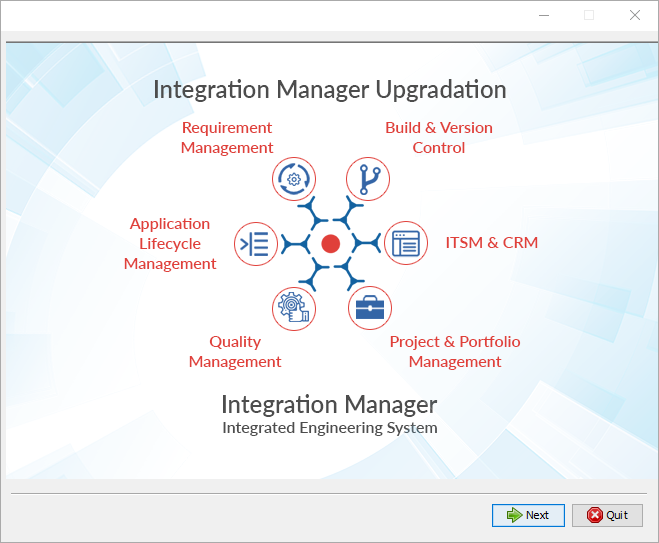

### Launch the installer in different Operating Systems

* Unzip the OIM installer folder to find the executable(.exe) file.
* The steps to launch the installer in different Operating Systems (OS) are given below. Follow the steps given for the OS that you are using.

| **Windows**                                                                                                                                                                                                                                                                                                                                                                                                                                                                | **Linux**                                                                                                                                                                                                                                                                                                                                                                                                                                                                                                                                                                                                                                                                                                                                                                                                                                                                                                                                                                                                                                                                                                                                                                                                                                                                                                                                                                                                                                                                                                                                                                                                                                                                                                                                                                                                                                                                                                                                                                                                                                                                                                                                                                                                                                                                                                                                                                                                                                                                                                                                                                                                                                                                                                                                                                                                                                                                                                                                                                                                                                                                               |
| -------------------------------------------------------------------------------------------------------------------------------------------------------------------------------------------------------------------------------------------------------------------------------------------------------------------------------------------------------------------------------------------------------------------------------------------------------------------------- | --------------------------------------------------------------------------------------------------------------------------------------------------------------------------------------------------------------------------------------------------------------------------------------------------------------------------------------------------------------------------------------------------------------------------------------------------------------------------------------------------------------------------------------------------------------------------------------------------------------------------------------------------------------------------------------------------------------------------------------------------------------------------------------------------------------------------------------------------------------------------------------------------------------------------------------------------------------------------------------------------------------------------------------------------------------------------------------------------------------------------------------------------------------------------------------------------------------------------------------------------------------------------------------------------------------------------------------------------------------------------------------------------------------------------------------------------------------------------------------------------------------------------------------------------------------------------------------------------------------------------------------------------------------------------------------------------------------------------------------------------------------------------------------------------------------------------------------------------------------------------------------------------------------------------------------------------------------------------------------------------------------------------------------------------------------------------------------------------------------------------------------------------------------------------------------------------------------------------------------------------------------------------------------------------------------------------------------------------------------------------------------------------------------------------------------------------------------------------------------------------------------------------------------------------------------------------------------------------------------------------------------------------------------------------------------------------------------------------------------------------------------------------------------------------------------------------------------------------------------------------------------------------------------------------------------------------------------------------------------------------------------------------------------------------------------------------------------- |
| 
* Double click the executable <em>.exe file given in the application folder (It is advisable to run .exe file by right-clicking <strong>Run as administrator</strong> where * is replaced with the application version).</em> If one instance of this release is already installed, then the user will be notified. * Click <strong>yes</strong> to continue with the installation. It will then display the uninstallation key for the current installation.
 | 
<strong>Before Installation</strong> * Extract the zip file. Make sure user who will run installer owns the files and has full access to extracted files. * Create empty directory with full access(it should not be inside installation directory) and export it's path to OPSHUB_TEMP_DATA variable as shown in below example: <strong>export OPSHUB_TEMP_DATA=/home/setup/temp</strong> * If you are doing a silent installation, make sure you have provided the same path for OPSHUB_TEMP_DATA as provided during <a href="registration.md#silent-registration-for-linux">Silent Registration for Linux</a>. * If Linux has NFS (Network File System) based file system, please add the following line in OIM user's '.bashrc' file: <strong>In /home/{OIM user}/.bashrc file, add the following line at the end:</strong> <em><strong><code>export JAVA_OPTS="$JAVA_OPTS -XX:+StartAttachListener"</code></strong></em> <strong>Without the Java option, the server start up will fail. The error details are available</strong> <a href="../help-center/troubleshooting/errors/install/could-not-self-attach-to-current-vm-using-external-process.md"><strong>here</strong></a><strong>.</strong> * See minimal access required to install OpsHub Integration Manager <a href="installation.md#minimal-access-required-to-run-linux-installer-using-external-file">here</a>, when you do not have root access.  <strong>To Run sh file</strong> * Open terminal window and go to the folder containing the install.sh file. * Execute the following command: <strong>sudo -E sh install.sh</strong>. * To run the sh File, you need to have access to Linux UI. This is because the installation process requires user inputs through UI. Installation won't get completed through remote terminal connection (i.e. Putty).  <strong>To Run sh File from External File (Silent Installation)</strong> To install OpsHub Integration Manager through terminal connection (i.e. Putty), follow the steps given below: * Complete user registration as described <a href="registration.md#silent-registration-for-linux">here</a>. * Download and modify OpsHubAutoInstall.xml file as per your requirement by click <a href="prepare-xml-for-auto-installation-upgradation.md">here</a>. * Make sure, you will transfer the modified file on the instance where you want to install OpsHub Integration Manager. * Set an environment variable OPSHUB_AUTO_INSTALL on the installation instance, the value of variable is the path to the OpsHubAutoInstall.xml file. File name can be different. <strong>For example, export OPSHUB_AUTO_INSTALL=/home/Downloads/OpsHubAutoInstall.xml.</strong> * After setting environment variable, run the installer with command <strong>sudo -E sh install.sh</strong>. * Please refer <a href="installation.md#possible-error-during-silent-installation-upgradation">Possible Error</a> section for trouble shooting error(s) occurred during Installation.
 |

#### Recommended Installation Path for <code class="expression">space.vars.SITENAME</code> Installer for Linux

* It is recommended to install or perform migration of the <code class="expression">space.vars.SITENAME</code> in the /opt folder or /user/local folder.
  * For <code class="expression">space.vars.SITENAME</code> migration, if the <code class="expression">space.vars.SITENAME</code> is not installed at the above places, then follow the steps mentioned [here](https://github.com/OpsHubProduct/OIM-Documentation/blob/main/docs/faqs/general/how-to-move-application-server-from-one-machine-to-other.md).
  * Reason: SELinux prevents Linux users from running a <code class="expression">space.vars.SITENAME</code> service in the user's home directory. Hence, the user needs to avoid installing <code class="expression">space.vars.SITENAME</code> in the home directory.

#### Minimal access required to run linux installer using external file

* <code class="expression">space.vars.SITENAME</code> Installation Directory should be owned by user who run installer/migrator and has following permissions.

Here are the required permissions:

| **Permission** | **Directory**                                                                                                   |
| -------------- | --------------------------------------------------------------------------------------------------------------- |
| --x            | /usr                                                                                                            |
| --x            | /proc                                                                                                           |
| r-x            | /usr/bin                                                                                                        |
| r-x            | /usr/bin/\*                                                                                                     |
| --x            | /usr/lib64                                                                                                      |
| r-x            | /usr/lib64/\*                                                                                                   |
| --x            | /usr/share (if user edits file using nano)                                                                      |
| r-x            | /usr/share/\*                                                                                                   |
| rw-            | /etc/systemd/system (if user needs <code class="expression">space.vars.SITENAME</code> as a service for Ubuntu) |

* Note: For HSQLDB, root access is required when user needs to install/migrate <code class="expression">space.vars.SITENAME</code>.

#### Possible error during Silent Installation/Upgradation

\[ Starting automated installation ]

\[Timestamp] java.util.prefs.FileSystemPreferences$2 run

INFO: Created system preferences directory in java.home.

com.izforge.izpack.installer.InstallerException: Validating data for panel UserInputPanel.EmailIdVerificationForExistingCode was not successfull

com.izforge.izpack.installer.InstallerException: Validating data for panel UserInputPanel.EmailIdVerificationForExistingCode was not successfull

at com.izforge.izpack.installer.AutomatedInstaller.validatePanel(Unknown Source)

at com.izforge.izpack.installer.AutomatedInstaller.installPanel(Unknown Source)

at com.izforge.izpack.installer.AutomatedInstaller.doInstall(Unknown Source)

at com.izforge.izpack.installer.Installer.main(Unknown Source)

\[ Automated installation FAILED! ]

**Solution**

Make sure you have performed the following steps correctly:

* You have registered as described [Registration - Silent Registration for Linux](registration.md#silent-registration-for-linux) before Installation/Upgradation.
* You have registered using the same path for which you install/upgrade <code class="expression">space.vars.SITENAME</code>.
* You have used the correct verification code.
  * Verification Code is unique for each machine and installation path. The code generated on a different machine and for different path won't work.
* You have export same value for OPSHUB\_TEMP\_DATA during Registration and Installation/Upgradation.

### License Information

On launching the installer, you will see the license agreement window that contains all license-related terms and conditions.

If you agree with the license details, then only you can move to the next step i.e. Installation.

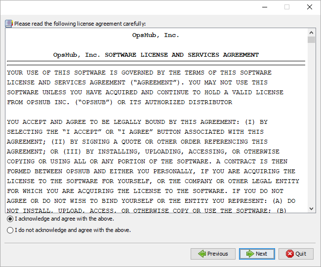

License Information window has the details of the trial license and the contact information to purchase the license.

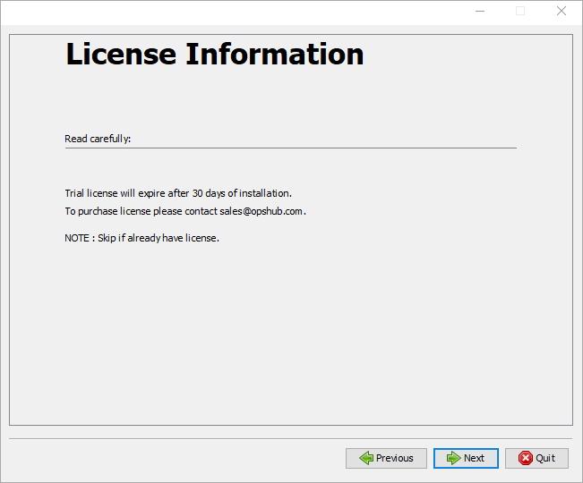

#### Possible exceptions

While uploading the license from license management tab, <code class="expression">space.vars.SITENAME</code> throws exceptions as below:

* **Unable to install license** `com.opshub.license.exception.LicenseException`: Failed to get license content because of If you are accessing OpsHub from different machine then change localhost to ip address of the machine where OpsHub installed.
* **The filename, directory name, or volume label syntax is incorrect**

com.opshub.license.install.OpsHubLicenseManager.getLicenseContent(OpsHubLicenseManager.java:60) at com.opshub.license.install.OpsHubLicenseOperationManager.getLicenseContent(OpsHubLicenseOperationManager.java:34) at com.opshub.license.install.LicenseInstaller.getOHLicenseContent(LicenseInstaller.java:128) at com.opshub.license.install.LicenseInstaller.installLicense(LicenseInstaller.java:57) at com.opshub.license.install.LicenseInstaller.installLicense(LicenseInstaller.java:51) at com.opshub.license.server.LicenseBO.validateAndInstallLicense(LicenseBO.java:329) at com.opshub.license.server.LicenseServer.validateAndInstallLicense(LicenseServer.java:96) at sun.reflect.NativeMethodAccessorImpl.invoke0(Native Method) at sun.reflect.NativeMethodAccessorImpl.invoke(NativeMethodAccessorImpl.java:62) at sun.reflect.DelegatingMethodAccessorImpl.invoke(DelegatingMethodAccessorImpl.java:43) at java.lang.reflect.Method.invoke(Method.java:483) at com.metaparadigm.jsonrpc.JSONRPCBridge.call(JSONRPCBridge.java:1122) at com.opshub.JSON.JSONRPCServlet.service(JSONRPCServlet.java:349) at javax.servlet.http.HttpServlet.service(HttpServlet.java:729) at org.apache.catalina.core.ApplicationFilterChain.internalDoFilter(ApplicationFilterChain.java:230) at org.apache.catalina.core.ApplicationFilterChain.doFilter(ApplicationFilterChain.java:165) at org.apache.tomcat.websocket.server.WsFilter.doFilter(WsFilter.java:53) at org.apache.catalina.core.ApplicationFilterChain.internalDoFilter(ApplicationFilterChain.java:192) at org.apache.catalina.core.ApplicationFilterChain.doFilter(ApplicationFilterChain.java:165) at org.apache.catalina.filters.HttpHeaderSecurityFilter.doFilter(HttpHeaderSecurityFilter.java:120) at org.apache.catalina.core.ApplicationFilterChain.internalDoFilter(ApplicationFilterChain.java:192) at org.apache.catalina.core.ApplicationFilterChain.doFilter(ApplicationFilterChain.java:165) at com.opshub.JSON.CacheControlFilter.doFilter(CacheControlFilter.java:27) at org.apache.catalina.core.ApplicationFilterChain.internalDoFilter(ApplicationFilterChain.java:192) at org.apache.catalina.core.ApplicationFilterChain.doFilter(ApplicationFilterChain.java:165) at org.apache.catalina.core.StandardWrapperValve.invoke(StandardWrapperValve.java:199) at org.apache.catalina.core.StandardContextValve.invoke(StandardContextValve.java:96) at org.apache.catalina.authenticator.AuthenticatorBase.invoke(AuthenticatorBase.java:474) at org.apache.catalina.core.StandardHostValve.invoke(StandardHostValve.java:140) at org.apache.catalina.valves.ErrorReportValve.invoke(ErrorReportValve.java:79) at org.apache.catalina.valves.AbstractAccessLogValve.invoke(AbstractAccessLogValve.java:624) at org.apache.catalina.core.StandardEngineValve.invoke(StandardEngineValve.java:87) at org.apache.catalina.connector.CoyoteAdapter.service(CoyoteAdapter.java:349) at org.apache.coyote.http11.Http11Processor.service(Http11Processor.java:495) at org.apache.coyote.AbstractProcessorLight.process(AbstractProcessorLight.java:66) at org.apache.coyote.AbstractProtocol$ConnectionHandler.process(AbstractProtocol.java:767) at org.apache.tomcat.util.net.NioEndpoint$SocketProcessor.doRun(NioEndpoint.java:1347) at org.apache.tomcat.util.net.SocketProcessorBase.run(SocketProcessorBase.java:49) at java.util.concurrent.ThreadPoolExecutor.runWorker(ThreadPoolExecutor.java:1142) at java.util.concurrent.ThreadPoolExecutor$Worker.run(ThreadPoolExecutor.java:617) at org.apache.tomcat.util.threads.TaskThread$WrappingRunnable.run(TaskThread.java:61) at java.lang.Thread.run(Thread.java:745) Caused by: java.io.FileNotFoundException: If you are accessing OpsHub from different machine then change localhost to ip address of the machine where OpsHub installed.

* **The filename, directory name, or volume label syntax is incorrect**

at java.io.FileInputStream.open(Native Method) at java.io.FileInputStream.(FileInputStream.java:138) at de.schlichtherle.license.LicenseManager.loadLicenseKey(LicenseManager.java:741) at com.opshub.license.install.OpsHubLicenseManager.getLicenseContent(OpsHubLicenseManager.java:55)

## Installation

Here is a video on how to install <code class="expression">space.vars.SITENAME</code> on the Windows machine:



### Select Installation Path

* You now have to select the installation directory. Before you select a directory, make sure the directory is empty. All the log files, configuration files, and servers are placed in this directory. If the directory is not available, you can create a directory as per your own specifications.

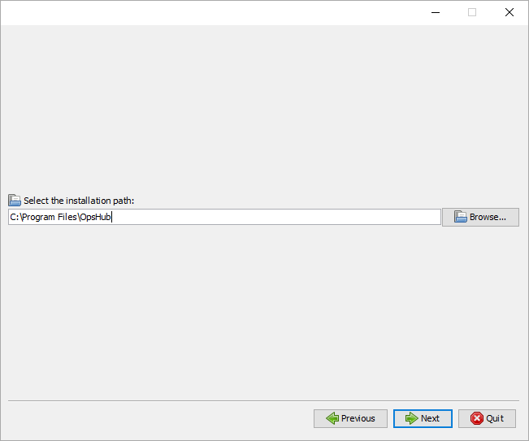

### Registration

* Each installation must be registered with OpsHub. Registration can be done either in Online or Offline mode. Please refer [Registration](registration.md) section for more details.

### Database Selection# Advance Installation

* Go through this section if you want to configure Advance Installation. Else, proceed to the [Installation Progress](installation.md#installation-progress) section.

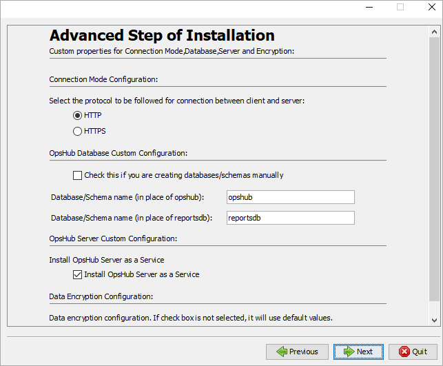

Let's now learn about the steps for advance installation.

### Connection Mode Configuration

* Select the type of connection protocol you want to use for running the server. If HTTPS is selected, you need to follow one more step [SSL Certificate Configuration](installation.md#ssl-certificate-configuration) for advance installation.

### OpsHub Database Custom Configuration

* If you want to create databases manually, mark the checkbox "Check this if you will be creating databases manually". The instructions to create databases have been mentioned in the section [Manual creation of databases](installation.md#manual-creation-of-databases).
* If the checkbox "check this if you are creating databases manually" is unchecked then enter the names of the databases that you want to configure and according to the database selection in the previous stage (MySql, MS SQL/Azure SQL, PostgreSQL or Oracle) databases/schemas will get created.
* Database name can contain $, \_, #, alphabets, and numbers without any space.
* If there are more than one database, give different names for each one.

### Install OpsHub server as a service

* If the application is installed as a service, the server will automatically start on system boot. You need not to start and stop the server explicitly. In case, you want to stop the services, you can go to Services, find the service and stop it manually from there.

### Data Encryption Configuration

* Advanced Data Encryption: Enables user to generate a secret key and store it in a secured location, or select an existing secret key if available. This configuration also allows the user to select the desired encryption algorithm for ensuring security of the application.

**a) Configuration for secret key location** User can select either of two options:

* Generate a secret key: With this option, a secret key would be automatically generated, and user needs to select location, where he/she desires to store this key.

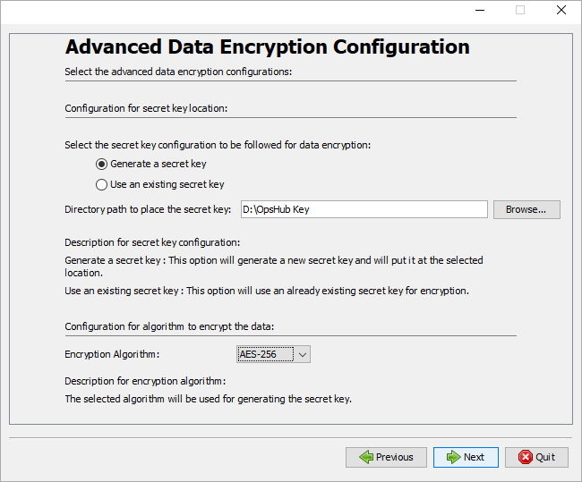

* Use the existing secret key: If user already has secret key available,then user should select this option. User needs to select path where "opshub.key" file is available to use that key.

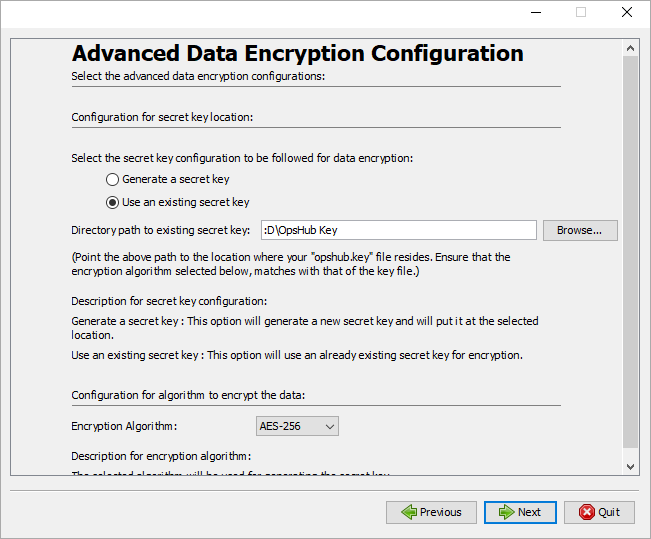

**b) Configuration for algorithm to encrypt data** User can select his desired algorithm from the available list to ensure security of data in application.

### Installation Progress

The image below shows the overall progress of installation.

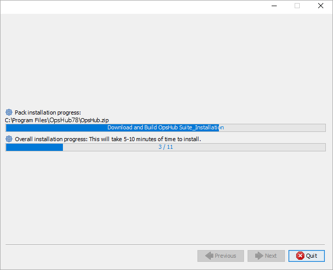

* Setup Shortcuts: It will add the application to the Windows program list if the operating system is Windows and will add the application to the Linux program list if the operating system is Linux. It will also create the <code class="expression">space.vars.SITENAME</code> launcher.

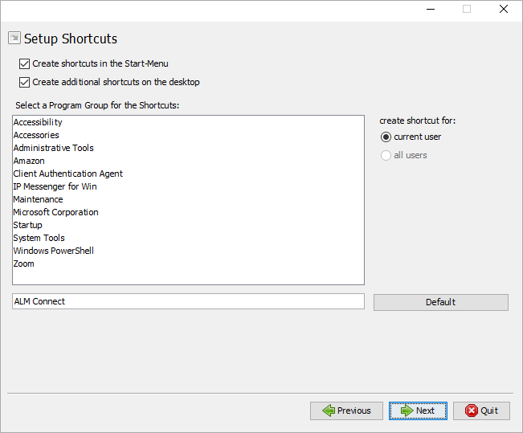

### Installation Success

The image below shows a successful installation.

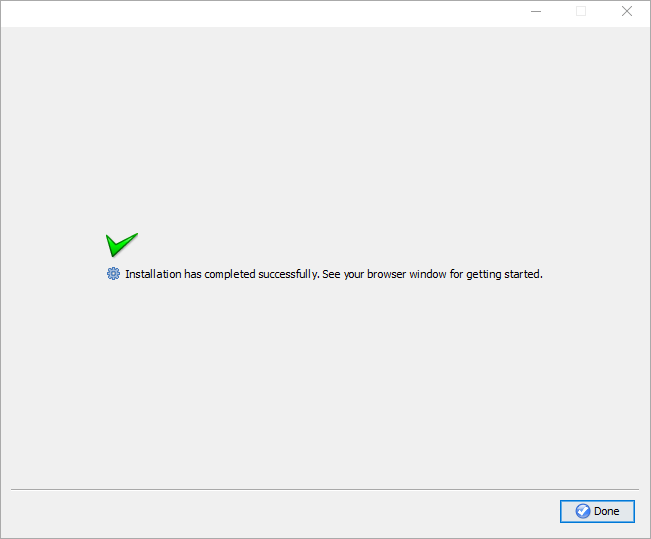

Once you have installed the application, click [Get Started With the Application](logging-in.md) to see how to get started.

**Appendix**

## SSL Certificate Configuration

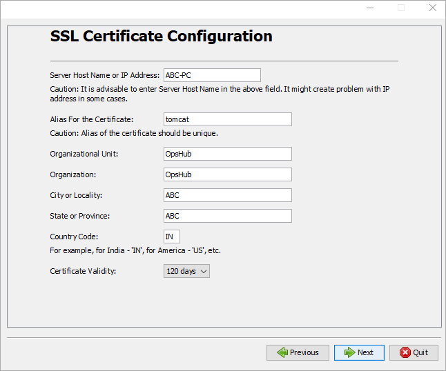

It is advisable to enter the server-host name in the given field, it might create problem with IP address in some cases. Alias of the certificate should be unique.

* Enter the name of your Organizational unit.
* Enter the Organization name.
* Enter the current City or Locality.
* Enter the current Country Code. It should be alphabetic code. For e.g., "IN" for India, "US" for America, "AU" for Australia, etc.
* Select the number of days till when the certificate should be valid.

> **Note** : Please note with the above steps <code class="expression">space.vars.SITENAME</code> will be installed with SSL configuration. But the corresponding SSL certificate imported will be self-signed. In case you want to install certificate signed by your CA authority then follow the steps given in this section [How To Import a Certificate](how-to-import-a-certificate.md) in appendix.

## Manual creation of databases

For manual creation of databases, you can use the following queries:

### Queries for MySQL database



### Queries for MS SQL/Azure SQL Database



### Queries for Oracle Database



### Queries for PostgreSQL Database



## Collation change of MS SQL/Azure SQL Databases


