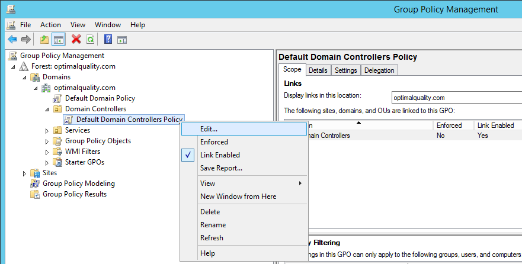
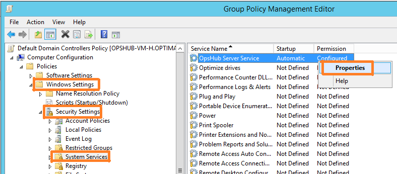
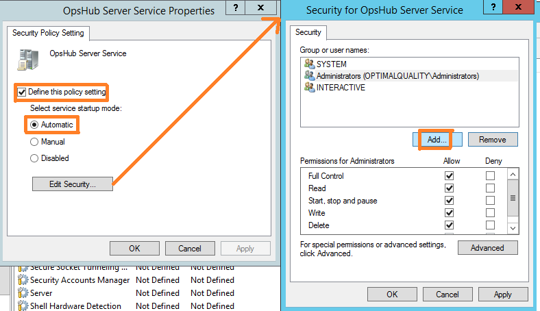
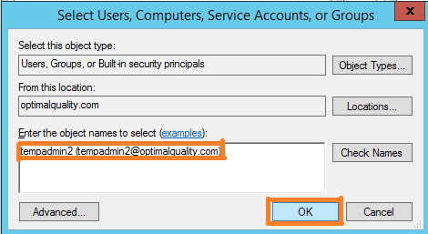
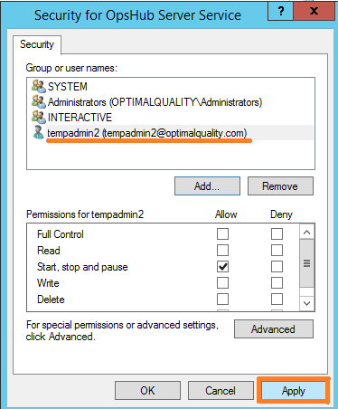
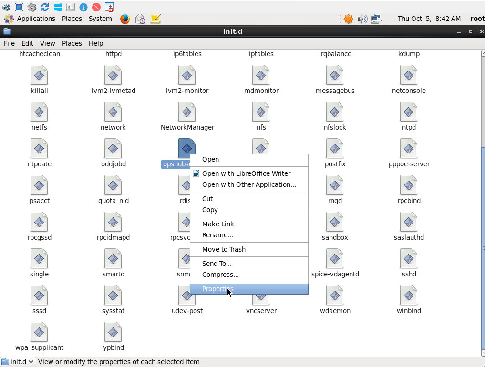
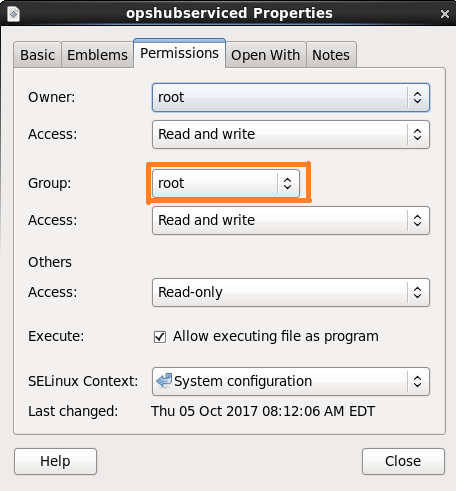

# Start/Stop OpsHub Integration Manager

Let's see how to start and stop the service.

## Windows

If you are using a Windows machine, there are two ways to start and stop the service:

**Using Windows Services**

* Open Windows Services with Administrator rights (By typing Services in Start-up menu or services.msc in Windows->Run option)
* Find OpsHub Server Service in the list of services
* Start/Stop service either by right clicking on service or option available in left panel

**Using Windows Command Prompt**

* Open Windows command prompt with administrator rights
* Type in following commands to start/stop OpsHub service:
  * To start service: `net start "OpsHub Server Service"`
  * To stop service: `net stop "OpsHub Server Service"`

If you don't have requisite permission for accessing OpsHub Server Services in Windows, you will get an error while trying to execute OpsHub from the above commands from command prompt. Command prompt will show the error: **Access is denied**.

This section is useful in case user is not able to access the service as user doesn't have enough permisisons.

To provide the rights to a particular user, admin just needs to follow the steps given below.

> **Note**: **To open Group Policy Management, Press Windows Logo Key + R to open RUN dialog box. Type gpmc.msc and click Ok.**

* Step 1: Edit default policy used by organization

* Step 2: Open OpsHub Server Service properties window

* Step 3: Define the policy setting for OpsHub Server Service

* Step 4: Add User or Group so that they can access OpsHub Server Service

* Step 5: Allow required permission to User or Group

## Linux

If the application is installed on a Linux machine, here is the way to start and stop OpsHub service.

**Linux Terminal**

* Open Linux Terminal with su/sudo user
* Type in following commands to start/stop OpsHub service.
* Linux:
  * To start service: `systemctl start opshubserviced.service`
  * To stop service: `systemctl stop opshubserviced.service`

If you don't have requisite permission for accessing OpsHub Server Services in Linux, you will get an error while trying to execute OpsHub from the above commands from Terminal. Terminal will show the error: **Permission denied.**

Note: **To access OpsHub Server Services navigate to \etc\systemd\system**

This section is useful in case user is not able to access the service as users does not have enough permissions.\
To give permission to users follow the steps given below:

Step 1: Access properties of OpsHub service

Step 2: Assign appropriate access to group

Required commands:

* Identify user's group: `groups <<username>>`
* Add a user in group: `usermod -a -G <<Group Name>> <<User Name>>`
