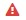

# Integrations are configured but synchronization is not happening, What can be potentials reasons?

### Description

Integration for system A and system B is configured and activated. Now user is creating/updating entity in system A and even after waiting for 10-15 minutes, the entity is not synchronizing in system B.

### Solution

There can be multiple reasons for synchronization not working. To troubleshoot the issue, follow the steps given below:

* Check which user has created the entity in system A. If the user used for configuring system A in <code class="expression">space.vars.SITENAME</code> has done the changes in system A, then those changes will be skipped by <code class="expression">space.vars.SITENAME</code> for synchronization. The user used in configuring system in <code class="expression">space.vars.SITENAME</code> is a reserved user for <code class="expression">space.vars.SITENAME</code>. If you want to validate synchronization, then create/update entity with a user other than this user in system A and then wait for the synchronization.
* Check the failed event - There can be failures logged in <code class="expression">space.vars.SITENAME</code> due to which entities are not synchronized in destination system. For managing failed events, refer [Manage Integration Failures](../../troubleshooting/manage-integration-failures.md).
* Check project/location used during integration configuration is correct or not. To validate project/location, edit the integration and see 'Synced Projects' section. If the project/location on which you created entity is not in the integration's 'Synced Projects' section, then add that project from 'Select Project(s) To Sync' option.
* Check that pre-requisites are being properly followed for the integrated systems. For this, refer [Connectors](../../../connectors/connectors.md) documentation and validate the details given for the concerned systems in its corresponding pre-requisites section.
* Check both systems are up. Make sure that both the systems are up and reachable from the machine on which <code class="expression">space.vars.SITENAME</code> is hosted.
* Check whether criteria filter is being configured in integration or not. If criteria filter is configured, then validate that the entity that you created is applicable for that criteria or not. To see criteria configuration of integration refer [Criteria Configuration](../../../integrate/integration-configuration.md#criteria-configuration).
* Check the global failure in integration. In case of continuous failure(s) while reading data from source system, global failure is generated. Global failures have  icon in integration health column on View Integrations page for this integration. Click that icon, read the error message and try to fix the error.
* Check the polling time in integration. 'Start polling time' means the time from when <code class="expression">space.vars.SITENAME</code> should start polling data from the source system. For more information, refer [Polling Time usage in Integration](start-polling-time-usage-in-integration.md).
* Check the Sync Report. This will provide the information for each entity synchronized by <code class="expression">space.vars.SITENAME</code>. For more information on how to see sync report, refer [Integration Sync Report](../../troubleshooting/integration-sync-report.md).
