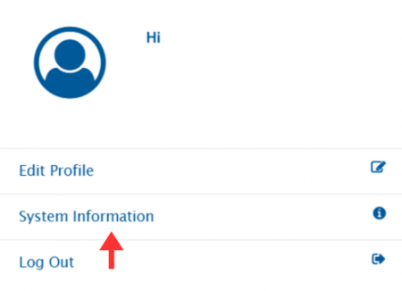
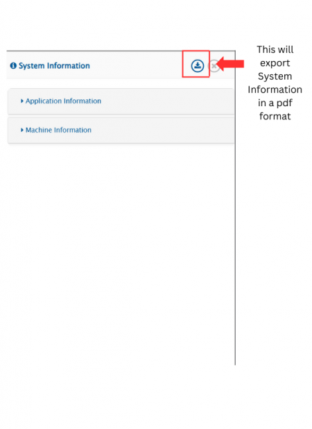

# System Information

## View System Information

To view system information, click on the user profile icon in the top-right corner of the navigation bar.

Then click on System Information.

It will display the following window, with two sections: **Application Information** and **Machine Information**.

> **Note**: As highlighted in the screenshot below, system information can be exported in a pdf format.

## System Information Overview

### Application Information

**Integration Configurations**

* **Total Integrations:** Number of configured integrations
* **Active Integrations:** Currently active integrations
* **Inactive Integrations:** Inactive integrations
* **Cache Timeout:** Cache expiration time (minutes)

**Thread Info**

* **Total Threads:** Allocated threads
* **Active Threads:** Currently active threads

**Log Settings**

* **Global Log Settings**
  * **Size of Global Log Files:** Maximum size limit in MB
  * **No of Max Backup Global Log Files:** Maximum number of backup files
* **Global Level Integration Log Settings**
  * **Log Level:** Current integration log level
  * **Size of Integration Log Files:** Maximum size limit in MB
  * **No of Max Backup Integration Log Files:** Maximum number of backup files at integration level

**HTTP Connection Info**

* **Total Connections:** Maximum HTTP connections
* **Acquired Connections:** Connections that are currently in use

**Database Configurations**

* **Type:** Database type and version
* **Username:** Database access username
* **Name:** Database name
* **Schema:** Database schema
* **Allowed Connections:** Maximum allowed database connections
* **Active Connections:** Active database connections that are currently in use

**Memory Details**

* **Max Memory Allocated:** Maximum allocated memory
* **Min Memory Allocated:** Minimum allocated memory
* **Used Memory:** Current memory usage

**Directory Configurations**

* <code class="expression">space.vars.SITENAME</code> **Folder Size:** Application folder size
* **Remaining Space on Drive:** Available free space on drive where <code class="expression">space.vars.SITENAME</code> is installed
* **Logs Folder Size:** Indicates log directory size
* **Total Space on Drive:** Total drive capacity where <code class="expression">space.vars.SITENAME</code> is installed

**Version Details**

* **Current Version:** Installed <code class="expression">space.vars.SITENAME</code> version
* **Initial Version:** First installed version of <code class="expression">space.vars.SITENAME</code>

### Machine Information

* **Operating System:** OS and its version
* **CPU Cores:** Number of CPU cores
* **Time Zone & Region:** Time zone settings
* **Total Physical Memory:** Total system memory
