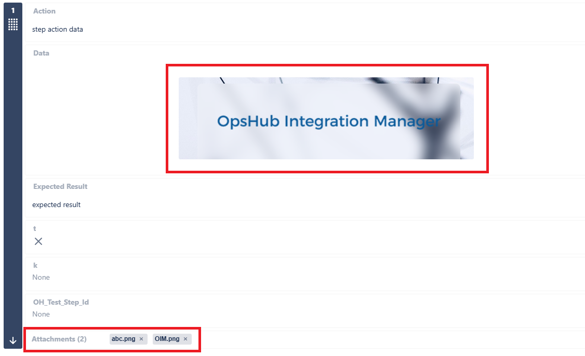
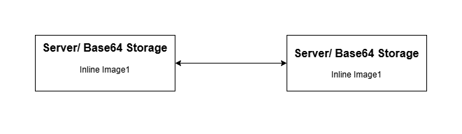
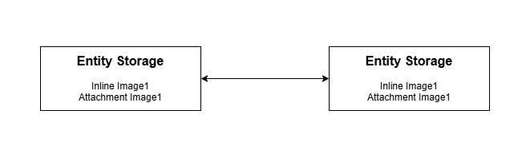
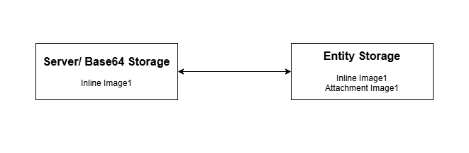

# Inline Image or File Synchronization

## Overview

<code class="expression">space.vars.SITENAME</code> supports the synchronization of images and files across end systems in fields, comments, and as attachments on the entity.

* There are certain types of end systems based on how they add images/ files on their entity fields and comments.

1. **Entity Storage:**
   * Upon adding an image/ file to rich text fields, the same image/ file is also added as an attachment to the entity.
   * Example: If image/ file is added to rich text field in Rally, the same image/ file will be visible in attachment section of the entity.
   * Entity Storage Systems: Rally, Jira, OpenText ALM Quality Center (Formerly Micro Focus ALM/QC), qTest, DOORS NG, ServiceNow, Codebeamer, Windchill, TestRail, OpenText ALM Octane, Enterprise Architect, Aha!, Redmine
2. **Server Storage:**
   * Upon adding an image/ file to rich text fields, they are uploaded to an end system location itself, but the image/ file will not be added as an attachment to the entity.
   * Example: If image/ file is added to rich text field in Azure DevOps, this image/ file will not be visible in attachment section of entity. Instead, it will be uploaded to an end system.
   * Server Storage Systems: Version one, Jama, Aras, Readyone, Salesforce, ETM, DOORS, Hubs=Spot, Azure DevOps
3. **Base64 Storage:**
   * Upon adding an image/ file to rich text fields, they are not uploaded anywhere. The raw data itself is encoded in Base64 and is set in the rich text field. Image/ file will not be added as an attachment on the entity.
   * Example: If image/ file is added to rich text field in Broadcom Clarity, image/ file will not be uploaded anywhere. Also, it will not be added as attachment on the entity.
   * Base64 Storage Systems: Broadcom Clarity
4. **Field Storage:**
   * Upon adding an image/ file to a rich text field (such as the Test Step field), it is stored only within that specific field. It is not stored at the entity level or server level.
     * This means the attachment is linked directly to the field where it is added (field-level storage).
   * Example: If an image/ file is added to the Test Step field of a Test entity in Jira Xray (Cloud), it will be visible only in the attachment section of that Test Step field.
   * Field Storage System: Jira Xray (Cloud) – Test Step field of Test entity

<div align="center"></div>

## Image/ File Synchronization Behavior with Storage Combinations

### Server/ Base64 Storage System Combinations

<div align="center"></div>

* Between server/ base64 and server/ base64 storage combination systems, if an inline image/ file is added to the entity upon synchronization by <code class="expression">space.vars.SITENAME</code> as shown in the above image, it will be similar to the way image/ file is added to the source end system entity, i.e., it will only be added on inline field/ comment.

### Entity Storage System Combinations

<div align="center"></div>

* Between entity and entity storage combination systems, if an inline image/ file is added to the entity, upon synchronization by <code class="expression">space.vars.SITENAME</code> as shown in the above image, it will be similar to the way image/ file is added to the source end system entity, i.e., it will be added on inline field/ comment and also as an attachment on the entity.
  * Due to the entity storage system's behavior of auto-adding the image/ file as an attachment to the entity regardless of whether attachment synchronization is enabled/ disabled in mapping. <code class="expression">space.vars.SITENAME</code> will also add the attachment on the entity to synchronize the image/ file.

### Server/ Base64 Storage and Entity System Combinations



* Between server/ base64 and entity storage combination systems, if an inline image/ file is added to the entity, upon synchronization by <code class="expression">space.vars.SITENAME</code> above shown image will be the way image/ file will be added to the entity.
  * When the entity storage system is the target, <code class="expression">space.vars.SITENAME</code> will auto-add the image/ file as an attachment to the entity.
  * When server/ base64 storage system is the target, <code class="expression">space.vars.SITENAME</code> will not auto-add the image/ file as an attachment to an entity. It will only be added in the rich text field/ comment.
  * View parity between these storage combinations will be due to end-system behavior differences.

## Image/ File Synchronization Behavior with Text Fields/ Comments

* In the case of a Text type field/ comment, we cannot add renderable images/ files.
  * Hence, we will add a custom tag with the uploaded image/ file URL and the filename of the uploaded image/ file.

```xml
<InlineFile src="https:://opshub.jamacloud.com/attachment/1193337/img1.png">img1.png</InlineFile>
```

* In case of backward synchronization of such fields:
  * The original uploaded image to the original source will be preserved. i.e., in backward synchronization, we will ensure that the renderable source image is not removed.
    * For Base64 end systems, since a custom tag was not added in backward sync, the original image added to the source entity will be removed.

> **Note:** If the target end system is Base64 storage and the mapped field is text type, then bidirectional mapping with a rich text field is not advisable due to the removal of the image at the source field

## Image/ File Synchronization Behavior with Target end system not supporting Inline Synchronization

* In case the target end system does not support inline synchronization, and an inline image/ file is added to the source entity rich text field/ comment, then upon synchronization by <code class="expression">space.vars.SITENAME</code>, below mentioned will be the behavior:
  * Data synchronized to the target entity will not have any renderable images/ files or opshub custom tags for image/ file when it is not a renderable field/ comment.
  * Images/ files will be uploaded to the entity as attachments.
  * In backward synchronization, from such end systems, the originally added images/ files will be removed from the fields.

## Image/ File Synchronization Behavior with Comment

* If a comment has been synchronized by <code class="expression">space.vars.SITENAME</code> with an inline image/ file, the target comment will also have the image/ file.
  * Now, even if the comment is deleted in the source end system, the image/ file will persist in the target comment and also as an attachment on the entity in case it is an entity storage end system.

## Attachment and Inline Image Synchronization with Field Storage

* While synchronizing test-step type fields, no additional customization is required in the mapping or workflow to handle step level attachments, inline images, or files for these systems: Jira Xray cloud, Jama and Codebeamer. Other systems may require additional customization to handle step level attachments, inline images, or files. Please refer to connector documentation for more details.
* Format conversion of step-level fields (except additional step-level fields) is automatically managed by the system.
* Only the additional step-level fields (which may vary from system to system) need to be handled explicitly in the mapping XSLT, as done earlier.
* When a test-step type field with attachments is synced from a field storage system (Jira Xray Cloud) to an entity/server storage system (Jama or Codebeamer), the attachment is stored at the entity level in Jama/Codebeamer.
* To properly sync step attachment deletion from entity/server storage (i.e. Jama or Codebeamer) to field level (Jira Xray cloud), attachment mapping must be enabled.

### General Behaviors:

#### Attachment Synchronization

| Source Storage | Target Storage        | Behavior                                |
| -------------- | --------------------- | --------------------------------------- |
| Field Storage  | Field Storage         | Attachment is added to the field.       |
| Field Storage  | Entity/Server Storage | Attachment is added to the entity only. |

#### Inline Image/File Synchronization

| Source Storage | Target Storage        | Behavior                                                                           |
| -------------- | --------------------- | ---------------------------------------------------------------------------------- |
| Field Storage  | Field Storage         | Attachment is added to the field and its reference is added in the field content.  |
| Field Storage  | Entity/Server Storage | Attachment is added to the entity and its reference is added in the field content. |

#### Overwrite Behavior

| Scenario                                                                                                                                                      | Expected                                   | Actual Behavior                                 | Explanation                                                                                                                                                                                    |
| ------------------------------------------------------------------------------------------------------------------------------------------------------------- | ------------------------------------------ | ----------------------------------------------- | ---------------------------------------------------------------------------------------------------------------------------------------------------------------------------------------------- |
| Sync from field storage → entity storage (Overwrite enabled for entity storage), attachment deleted in field system, and sync triggered in backward direction | Attachment should be re-added to the field | Attachment is added at the entity level in Xray | Jama stores attachments at the entity level and does not retain field-level association details, so during reverse sync the attachment is restored at the entity level only not at field level |

## Synchronization Behavior

Following are the **Before** and **After** behaviors for the given scenarios:

| **Serial No.** | **Scenario**                                                                                                                                                                                                                    | **Source Applicable To** | **Target Applicable To** | **Behavior before 7.195**                                                                                                                                                                                                                                     | **Behavior after 7.195**                                                                                                                                                                                                                                                                                               |
| -------------- | ------------------------------------------------------------------------------------------------------------------------------------------------------------------------------------------------------------------------------- | ------------------------ | ------------------------ | ------------------------------------------------------------------------------------------------------------------------------------------------------------------------------------------------------------------------------------------------------------- | ---------------------------------------------------------------------------------------------------------------------------------------------------------------------------------------------------------------------------------------------------------------------------------------------------------------------- |
| 1              | <p>- Create entity with no attachment or inline images<br>- Add inline image to entity &#x26; start synchronization</p>                                                                                                         | Entity Storage           | Server Storage           | <p>- An image will be uploaded twice, one as attachment &#x26; second as inline image<br>- Due to re-upload of image, one image of source will be in sync with multiple target images</p>                                                                     | - An image will be uploaded on server & will be referred in rich text field                                                                                                                                                                                                                                            |
| 1 (contd.)     |                                                                                                                                                                                                                                 | Entity Storage           | Entity Storage           | - An image will be added to entity as attachment & will be referred in rich text field                                                                                                                                                                        | Same                                                                                                                                                                                                                                                                                                                   |
| 2              | <p>- Create entity with no attachment or inline image<br>- Add comment with inline image &#x26; start synchronization</p>                                                                                                       | Entity Storage           | Server Storage           | <p>- First, image will be added as attachment<br>- When the image is detected as inline image, the same will be removed from the attachment<br>- A new image will be uploaded as the inline image. It will be referred from rich text field or comment.</p>   | Same                                                                                                                                                                                                                                                                                                                   |
| 3              | <p>- Create entity with one attachment<br>- Add the same file in rich text field</p>                                                                                                                                            | ALL                      | ALL                      | Same                                                                                                                                                                                                                                                          | Same                                                                                                                                                                                                                                                                                                                   |
| 4              | <p>- If the rich text field was not mapped previously and it had inline images<br>- After few revisions, rich text field is mapped</p>                                                                                          | ALL                      | ALL                      | - No image was added in target, OH\_IMG tag was added with a unique code                                                                                                                                                                                      | - Field will have inline images in target                                                                                                                                                                                                                                                                              |
| 5              | <p>- Create entity with multiple same name images referred in single rich text field &#x26; synchronize to target<br>- Update target entity &#x26; start other way synchronization</p>                                          | ALL                      | ALL                      | - All same named images will be mapped to one source image                                                                                                                                                                                                    | - Despite matching file names, a one-to-one mapping between source and target images will be preserved                                                                                                                                                                                                                 |
| 6              | <p>- Create entity with same image referred in two or more rich text fields<br>- Update the content of image<br>- In later revision, both rich text field has some text appended</p>                                            | ALL                      | ALL                      | <p>- Inline image will be updated twice<br>- Due to re-upload, one image of source will be in sync with multiple target images</p>                                                                                                                            | - Inline image will be updated only once                                                                                                                                                                                                                                                                               |
| 7              | <p>- HTML type of field is mapped with text field in target<br>- Source field has an inline image</p>                                                                                                                           | ALL                      | Server Storage           | <p>- Two images will be uploaded, one as external image in target system and other as attachment on entity<br>- In target text field, it will be shown as <code>&#x3C;ImageTag>Img1.png&#x3C;/ImageTag></code></p>                                            | <p>- One image will be uploaded in the target system and this will not be visible in attachment section of entity<br>- In target text field, it will be shown as <code>&#x3C;ImageTag src=”Server storage uploaded URL”>Img1.png&#x3C;/ImageTag></code></p>                                                            |
| 7 (contd.)     |                                                                                                                                                                                                                                 | ALL                      | Entity Storage           | <p>- Attachment will be uploaded twice<br>- In target text field, it will be shown as <code>&#x3C;ImageTag>Img1.png&#x3C;/ImageTag></code></p>                                                                                                                | <p>- Attachment will be visible in attachment section of entity.<br>- In target text field, it will be shown as <code>&#x3C;ImageTag src=”Attachment URL”>Img1.png&#x3C;/ImageTag></code></p>                                                                                                                          |
| 7 (contd.)     |                                                                                                                                                                                                                                 | ALL                      | Base64 Storage           | - Inline image with base64 storage is not supported                                                                                                                                                                                                           | <p>- Target text field will have <code>&#x3C;ImageTag>Img1.png&#x3C;/ImageTag></code><br>- Image will not be uploaded to attachment or anywhere. Instead, an image tag with filename will be created</p>                                                                                                               |
| 8              | <p>- Same source field is mapped to two different fields in target &#x26; one of them is a text field and other one is a rich text field<br>- Source field has inline image</p>                                                 | ALL                      | Server Storage           | <p>- Image will be synchronized both as inline image for rich text field and as attachment to the target entity<br>- Rich text field has inline image<br>- Text field has <code>&#x3C;ImageTag>Img1.png&#x3C;/ImageTag></code><br>- Entity has attachment</p> | <p>- Rich text field will have inline image<br>- Text field will have <code>&#x3C;ImageTag src = ”Server storage uploaded URL”>Img1.png&#x3C;/ImageTag></code><br>- Image will be uploaded to external server and will be referred in these 2 fields</p>                                                               |
| 8 (contd.)     |                                                                                                                                                                                                                                 | ALL                      | Entity Storage           | <p>- Rich text field will have inline image<br>- Text field will have <code>&#x3C;ImageTag src= ”Attachment URL”>Img1.png&#x3C;/ImageTag></code><br>- The entity will have only the attachment due to the implicit behaviour of Entity Storage Connector</p>  | Same                                                                                                                                                                                                                                                                                                                   |
| 9              | <p>- Create entity with no attachment or inline image<br>- Add comment with inline image &#x26; start synchronization<br>- Target end system does not support inline image in comments</p>                                      | ALL                      | Server Storage           | <p>- Same image will be uploaded twice to the end system<br>- Attachment will be added to the entity also</p>                                                                                                                                                 | <p>- First, image will be added as attachment<br>- When the image is detected as inline image, the same will be removed from attachment &#x26; image will be uploaded to server again<br>- The comment will be added with <code>&#x3C;ImageTag src = ”Server storage uploaded URL”>Img1.png&#x3C;/ImageTag></code></p> |
| 9 (contd.)     |                                                                                                                                                                                                                                 | ALL                      | Entity Storage           | <p>- First, image will be added as attachment to entity<br>- When the image is detected as inline image, a comment will be added with <code>&#x3C;ImageTag src = ”Attachment URL”>Img1.png&#x3C;/ImageTag></code></p>                                         | Same                                                                                                                                                                                                                                                                                                                   |
| 10             | <p>- Comment synchronization is enabled<br>- Rich text field is mapped to text field in target<br>- Both have same inline image</p>                                                                                             | Entity Storage           | Server Storage           | <p>- Image will be uploaded to server system &#x26; text field data added with <code>&#x3C;ImageTag src = ”Server storage uploaded URL”>Img1.png&#x3C;/ImageTag></code><br>- Comment will be added with referred inline image</p>                             | Same as before                                                                                                                                                                                                                                                                                                         |
| 11             | <p>- Source HTML field is mapped to target text field<br>- Create entity with inline image &#x26; synchronize<br>- Update target text field &#x26; start reverse synchronization (from target to source)</p>                    | ALL                      | Base64 Storage           | - Inline image with base64 storage is not supported                                                                                                                                                                                                           | <p>- If same name image is found in source entity, it will be replaced with source URI<br>- In case, image with same name is not found, the image will be removed from the source entity</p>                                                                                                                           |
| 12             | <p>- Create entity with rich text field having image 1<br>- In next revision, image 2 is uploaded on the same field<br>- If the events fail and are in retry but image 1’s base64 data is missing from the write-side cache</p> | Base64 Storage           | ALL                      | - Inline image with base64 storage is not supported                                                                                                                                                                                                           | <p>- Base64 content for image 1's hashcode will be queried in source entity<br>- Since, it is no longer present on entity now, image 1 will not be synchronized<br>- In the next revision, image 2 will be synchronized</p>                                                                                            |
