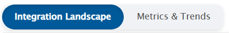
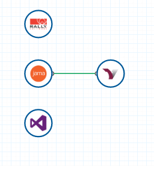
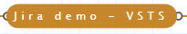
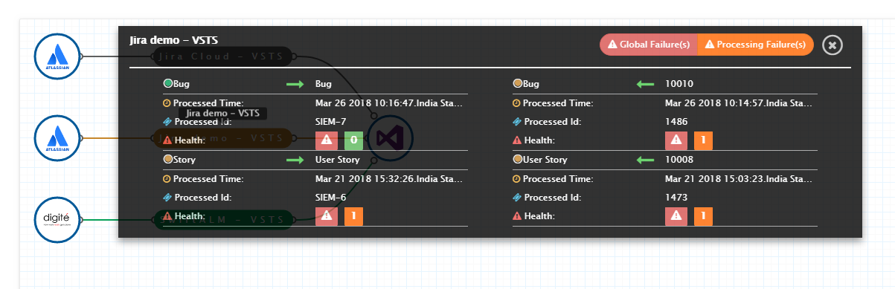
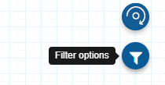
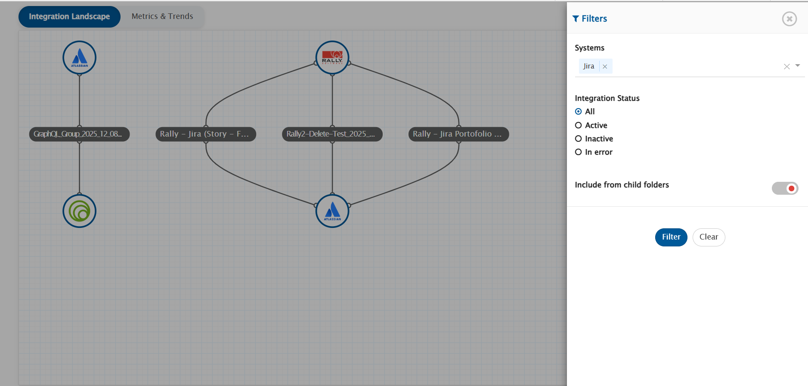
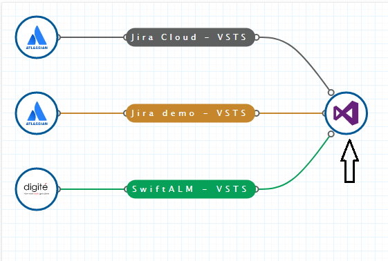
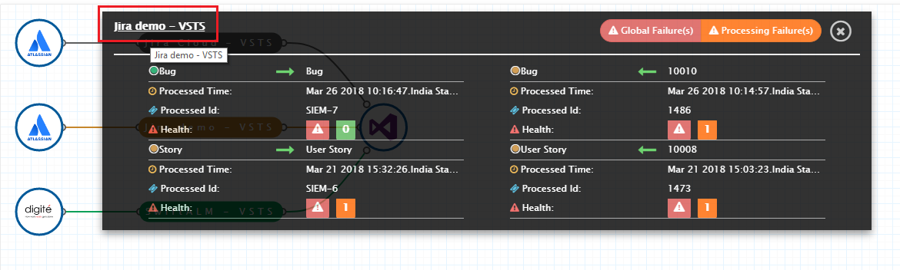
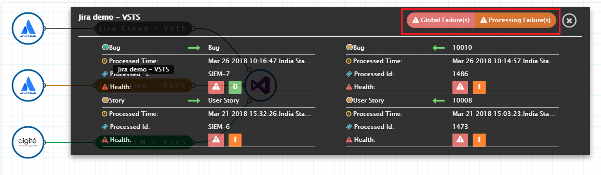

# Integration Landscape

The OIM dashboard gives a quick view of integrations configured in <code class="expression">space.vars.SITENAME</code>. Users can check overall health of integrations and know if integrations are working fine or have any failures. Users can navigate directly to integrations, systems, and failures from the dashboard.

Here is a video on how to use the dashboard in OIM:



## Graphical View

* Login into <code class="expression">space.vars.SITENAME</code>.
* Dashboard will appear on home page under Integration Landscape tab.

\- Click on !\[]\(../assets/rotate.png) at top right corner of dashboard to rotate graphical representation of integration.

* **Node:** Represents system created in <code class="expression">space.vars.SITENAME</code>.
* **Branch:** Represents that two nodes are connected through integration. Click on branch to view integration in read-only mode. Color of branch depicts status of integration.
  * **Green:** Integration is active.
  * **Gray:** Integration is inactive.
  * **Red:** Job failure in integration.
  * **Orange:** Processing failures in integration.
  * Click on  to view integration details from dashboard.

In integration details window, the following information is shown:

* Entity type(s) integrated.
* Flow of integration (Uni-directional or Bi-directional) for each entity type.
* For each flow:
  * **Last processed time:** Last time when integration was executed.
  * **Last processed entity ID:** Last entity processed by integration.
  * **Health:** Shows failures, if any, logged in integration.

## Filtering the Dashboard by Various Functions

> **Note**: The dashboard display data associated with the currently selected folder, including its child folders. To view data across all folders, select the Default Folder. You can also select any other folder that you have access to.

Users can filter the integrations according to the system and integration status.

* Click the funnel icon to view the filter options.

* Select the **systems** and click **Filter** button. All the integrations that use the selected systems will be displayed.
* The available options for **integration status** are: All, Active, Inactive, and In error. Select one and click **Filter**.
* If “Include from child folders” is enabled, integrations from child folders are also included. This option is enabled by default.
* You can try combinations — for example: set Jira as a system filter, Active as an integration status filter, and enable include from child folders to view all active Jira integrations of current folder and its child folders.

* Click **Clear** to view all integrations and remove applied filters.

## Navigation from Dashboard

### Navigate to System

* Click on a system node in the graph. For example, clicking on the “Team Foundation Server” icon will open that system’s configuration.

### Navigate to Integration

* Click on the integration name in the graph to open its details.

### Navigate to Failure

* Click on "Global Failure(s)" or "Processing Failure(s)" to go directly to the Failures module.

