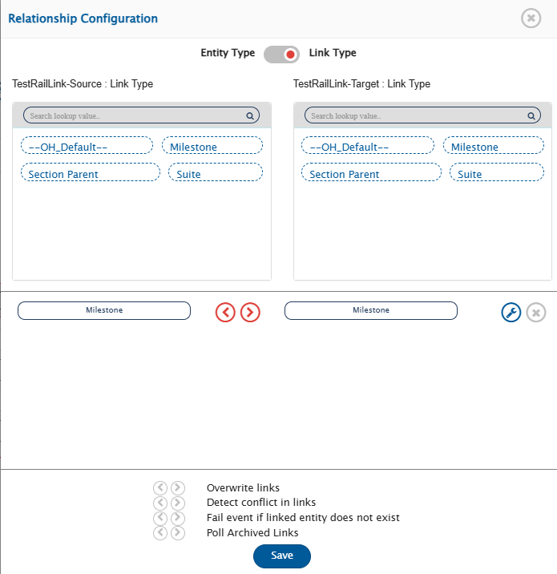
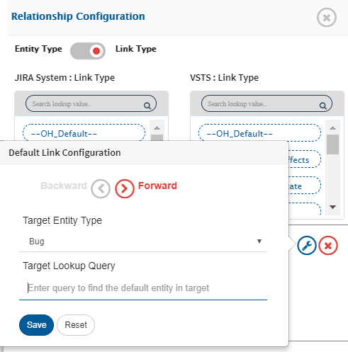

# Default Link Configuration

`Default Link Settings` provide information about the default target entity that needs to be linked with the synced target entities (synced from source system) at the time of synchronization.

## When to configure default link

* **Case 1**: **When the target system has any link type that must be added when the entity is created, and the source system may or may not have that corresponding link.**
  * For example: TFS Task to VersionOne Task integration\
    Tasks entity in VersionOne must have a parent link type. The parent link could be a Backlog item or a Defect. In TFS, Tasks can have a parent link, but it is not mandatory. Therefore, when user needs to synchronize a Task from TFS that doesn't have any parent in VersionOne, user should provide a default link configuration in the Issue Relationship panel at the time of mapping. So that, the entity meeting this configuration can be set as a parent entity for the synced task in VersionOne.
* **Case 2**: **When the target system requires a mandatory link when an entity is created, but the corresponding link type does not exist in the source system or source system doesn't have a mandatory link for that entity**
  * For example: JIRA Task to VersionOne Task integration\
    Tasks entity in a VersionOne must have a parent link type. The parent link could be a Backlog item or Defect. In JIRA, there is no parent type link available for a Task that can be mapped to a parent in VersionOne. In this case, user can map the 'OH-Default' value from the source link type with the target link type (OH-Default → Parent). User should provide a default link configuration in the Issue Relationship panel at the time of mapping.
*   **Case 3**: **When both the end systems have a set of linkages available for mapping and none of the linkages in the target system are mandatory - but business use case is to set default link whenever an entity synchronizes in the target system.**

    In TFS, Tasks can have a parent link, but it is not mandatory. In JIRA, there is no parent type link available for a Task. Taking an example of synchronization of Tasks from JIRA to TFS, if you want to assign the TFS tasks to some Problem or Requirement Work item, then, you can have a default link configuration stating that link the TFS tasks to a certain existing Problem or Requirement.

## How to configure the default link

<div align="center"></div>

<div align="center"></div>

* Open **Issue Relationship** section.
* Map the source link type to the target link type for which the default link needs to be configured.
* Click the edit icon against the link type for which you need to set default link. The 'Default Link Settings' option is applicable to any link type, not necessary to only mandatory link.
* Provide the default link setting parameters: Entity Type and Look-up query.
  * **Entity Type**: Entity type of the target end system that will be linked as the default link.
  * **Look-up query**: The lookup query must be provided in the target end system's native format which must be a valid value for XSLT element. This query is used to look up the entity that needs to be set as a default link while entity synchronizes to the target system. <code class="expression">space.vars.SITENAME</code> searches the entity in the target system using 'look-up' query against the target entity type and considers the first matched entity as the default link. Found entity will be linked as default link for the link type against which this setting is configured.
    * The **look-up query** can have dynamic (evaluating expression) or static value. Refer section [Default Query Sample](default-link-settings.md#default-query-sample) for examples on dynamic and static value in look-up query.
  * When "Default link" is configured for an entity type X in mapping, but the same entity type X does not exist in the target project configured in the integration:
    * In such case to avoid the sync failure, a target project can be overridden for entity type X in Default Link configuration. This project can be overridden in the relationship's advanced mapping.
    * Here, the user needs to provide the project Id as a value for **TargetProject** element in the relationship mapping.
    * Any project which contains the entity type X (configured in default link) can be utilized.

```xml
<xsl:for-each xmlns:xsl="http://www.w3.org/1999/XSL/Transform" select="$linksToBeAddedAsDefault">
  <op_list>
    <xsl:element name="{.}">
      <xsl:element name="_1">
        <xsl:element name="EntityType">
          <xsl:value-of select="@entityType"/>
        </xsl:element>
        <xsl:element name="LookupQuery">
          <xsl:value-of select="@lookupQuery"/>
        </xsl:element>
        <xsl:element name="TargetProject">
          <xsl:value-of select="10405"/>
        </xsl:element>
      </xsl:element>
    </xsl:element>
  </op_list>
</xsl:for-each>
```

> **Note** : For the end system native query format, refer the **criteria configuration** section of the corresponding system.

* Option: **Fail event if linked entity does not exist** set as 'true'. If the configured default link is not found in the target system then event processing results into failure, otherwise no default link is set to target entity.

> **Note** : If an incoming event from source has the corresponding link then precedence is given to the incoming link from source upon the default link.

## Appendix

### Default Query Sample

Lookup query can be given in 2 ways:

1. Static lookup query
2. Dynamic lookup query

For any of the query type, if your target system's native format expects `{` or `}` then `{` braces must be used as `{{` and `}` braces must be used as `}}`. Please refer to default link configuration for [Verisium Manager](https://github.com/OpsHubProduct/OIM-Documentation/blob/main/docs/connectors/verisium-manager.md#default-link-configuration) end system for such example.

#### Look-up query with fixed value / Static query

**TFS Task to Version One Task:** Default link for Parent link type of end system (VersionOne)

* **Sample target lookup query:**
  * **Link type in Relationship configuration:** Parent → Parent
  * **Default Link Setting:**
    * **Entity Type:** Defects
    * **Query:** `Workitem.Number='D-43478'`

> **Note**: Here, `Workitem.Number='<static value>'` is as per target end system's native query format whereas, `<static value>` is the static value with which you need to match field Workitem.Number.\
> The above query will search for Defect 'D-43478' in VersionOne end system and will link all VersionOne tasks (synced from source system TFS) to the found target defect.

#### Look-up query with evaluating expression within query / Dynamic query

**TFS Task to Version One Task:** Default link for Parent link type of end system (VersionOne)

* **Sample target lookup query:**
  * **Link type in Relationship configuration:** Parent → Parent
  * **Default Link Setting:**
    * **Entity Type:** Defects
    * **Query:** `Workitem.Number='{SourceXML/updatedFields/Property/workitemid}'`

> **Note**: Here, `Workitem.Number='<evaluating expression>'` is as per target end system native query format whereas, `<evaluating expression>` is the dynamic part with which you want to match field Workitem.Number. The property path `SourceXML/updatedFields/Property/workitemid` refers to the source system field name i.e. Name of the field in which the Workitem id of target entity will be stored. The source field name is an internal field name which can be found from advance mapping XSL corresponding to the field mapped.

**JIRA Test Case to HP ALM Test Case:** Default link for Test\_Instance link type of end system (HP ALM)

* **Sample target lookup query:**
  * **Link type in Relationship configuration:** OH-Default → Parent Link
  * **Default Link Setting:**
    * **Entity Type:** test-sets
    * **Query:** `name['{SourceXML/opshubProjectName}']`

> **Note**: Here, `name['<evaluating expression>']` is as per target system native query format whereas, `<evaluating expression>` is the dynamic part which you want to evaluate.\
> The above query fetches the first test-set matching the name equivalent to the incoming project name from JIRA. The property path `SourceXML/opshubProjectName` refers to the source system project name i.e. Name of the project to which incoming entity from system belongs to. Here, `opshubProjectName` is a source field. The source field name is an internal field name which can be found from advance mapping XSL corresponding to the field mapped.
