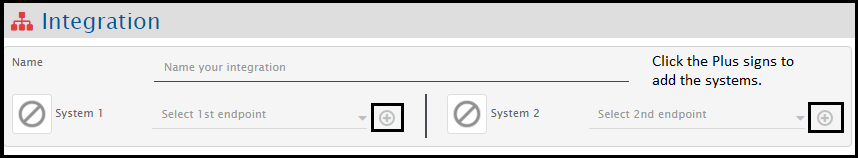
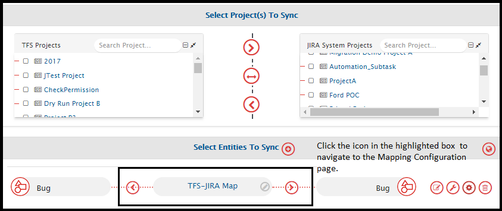

# Overview

* Each system has its own set of prerequisites for successful configuration. Please refer to the system-specific pre-requisite section in the [Connectors](../connectors/connectors.md) section before you proceed.
* Create one user dedicated to integration. User should not be used to do any operations from the system's user interface.

***

## Integration Overview

Integration is the process of connecting two or more systems in order to enable a seamless exchange of information between the system users.

To configure an integration, you should go to the integration page from the homepage as shown in the image below and fill the requested details in the integration form.

If you are creating an integration for the first time, you need to follow the steps given below:

* Start creating an integration.
*   Choose the two systems you want to integrate.

    

* Go to the System Configuration screen and configure the systems that you want to integrate. The details of how to configure a system can be accessed on the [System Configuration](system-configuration.md) page.
* Then, select the project and entities that you want to synchronize between the systems. You will be prompted to create a mapping for the integration. The details of how to create a mapping can be accessed on the [Mapping Configuration](mapping-configuration.md) page.

* You can then proceed with integration and set the polling time and define other advanced settings. Click [Integration Configuration](integration-configuration.md) to learn more.

***

## Sync Limitations

Each system has its own set of synchronization limitations. Please refer to the system-specific known limitations section on the [Connectors](../connectors/connectors.md) page before you proceed.

Additionally, there are a few limitations that are common across all connectors. Those limitations are listed below:

* Inline image from an entity of the source system synchronizes as broken image to the target system, given that the embedded inline image URL in the source system is not accessible/reachable from the machine on which <code class="expression">space.vars.SITENAME</code> is installed while the entity is being synchronized. In this case, the inline image synchronized to the target system without transformation to URL corresponds to the target system and as a result, the synchronized image is broken.

### User mention synchronization limitations

* If both the source and the target system support synchronization of User mentions and the user which is being synchronized from the source system does not exist in the target system, then that user's display name as seen in the source system will synchronize to the target system as literal text.
* If the source system supports synchronization of User mentions but the target system does not, then there are two scenarios:
  * If the user _exists in both the source and the target system_, then the target system's user's display name will synchronize to the target system as literal text.
  * If the source user _does not exist in the target system_, then the source system's user's display name as seen in the source system will synchronize to the target system as literal text.
* In both the above-mentioned cases, once the literal text for the user's display name is synchronized to the target system, and when this data is synchronized back to the other system, the actual User mention will be overwritten with the literal text as displayed in the target system.
