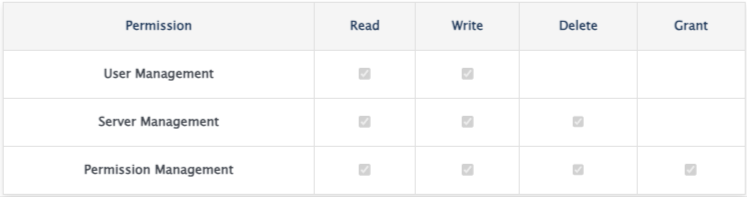
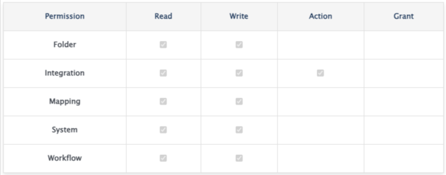
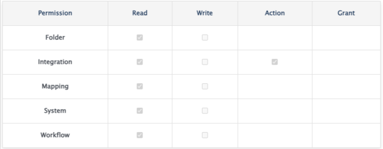
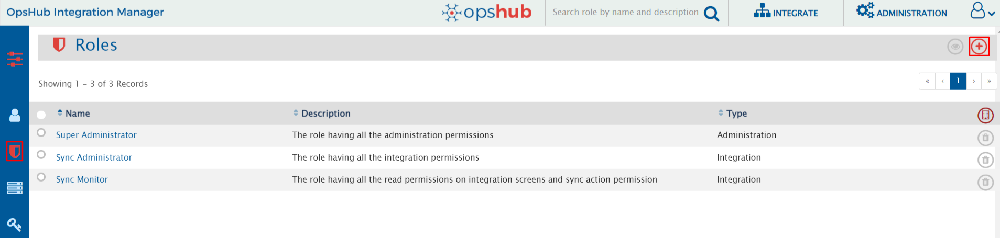
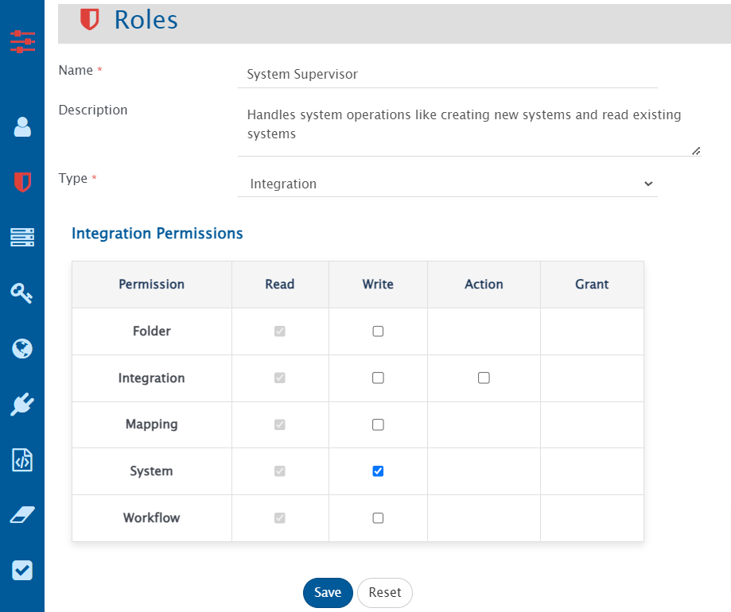
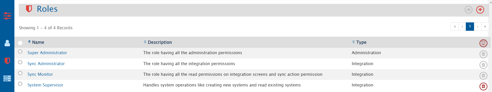

# Role Configuration

## Overview

<code class="expression">space.vars.SITENAME</code> supports User Access Control, enabling users manage permissions in <code class="expression">space.vars.SITENAME</code> by associating users with specific roles. Each role encapsulates a set of permissions suited to particular responsibilities.

## Permission

Permission refers to specific rights like Read, Write, Delete, Grant on different resources like System, Mapping, Integration, User Management associated with a given role.

## Role

* A Role is a set of permissions that define what actions a user is permitted to perform on a resource.
* Integration Role:
  * An Integration role allows user to configure permissions for operations that can be performed on **Integration** tab in <code class="expression">space.vars.SITENAME</code> like System, Mapping, Integration, etc.
  * Refer to [Associating Integration Role to a User](user-role-association.md#associating-integration-role-to-a-user) section to understand how integration roles can be associated with user.
* Administration Role:
  * An Administration role allows user to configure permissions for operations that can be performed on **Administration** in <code class="expression">space.vars.SITENAME</code> tab like Proxy Settings, License Management, etc.
  * Refer to [Associating Administration Role to a User](user-role-association.md#associating-administration-role-to-a-user) section to understand how administration roles can be associated with user.

## Default Roles

<code class="expression">space.vars.SITENAME</code> provides with the following default roles:

| **Role Name**       | **Description**                                                                                                                                                                                                             |
| ------------------- | --------------------------------------------------------------------------------------------------------------------------------------------------------------------------------------------------------------------------- |
| Super Administrator | 
All administration permissions are available 

                                                                      |
| Sync Administrator  | 
All integration permissions are available 

                                                                          |
| Sync Monitor        | 
All read and sync action permissions are available 

 |

## Create Custom Roles

*   Navigate to **Role Management** screen under **Administration** tab and click on Create Role button on the top right corner as shown below:

    

*   Add Role Name, Description, Type and select permissions that a user want to associate with the role. For instance, if a role is to be configured for performing all system operations, select **Integration** under Role type and tick mark **write** permission checkbox as shown below:

    

*   Save the role and it will be accessible from **Role Management** screen as shown below:

    

## Standard Role Behaviors

* In Integration type role, **read** permission is granted by default on all resources like System, Mapping, Folder, etc.
* In Integration type role, with **Write** permission, **Action** permission is granted by default for **Integration**.
* Default roles cannot be edited or deleted.
* In Administration type Role, with **write** permission on **User Management**, all write operations can be performed in all user accounts.
* Role type cannot be changed after the role is created.

## Permissions and Corresponding Actions

* Permissions and operations that can be performed are listed below:

| **Permission Name**                                                                          | **Permission Scope** | **Actions Supported**                                                                                                                                                                                               |
| -------------------------------------------------------------------------------------------- | -------------------- | ------------------------------------------------------------------------------------------------------------------------------------------------------------------------------------------------------------------- |
| **Integration Permissions**                                                                  |                      |                                                                                                                                                                                                                     |
| Folder                                                                                       | Read                 | Read Folders                                                                                                                                                                                                        |
| Folder                                                                                       | Write                | Create, update, delete folders                                                                                                                                                                                      |
| Folder                                                                                       | Grant                | Allows user to manage integration permissions of other users on the folders on which the user has access                                                                                                            |
| Integration                                                                                  | Read                 | 
Read integrations, reconciliations, failures Export sync report Read failure notifications' configuration
                                                                                              |
| Integration                                                                                  | Write                | 
Create, update, delete, merge, move integrations Create, update reconciliations
                                                                                                                           |
| Integration                                                                                  | Action               | 
Failures: Retry, delete, edit event xml, configure failure notifications Integrations: Activate, inactive, execute Delete Synchronization: Execute Switch to integration mode (from reconciliation)
 |
| Mapping                                                                                      | Read                 | 
Read, import, export mappings Read, export excel uploads
                                                                                                                                                  |
| Mapping                                                                                      | Write                | 
Create, update, delete, clone, merge, move mappings Create, update, delete excel uploads
                                                                                                                  |
| System                                                                                       | Read                 | Read systems                                                                                                                                                                                                        |
| System                                                                                       | Write                | Create, update, move systems                                                                                                                                                                                        |
| Workflow                                                                                     | Read                 | Read, export workflows                                                                                                                                                                                              |
| Workflow                                                                                     | Write                | Create, update, move, delete workflows                                                                                                                                                                              |
| _Note:_ Move operation requires **write** permission in both source and destination folders. |                      |                                                                                                                                                                                                                     |
| **Administration Permissions**                                                               |                      |                                                                                                                                                                                                                     |
| User Management                                                                              | Read                 | 
Read users Read login servers
                                                                                                                                                                             |
| User Management                                                                              | Write                | 
Create, update users Create, update login servers
                                                                                                                                                         |
| Server Management                                                                            | Read                 | 
Read licenses Read proxy settings Read registered connectors Read system logs Read purge Read rules management Read schedule
                                                               |
| Server Management                                                                            | Write                | 
Install license Update proxy settings Create, update registered connectors Create, update rules management Create, update schedules
                                                              |
| Server Management                                                                            | Delete               | 
Uninstall License Apply purge Delete rules management Delete schedules
                                                                                                                              |
| Permission Management                                                                        | Read                 | Read roles                                                                                                                                                                                                          |
| Permission Management                                                                        | Write                | Create, update roles                                                                                                                                                                                                |
| Permission Management                                                                        | Delete               | Delete roles                                                                                                                                                                                                        |
| Permission Management                                                                        | Grant                | Grant permissions to other users                                                                                                                                                                                    |
