# Data Count Utility

## Overview

* This utility counts the total number of issues across one or more projects. It supports the following systems:
  * **Rally ( Cloud )**
  * **Jira ( Cloud, DC: 8.x to 11.x )**
  * **OpenText ALM ( 12.x to 24.x )**
  * **Helix ALM ( 2021, 2024 )**
* **After Downloading the Utility**
  * Once the utility is extracted, the folder will contain the following files:
    * **OpshubCountUtility.jar** – The main executable JAR file of the utility.
    * **run.bat** – Script to run the utility on Windows systems.
    * **run.sh** – Script to run the utility on Linux or macOS systems.
    * **propertyFiles** – Directory containing configuration property files.
    * **jre** – Bundled Java Runtime Environment.

## Configuration

Configuration should be provided in the respective properties file of the system for which you want to count the issues.

* Locate the **propertyFiles** directory. This directory contains the property files for each supported system:
  * **Jira.properties**
  * **HelixCoreALM.properties**
  * **Rally.properties**
  * **OpenTextALM.properties**
* Edit and provide the required configuration details in the property file corresponding to the system for which issue counts need to be calculated.

## Steps to Run Utility

Following are the steps to run the utility:

### STEP 01

* Open **Command Prompt**.
* Refer to the screenshot below:

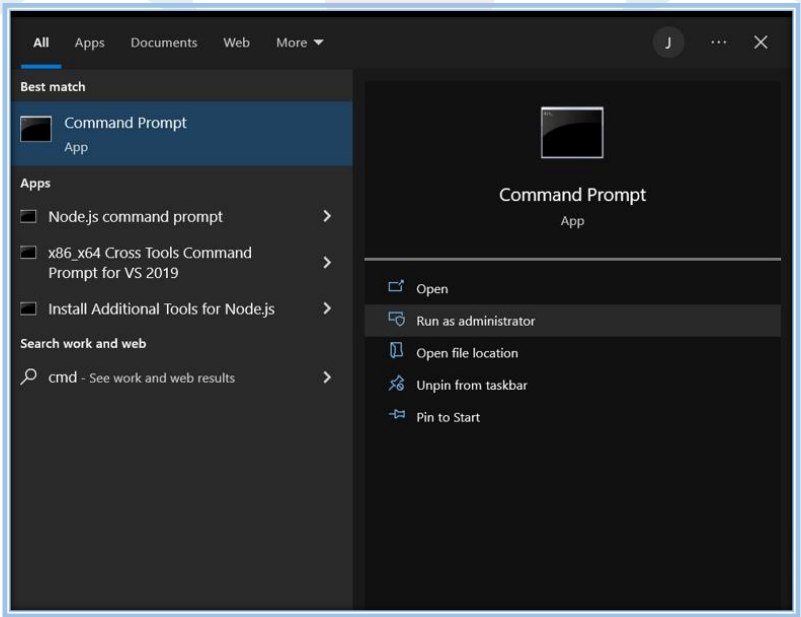

### STEP 02

* Go to the **directory** where the **Utility** is located.
* Refer to the screenshot below:

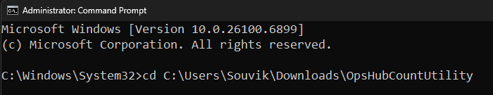

### STEP 03

* Type **run.bat** and press **Enter**.
* Refer to the screenshot mentioned below:

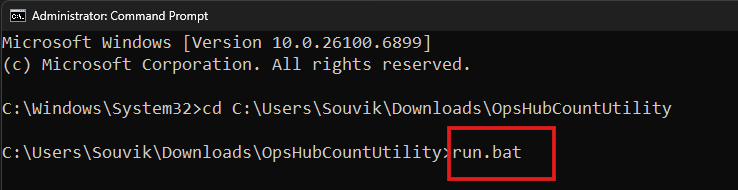

Once you press Enter, you will see the screen shown below.

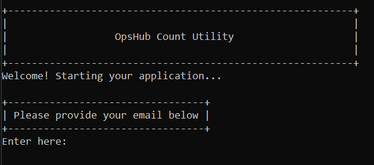

### STEP 04

* Once the welcome screen appears, it will prompt you to enter your email ID.
* Provide the **email ID** and press **Enter**.
* Refer to the screenshot below:

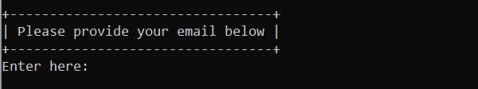

### STEP 05

* After providing the email ID, another screen will appear asking you to enter the system code displayed on the screen.
* Enter the **code** corresponding to the system for which you want to count the issues.
* Refer to the screenshot below:

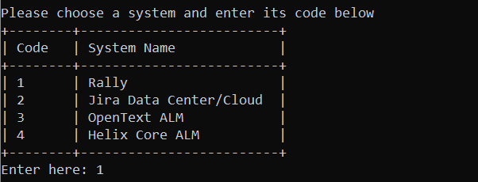

### STEP 06

The utility will prompt you to enter the system credentials. Provide the credentials for the system you selected.

#### For Rally

Supports two types of authentication modes **Authentication Token** and **Username and Password**.\
Based on the configuration in the **Rally.properties** file:

*   If the value of the **rallyAuthType** property is set to 1, the user must provide the **Authentication Token**.

    * Refer to the screenshot below:

    
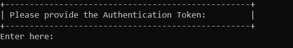

*   If the value of the **rallyAuthType** property is set to 2, the user must provide the **Username and Password**.

    * Refer to the screenshots below:

    
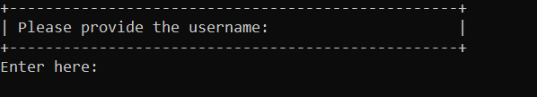

    
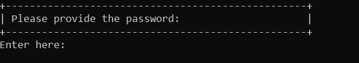

#### For Jira

The utility supports both **Data Center (DC)** and **Cloud** instances for Jira. Users must provide credentials based on the type of instance being used.

*   If the instance type is **Cloud**, provide the **email address** as the username.\
    If the instance type is **Data Center (DC)**, provide the **username**.

    * Refer to the screenshot below:

    
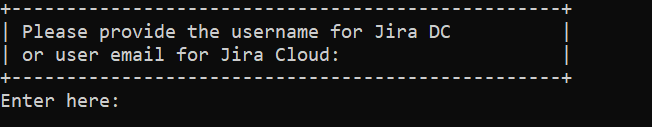

*   Provide the API token for **Cloud** instances, or the Password/API token for **Data Center (DC)** instances.

    * Refer to the screenshot below:

    
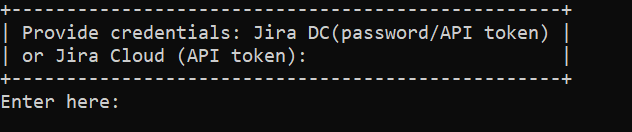

#### For OpenText ALM

In the case of OpenText ALM, the user must provide only the Username and Password.

* Refer to the screenshots below:

#### For Helix Core ALM

In the case of Helix, the user must provide only the Username and Password.

* Refer to the screenshots below:

### STEP 07

* Once the user provides all the credentials and presses Enter, a **verification code** will be sent to the registered email ID.
* The user must enter this code to complete the validation process.
* Refer to the screenshot below:

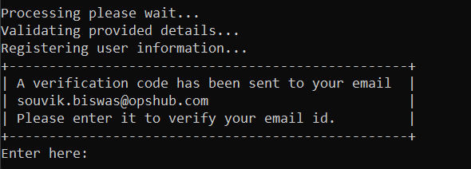

> **Note**: The above steps are explained for Windows OS. For **Linux**, the user should execute the **run.sh** file located in the utility folder and follow the steps mentioned above.

### Output

* Once the utility execution starts and all issue details are fetched, it creates an **output** folder. This folder contains subfolders named **Jira**, **Rally**, etc., based on the system selected by the user.
*   Based on the system selected, the execution result will be stored in a data count CSV file. For example, for Jira, the file name will be **Jira\_Count\_Data.csv**.

    * The CSV file contains counts of all issues of all issue types based on the project. Refer to the screenshot below:

    
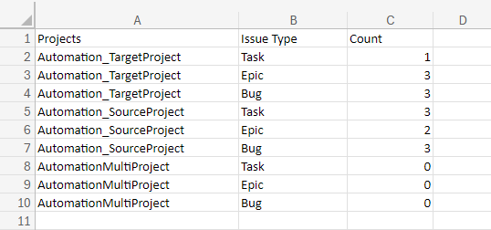

* In case any issue or error occurs, the utility creates another CSV file containing the error details. This CSV file is generated inside the system-specific output folder located within the main **output** directory.
  * For example, if the utility encounters an issue while processing a project for Jira, it will store the error details in the **jira\_error\_report.csv** file.
* Once the utility execution starts, it stores all execution logs in the **app.log** file located in the **OpsHubCountUtility/logs** folder.
