# Changing MSSQL Server Host


\* Close OM4ADO application before execution of the utility.



* Stop OpsHub Server Service before execution of the utility.


* Go to <code class="expression">space.vars.SITENAME</code>'s `<Installation Folder>/Other_Resources/Resources`
* Unzip `HostChange.zip`


- Open Command Prompt with administrator privileges and go to <code class="expression">space.vars.SITENAME</code>'s directory `<Installation Folder or OpsHub>/Other_Resources/Resources/HostChange` using command **`cd <Installation Folder or OpsHub>/Other_Resources/Resources/HostChange`**


\* Run \`HostChange.bat\` for Windows system.


* In case of linux system, run `HostChange.sh`


* Enter the path for <code class="expression">space.vars.SITENAME</code>'s Installation Directory

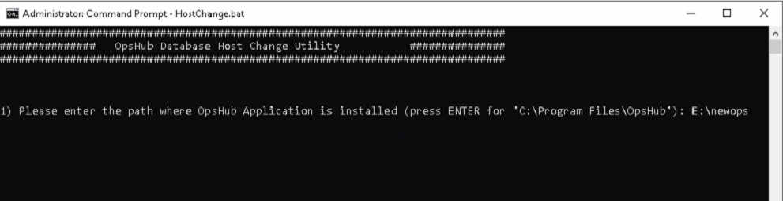

### HostChange with MYSQL

* Enter the new Host Name for MYSQL:

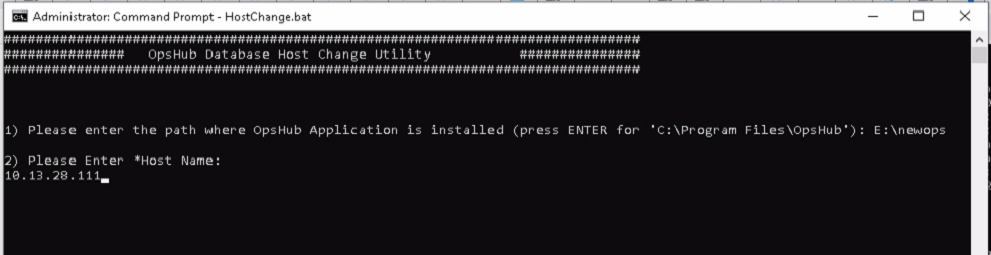

* If the Host Name input is not entered in the above step, then user will get the notification mentioned in the screen shot below. As the Host Name is a mandatory input that defines the new Host Name you want <code class="expression">space.vars.SITENAME</code> database to refer to:

* Enter the Port for MYSQL:

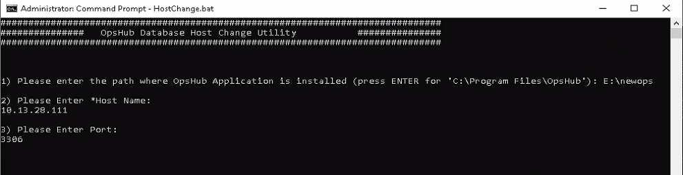

* If the Port input is not entered in the above step, then utility will use the existing Port \[entered at a time of <code class="expression">space.vars.SITENAME</code> installation]. If that is not the case, then enter the Port here:

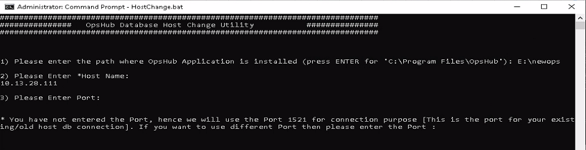

* Utility will check the connection with new Host Name:

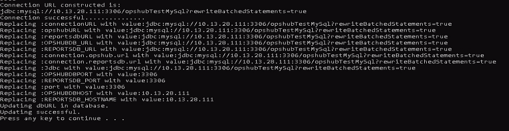

### HostChange with ORACLE

* Enter the new Host Name for ORACLE:

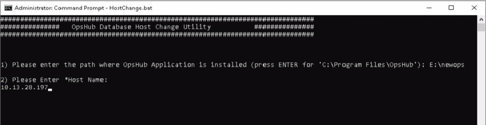

* If the Host Name input is not entered in the above step, then user will get the notification mentioned in the screen shot below. As the Host Name is a mandatory input that defines the new Host Name you want <code class="expression">space.vars.SITENAME</code> database to refer to:

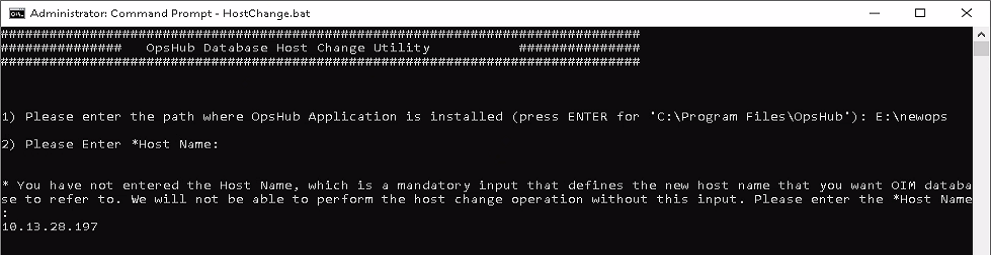

* Enter the Port for ORACLE:

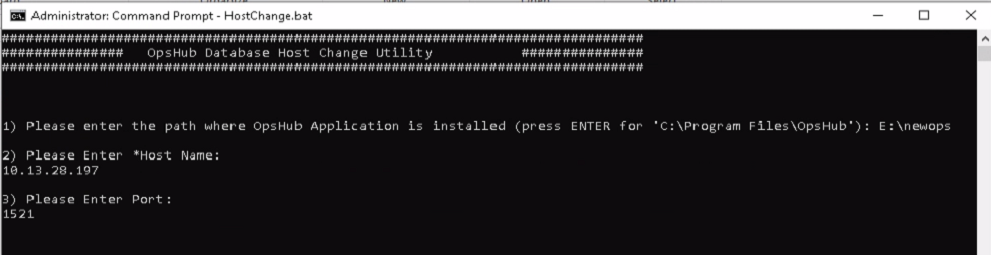

* If the Port input is not entered in the above step, then utility will use the existing Port \[entered at the time of <code class="expression">space.vars.SITENAME</code> installation]. If that is not the case, then enter the Port here:

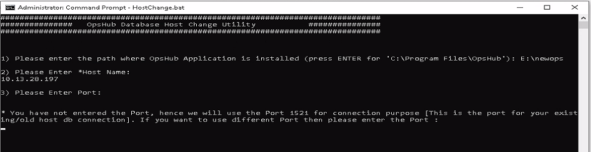

* Utility will check the connection with new Host Name:

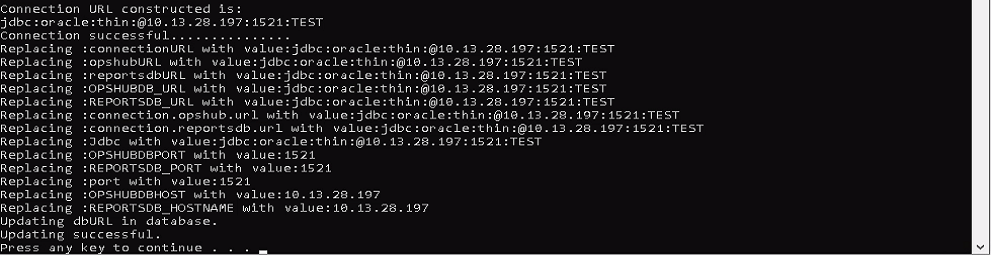

### HostChange with MSSQL Server

* **Note**: If <code class="expression">space.vars.SITENAME</code> is installed with Windows Authentication mode, then before running the utility, the user needs to make sure that the user who is logged into the Windows \[where the <code class="expression">space.vars.SITENAME</code> is installed] also logs into the new host's MSSQL instance with the same credentials.
* Enter the new Host Name for MSSQL Server:

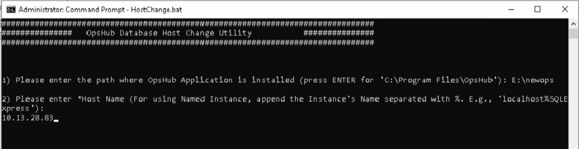

* If the Host Name input is not entered in the above step, then user will get the notification mentioned in the screen shot below. As the Host Name is a mandatory input that defines the new Host Name you want <code class="expression">space.vars.SITENAME</code> database to refer to:

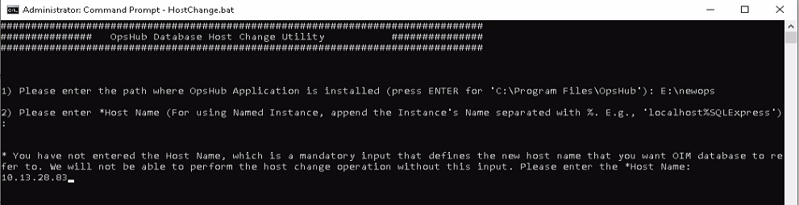

* If the new Host Name is a named instance, then there is no input required for the Port. Hence, after entering the Host Name, utility will check the connection with the new Host:

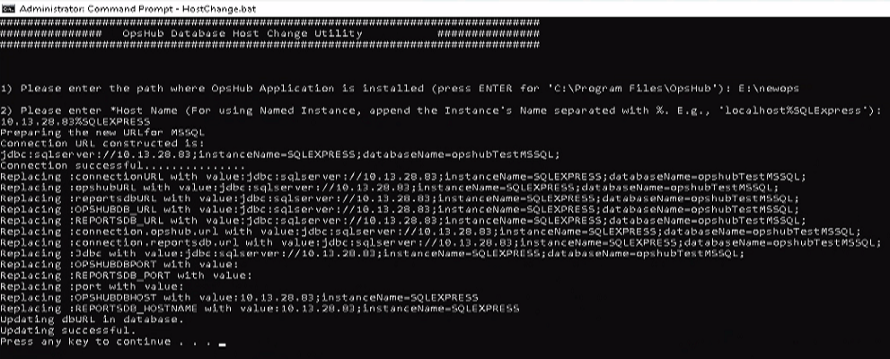

* If the new Host Name is a non-named instance, then enter the Port for MSSQL:

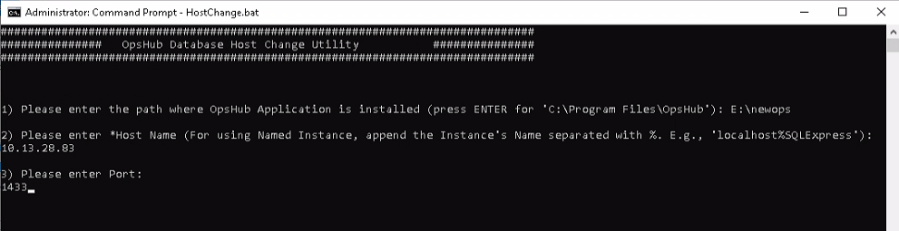

* If the Port input is not entered in the above step, then utility will use the existing Port \[entered at the time of <code class="expression">space.vars.SITENAME</code> installation]. If that is not the case, then enter the Port here:

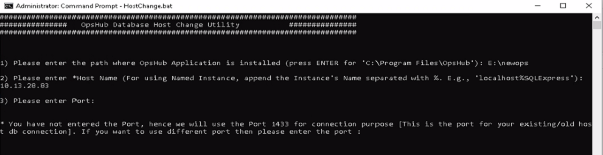

* Utility will check the connection with new Host Name \[In the case of SQL Authentication]:

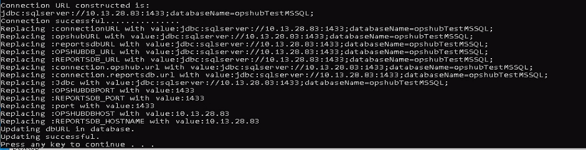

* Utility will check the connection with new Host Name \[In the case of Windows Authentication]:

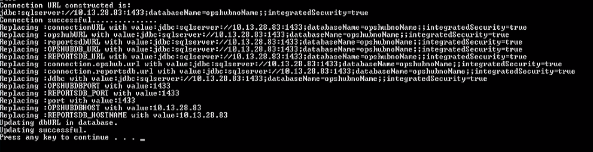

### HostChange with PostgreSQL

* Enter the new Host Name for PostgreSQL:

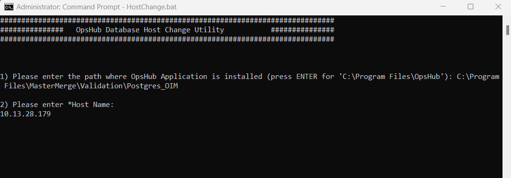

* If the Host Name input is not entered in the above step, then user will get the notification mentioned in the screenshot below. The Host Name is a mandatory input that defines the new Host Name user wants <code class="expression">space.vars.SITENAME</code> database to refer to:

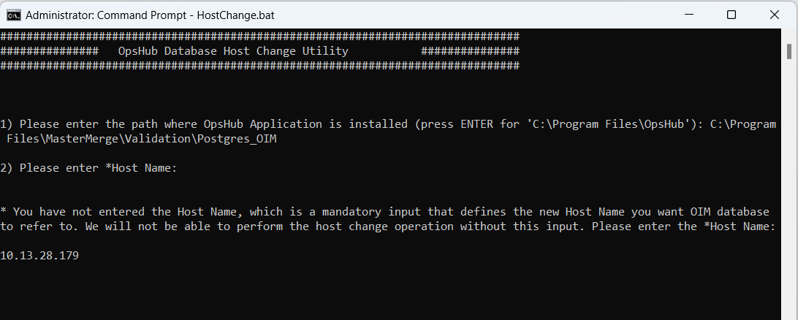

* Enter the Port for PostgreSQL:

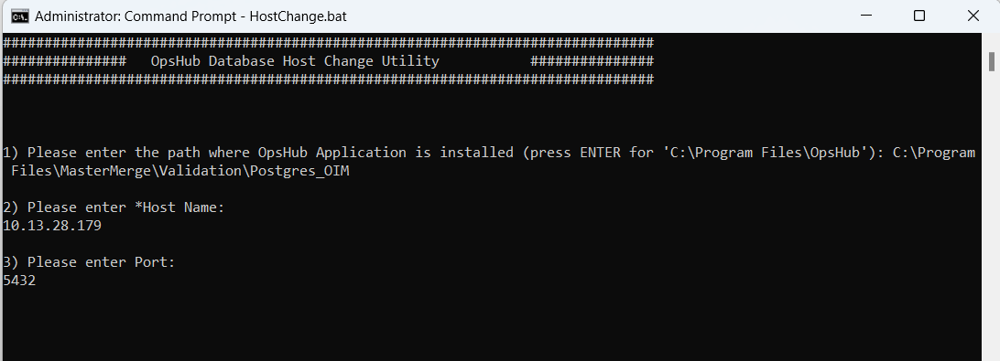

* If the Port's input is not entered in the above step, then the utility will use the existing Port \[entered at the time of <code class="expression">space.vars.SITENAME</code> installation]. If that is not the case, enter the Port as shown in the screenshot below:

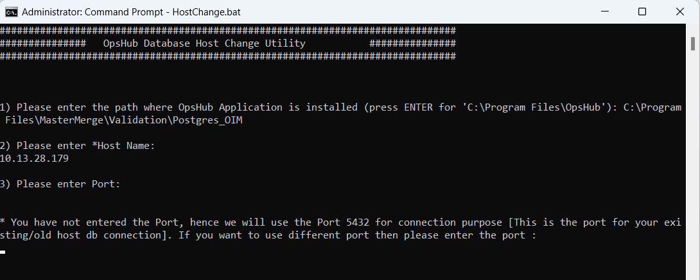

* Utility will check the connection with the new Host Name:

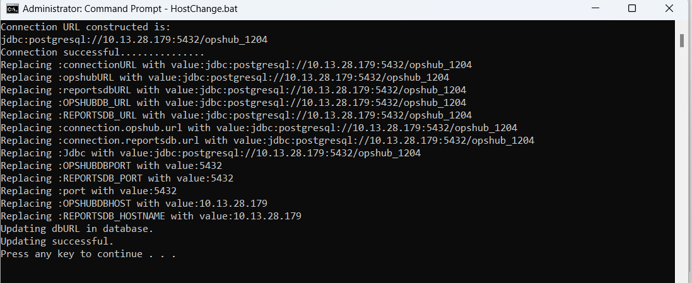

