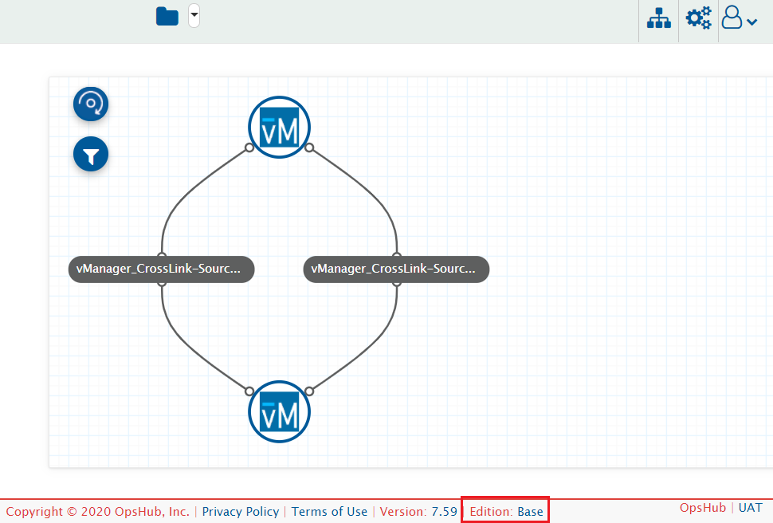
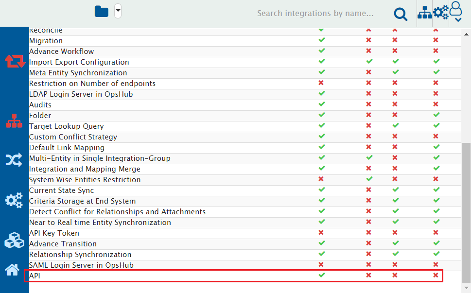

# Getting Started with APIs

## Overview

<code class="expression">space.vars.SITENAME</code> has rich user interface for achieving the integration configurations and using other functionality of <code class="expression">space.vars.SITENAME</code>. However, there can be various cases where the user might need to achieve/use them programmatically, i.e., with the external script, external software program, or with some API client, and <code class="expression">space.vars.SITENAME</code> API is useful in such cases. It is an alternate way to communicate with the <code class="expression">space.vars.SITENAME</code>.

The <code class="expression">space.vars.SITENAME</code> API is organized around REST and uses [JSON](https://www.json.org/json-en.html) format for data exchange.

To have a quick look on the use cases samples and <code class="expression">space.vars.SITENAME</code> API usage examples, please refer to [Use Cases](sample-use-cases.md).

## Prerequisites

Following are the prerequisites to use <code class="expression">space.vars.SITENAME</code> API:

### Access to <code class="expression">space.vars.SITENAME</code> Instance

* An active instance of <code class="expression">space.vars.SITENAME</code> which needs to be accessible from the machine/[platform](getting-started-with-api.md#platforms) for invoking the <code class="expression">space.vars.SITENAME</code> API.
* URL of <code class="expression">space.vars.SITENAME</code> instance. Example: `http://10.13.20.20:8989/OIM/` or `https://10.13.20.20:8443/OIM/`.
* User credentials for accessing the <code class="expression">space.vars.SITENAME</code> instance.

> **Note**: Please refer to [Validate access](getting-started-with-api.md#validate-access-to-opshub-integration-manager-instance) for validating this prerequisite.

### API License

* Usage of <code class="expression">space.vars.SITENAME</code> API requires "API" add-on in the <code class="expression">space.vars.SITENAME</code> license.

> **Note**: Please refer to [Validate API feature](getting-started-with-api.md#validate-api-feature) to determine whether the "API" feature is enabled or not on your <code class="expression">space.vars.SITENAME</code> instance.

### Platforms

* <code class="expression">space.vars.SITENAME</code> APIs can be invoked from the platform which can make the REST API Calls.
  * API client such as [postman](https://www.postman.com/).
  * Programs written in any programing language which has support for HTTP or HTTPS communication.
  * Command line tool such as [curl](https://curl.se/).

## Access to API

Access to API will be available for your instance with URL like below:

`<Protocol>://<Host Name or IP address of` <code class="expression">space.vars.SITENAME</code> `instance>:<Port Number>/OIM/rest/api/docs`

**For example** – If the application url of <code class="expression">space.vars.SITENAME</code> is `http://10.13.20.20:8989/OIM/`, then the Swagger UI will be available at `http://10.13.20.20:8989/OIM/rest/api/docs`.

## Appendix

### Validate API feature

To check whether the "API" feature is enabled in the <code class="expression">space.vars.SITENAME</code> or not, please perform the below steps:

1. [Login](../../getting-started/logging-in.md) to <code class="expression">space.vars.SITENAME</code> with the valid <code class="expression">space.vars.SITENAME</code> user credentials.
2. Navigate to the Footer and find "Edition" value.
3. Click on the Edition value of the <code class="expression">space.vars.SITENAME</code>

4. Please make sure the "API" feature is enabled.

> **Note**: If this feature is disabled, and you have the license in which this feature is available, then please [install](https://github.com/OpsHubProduct/OIM-Documentation/blob/main/docs/manage/api/Managing_Licenses/README.md) the correct license. If you don’t have a valid license, please reach out to OpsHub Sales/Support team for receiving the appropriate license.

### Validate access to <code class="expression">space.vars.SITENAME</code> instance

To check whether the <code class="expression">space.vars.SITENAME</code> instance is accessible or not, please perform the below steps:

1. Open <code class="expression">space.vars.SITENAME</code> instance URL from any browser from the machine/platform where <code class="expression">space.vars.SITENAME</code> APIs are invoked.
2. Access the <code class="expression">space.vars.SITENAME</code> instance from browser using the credentials you want to use for <code class="expression">space.vars.SITENAME</code> API communication.
3. If you can successfully login, this prerequisite is met.

> **Note**: If <code class="expression">space.vars.SITENAME</code> is configured on HTTPS, then SSL certificates needs to be imported based on the chosen platform:

* For the API clients like [postman](https://www.postman.com/), there are some [steps](https://learning.postman.com/docs/sending-requests/certificates/) to configure it.
* For the [curl](https://curl.se/) command, this can be [configured using -cert](https://curl.se/docs/manpage.html) option.
* For the programs, the steps will differ based on the expectation of the programming languages in which it was written.

## Known Limitations

1. SAML Users won't be able to login through the API.
   * Let's say the user has configured SAML login for OIM UI Login. Such users won't be able to login through the API. It would need either Default or LDAP user.
