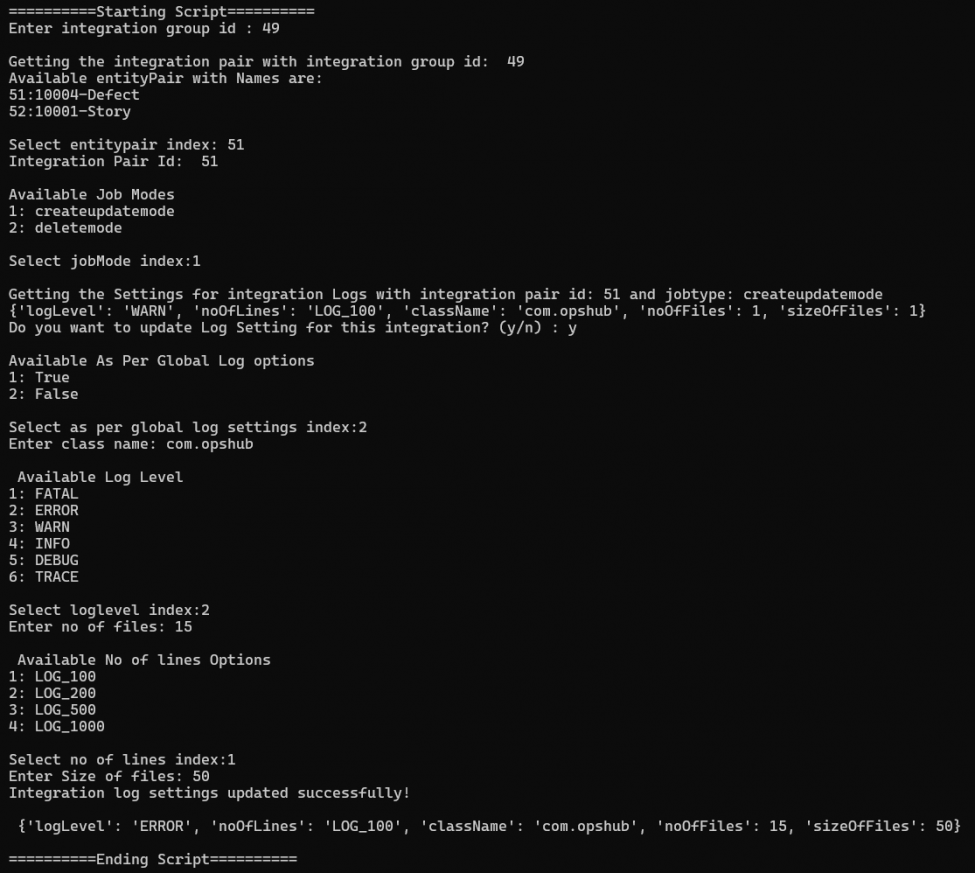
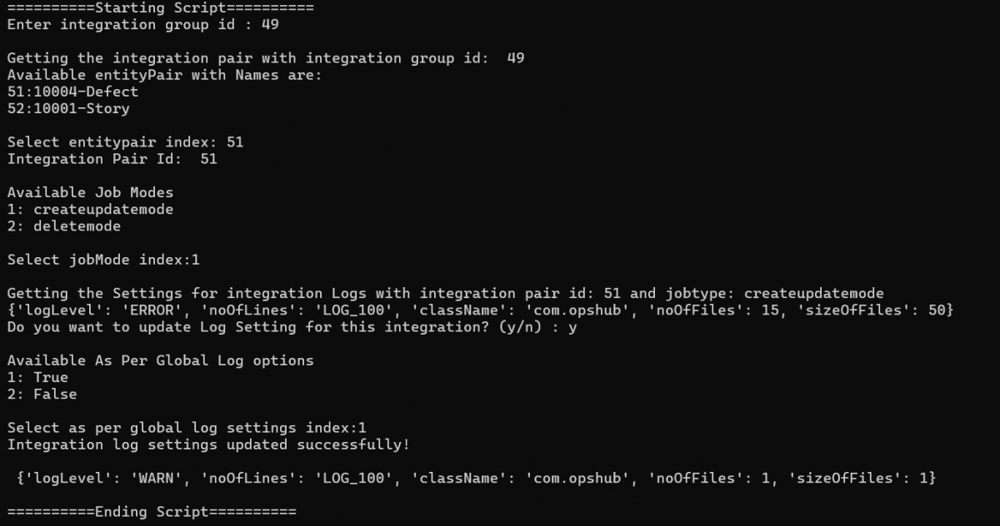

# Retrieve and Configure Integration Pair Log Settings

## Description

To retrieve and modify Integration Pair Log Settings.

## Input

* Instance details:
  * Instance details like <code class="expression">space.vars.SITENAME</code> instance URL, username and password are to be given in **instanceDetails.properties** file available within the script.
* Integration details (to be given at the time of script execution):
  * Integration Group id of the entity pair for which you want to retrieve or modify the logSettings.
  * Select Integration entity pair.
* Integration Log Setting details (to be given at the time of script execution):
  * Select the jobMode from the available options.
  * Enter 'y' to modify the Integration Log Setting configuration.
  * Enter 'n' to end the execution.
* Update Integration Log Setting details (to be given at the time of script execution):
  * Select the value for As per Global Log Settings.
  * If As per Global Log Settings is selected as true, Global Log Settings will be followed.
  * If As per Global Log Settings is selected as false, enter the Integration Log Setting configuration details.

## Output

Configured Log Settings for the integration pair.

## Script

You can download the script from [here](https://opshub.com/ohftp/AdminAPI/retrieveandconfigurelogsetting.zip).

Here is an example of execution of script showing the input and the output:

