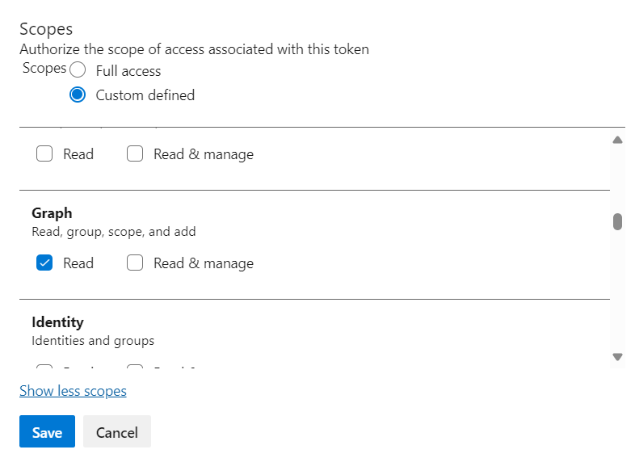

# Pre Migration Checklists

> 👉 **Looking for older version steps?**\
> Refer to the [Pre-Migration Checklist](https://docs.myopshub.com/oim/index.php/Pre-Migration_Checklist). for `<code class="expression">space.vars.SITENAME</code>` versions prior to **7.121**.

## Migrating <code class="expression">space.vars.SITENAME</code> version to 7.121 or above

### Upgradation of MySQL Server

**Applicable When:** <code class="expression">space.vars.SITENAME</code> is installed with MySQL database.

**Reason:** From version 7.121 onward, the special characters having 4 byte UTF8 encoding can be stored in <code class="expression">space.vars.SITENAME</code> database.

**Actions:** Upgrade MySQL database to 5.7.18 or above versions.

***

## Migrating <code class="expression">space.vars.SITENAME</code> version to 7.134 or above

**Applicable When:** If <code class="expression">space.vars.SITENAME</code> is installed with MSSQL database and the base installation version of <code class="expression">space.vars.SITENAME</code> is 6.03 or an earlier version.

**Actions:**

*   Execute the following queries to remove the default value constraint for column `Is_marked_deleted` of table `OHMT_EAI_entity_info` in MSSQL:

    ```
    SELECT col.name AS ColumnName, def.name AS ConstraintName 
    FROM sys.default_constraints def 
    INNER JOIN sys.columns col 
    ON def.parent_object_id = col.object_id 
       AND def.parent_column_id = col.column_id 
    WHERE parent_object_id = OBJECT_ID(N'DATABASE_NAME.TABLE_NAME');
    ```

    * The above query's output will be the constraint's name to be dropped. Example: `'DF__OHMT_EAI___Is_ma__63E3BB6D'`. Please put the constraint name fetched above in the query below to drop the constraint.

    ```
    ALTER TABLE DATABASE_NAME.TABLE_NAME DROP CONSTRAINT CONSTRAINT_NAME_FOUND_FROM_ABOVE_QUERY_FOR_COLUMN_IS_MARKED_DELETED;
    ```

**Reason:** In the 6.03 version, the default value was added to the `Is_marked_deleted` column of `OHMT_EAI_entity_info`. Because of this, MSSQL implicitly added a default constraint on this table. In the 7.134 version, the column `Is_marked_deleted` was dropped as a part of one feature of <code class="expression">space.vars.SITENAME</code>.

***

## Migrating <code class="expression">space.vars.SITENAME</code> version to 7.139 or above

**Applicable When:** If the initial installation version of <code class="expression">space.vars.SITENAME</code> is 6.11 Update 2 HF4 or earlier, the actions mentioned must be performed.

**Reason:** In the `reportsdb` database's `ReportsDBVersion` table, `6.11.02.00.00` entry was wrongly added to the `version` column.

**Actions:**

```sql
DELETE FROM reportsdb.ReportsDBVersion WHERE version='6.11.02.00.00';
```

***

## Migrating <code class="expression">space.vars.SITENAME</code> version to 7.145 or above

### Upgradation of MS SQL Server to enabled support for TLS 1.2 or above

**Applicable When:** <code class="expression">space.vars.SITENAME</code> is installed with MSSQL database and that MSSQL version does not support TLS v1.2 or above.

**Reason:** From version 7.145 onward, TLSv1.0 and TLSv1.1 protocols are not supported by <code class="expression">space.vars.SITENAME</code>.

**Actions:** An upgrade to MS SQL version will be needed, which supports TLSv1.2 or above. Refer to [this Microsoft link](https://support.microsoft.com/en-us/topic/kb3135244-tls-1-2-support-for-microsoft-sql-server-e4472ef8-90a9-13c1-e4d8-44aad198cdbe) for upgrading MS SQL version.

***

## Migrating <code class="expression">space.vars.SITENAME</code> version to 7.149 or above

### Link changes in <code class="expression">space.vars.SITENAME</code> for Jira Cloud

**Applicable When:**

* Jira Cloud is configured as one of the end points in the integration and the Epic link/Parent link/Issues in Epic/Child issues are configured in the <code class="expression">space.vars.SITENAME</code> mapping.

**Actions:**

* If the user has mapped both the Epic and the Parent links in the <code class="expression">space.vars.SITENAME</code>'s relationship mapping:
  * The user needs to remove one of them from the mapping. For example, they can remove Epic link/Parent link. Both these links must not be mapped.
* If the user has mapped both Child issues and Issues in the Epic link in the <code class="expression">space.vars.SITENAME</code>'s relationship mapping:
  * The user needs to remove one of them from the mapping. For example, they can remove Child issues/Issues in Epic. Both these links must not be mapped.

**Reason:**

* In Jira Cloud, the Epic link and the Parent link are merged to Parent link and Child issues & Issues in Epic are merged to the Child link. To adopt the Jira cloud behavior changes, the link changes are executed in the <code class="expression">space.vars.SITENAME</code>.

***

## Migrating <code class="expression">space.vars.SITENAME</code> version to 7.151 or above

### Link changes in <code class="expression">space.vars.SITENAME</code> for Codebeamer

**Applicable When:**

* Codebeamer/Codebeamer X is configured as one of the end points in the integration and the Parent/Hierarchy Parent/Child/Hierarchy Child links are configured in the <code class="expression">space.vars.SITENAME</code> mapping.

**Actions:**

* If the user has mapped both Parent and Hierarchy Parent links in the <code class="expression">space.vars.SITENAME</code>'s relationship mapping:
  * The user needs to remove one of them from the mapping. For example, Parent/Hierarchy Parent link can be removed. Both these links must not be mapped.
* If the user has mapped both Child and Hierarchy Child links in the <code class="expression">space.vars.SITENAME</code>'s relationship mapping:
  * The user needs to remove one of them from the mapping. For example, Child/Hierarchy Child link can be removed. Both these links must not be mapped.

**Reason:**

* In Codebeamer/Codebeamer X, links synchronization and hierarchy synchronization are processed via Hierarchy Parent and Hierarchy Child Links.

***

***

## Migrating <code class="expression">space.vars.SITENAME</code> version to 7.160 or above

### Integration configuration changes for Milestone entity in Rally

**Applicable When:**

* Rally is configured as one of the end systems and Milestone entity is configured in integration group along with other Rally entities.

**Actions:**

* A separate integration should be created for Milestone entity.

**Reason:**

* In Rally, Milestone is a workspace level entity, whereas other Rally entities are project level entities. Hence, it is recommended to have a separate integration for Milestone entity.

**Applicable When:**

* Rally is configured as one of the end systems and Milestone entity is configured with child project sync enabled at the integration level.

**Actions:**

* A new integration should be created for Milestone with no child project sync enabled in the integration configuration.

**Reason:**

* In Rally, Milestone is the workspace level and it has no concept of child workspace.

***

## Migrating <code class="expression">space.vars.SITENAME</code> version to 7.162 or above

### Provide additional permission for the Personal Access Token of Azure DevOps Services (Cloud Deployment)

<div align="center"></div>

**Applicable When:**

* If Azure DevOps Services is configured as a target system and any user field is mapped for synchronization.
* If the Azure DevOps Services (Cloud Deployment) is configured with personal access token as authentication mode.

**Actions:**

* The user needs to provide read permission of Graph for the given Personal Access Token.

**Reason:**

* Due to supporting service principal synchronization as a user, it is required to provide that permission.

***

## Migrating <code class="expression">space.vars.SITENAME</code> version to 7.172 or above

### Upgrade MSSQL Server to 2012 or above

**Applicable When:**

* If <code class="expression">space.vars.SITENAME</code> is installed with Microsoft SQL Server database version below 2012.

**Actions:**

* Upgrade Microsoft SQL Server to 2012 or above versions.
* Correct the connector JAR as mentioned in pre-migration checklist [here](pre-migration-checklist.md#updating-the-mssql-2012-database-connector-jar).

**Reason:**

* From version 7.172 onward, deprecated support of Microsoft SQL Server versions below 2012.

***

### Updating the MSSQL 2012 database connector JAR

**Applicable When:**

* This update is necessary if <code class="expression">space.vars.SITENAME</code> is running on MSSQL 2012 and currently using the connector JAR package `sqljdbc_6.0.8112.100_enu.tar.gz`.

**Actions:** **Prerequisites**

1. If the current OIM version is lower than <code class="expression">space.vars.SITENAME</code> 7.143 and an upgrade to 7.172 is required, follow these steps:
   * First, upgrade to <code class="expression">space.vars.SITENAME</code> 7.143 using the old JAR file, `sqljdbc_6.0.8112.100_enu.tar.gz`.
   * After completing the migration to version 7.143, proceed with the steps mentioned below and then upgrade to version 7.172.

* Locate the old JAR file `sqljdbc42.jar` in the following directories:
  * `<INSTALLATION_PATH>/Connector_Jars/`
  * `<INSTALLATION_PATH>/OpsHubServer/lib/`
* Replace the old JAR file with the new JAR `mssql-jdbc-10.2.0.jre11.jar`:
  * Download the new JAR from [this link](https://go.microsoft.com/fwlink/?linkid=2186164)
  * Unzip the new connector JAR package `sqljdbc_10.2.0.0_enu.tar.gz`
  * Locate `mssql-jdbc-10.2.0.jre11.jar` in the directory `sqljdbc_10.2.0.0_enu/sqljdbc_10.2/enu`
  * Copy the new JAR to the directories mentioned above and delete the old JAR `sqljdbc42.jar` from both the locations.
* If Windows authentication is being used, follow these additional steps:
  * Copy `mssql-jdbc_auth-10.2.0.x64.dll` from `sqljdbc_10.2.0.0_enu/sqljdbc_10.2/enu/auth/x64` to `<INSTALLATION_PATH>/OpsHub_Resources/jre/bin`.
  * Delete the existing `sqljdbc_auth.dll` located in `<INSTALLATION_PATH>/OpsHub_Resources/jre/bin`.

**Reason:**

* Flyway has been updated from version 4.2 to 10.15, and the newer version does not support the connector JAR `sqljdbc42.jar`. Therefore, it is necessary to upgrade to `mssql-jdbc-10.2.0.jre11.jar` to maintain compatibility and avoid <code class="expression">space.vars.SITENAME</code> upgrade failure.

***

### Updating MSSQL 2014 or above database connector JAR

**Applicable When:**

* This update is necessary if <code class="expression">space.vars.SITENAME</code> is running on MSSQL 2014 or above and currently using the connector JAR package `sqljdbc_6.0.8112.100_enu.tar.gz`.

**Actions:** **Prerequisites**

1. If the current OIM version is lower than <code class="expression">space.vars.SITENAME</code> 7.143 and an upgrade to 7.172 is required, follow these steps:
   * First, upgrade to <code class="expression">space.vars.SITENAME</code> 7.143 using the old JAR file, `sqljdbc_6.0.8112.100_enu.tar.gz`.
   * After completing the migration to version 7.143, proceed with the steps mentioned below and then upgrade to version 7.172.

* Locate the old JAR file `sqljdbc42.jar` in the following directories:
  * `<INSTALLATION_PATH>/Connector_Jars/`
  * `<INSTALLATION_PATH>/OpsHubServer/lib/`
* Replace the old JAR file with the new JAR `mssql-jdbc-12.2.0.jre11.jar`:
  * Download the new JAR from [this link](https://learn.microsoft.com/en-us/sql/connect/jdbc/release-notes-for-the-jdbc-driver?view=sql-server-ver16#122)
  * Unzip the new connector JAR package `sqljdbc_12.2.0.0_enu.tar.gz`
  * Locate `mssql-jdbc-12.2.0.jre11.jar` in the directory `sqljdbc_12.2.0.0_enu/sqljdbc_12.2/enu`
  * Copy the new JAR to the directories mentioned above and delete the old JAR `sqljdbc42.jar` from both the locations.
* If Windows authentication is being used, follow these additional steps:
  * Copy `mssql-jdbc_auth-12.2.0.x64.dll` from `sqljdbc_12.2.0.0_enu/sqljdbc_12.2/enu/auth/x64` to `<INSTALLATION_PATH>/OpsHub_Resources/jre/bin`.
  * Delete the existing `sqljdbc_auth.dll` located in `<INSTALLATION_PATH>/OpsHub_Resources/jre/bin`.

**Reason:**

* Flyway has been updated from version 4.2 to 10.15, and the newer version does not support the connector JAR `sqljdbc42.jar`. Therefore, it is necessary to upgrade to `mssql-jdbc-12.2.0.jre11.jar` to maintain compatibility and avoid <code class="expression">space.vars.SITENAME</code> upgrade failure.

***

## Migrating <code class="expression">space.vars.SITENAME</code> version to 7.181 or above

### Link rename for OpenText ALM Octane

**Applicable When:**

* Integration configuration has failures and configuration involves OpenText ALM Octane Endpoint and any of the following relationship is configured: Originated defect, Originated feature, Originated epic, Originated user story, Originated quality story, Original defect, Original feature, Original epic, Original user story, Original quality story.

**Actions:**

* Resolve all the failures before upgrading <code class="expression">space.vars.SITENAME</code>.

**Reason:**

* Relationship link names are renamed after upgrade on <code class="expression">space.vars.SITENAME</code>. So failed-entity are required to be resolved first.

***

## Migrating <code class="expression">space.vars.SITENAME</code> 's version to 7.205 or above

### Improved Change Identification in Gerrit

**Applicable When**

* You are using **Gerrit** as one of the endpoints in your integration.

**Actions**

* Please contact **support@opshub.com** for upgrade assistance.

**Reason**

* In earlier versions, Gerrit sometimes could not uniquely identify changes across repositories or branches, which could lead to errors.
* From **7.205 onwards**, the <code class="expression">space.vars.SITENAME</code> uses an improved ID format to ensure changes are always uniquely identified, avoiding such issues.

## Migrating <code class="expression">space.vars.SITENAME</code> 's version to 7.218 or above

### Windows Server Versions Earlier Than 2016 Are No Longer Supported

**Applicable When**

* You are running <code class="expression">space.vars.SITENAME</code> on Windows Server versions earlier than 2016 (i.e., Windows Server 2012 or older).
* Any associated database is hosted on these Windows Server versions.

**Actions**

* Upgrade the operating system to Windows Server 2016 or later. Refer to the [Supported Operating System](https://docs.opshub.com/getting-started/prerequisites#supported-operating-systems) documentation for detailed requirements.

**Reason**

* To meet enhanced security requirements, the JDK (Java Development Kit) has been upgraded to version 17.0.18, which requires **Windows Server 2016 or later**.
